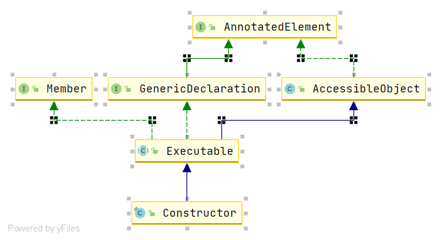

# Spring StandardReflectionParameterNameDiscoverer
- 类全路径: `org.springframework.core.StandardReflectionParameterNameDiscoverer`
- `StandardReflectionParameterNameDiscoverer` 是 `ParameterNameDiscoverer` 实现类. 其中实现方式都是使用 JDK 的标准反射进行处理


处理方式很简单. 

首先看一个类图来对 Method 和 Constructor 的关系





在了解上面内容后我们再看方法


```java
@Override
@Nullable
public String[] getParameterNames(Method method) {
   // 获取参数名称
   return getParameterNames(method.getParameters());
}

@Override
@Nullable
public String[] getParameterNames(Constructor<?> ctor) {
   // 获取参数名称
   return getParameterNames(ctor.getParameters());
}
```


在这里 `Method` 和 `Constructor` 都有`getParameters` 方法来获取参数列表. 而参数列表中有名字. 因此他们都调用了`getParameterNames`


### getParameterNames

- 方法签名: `org.springframework.core.StandardReflectionParameterNameDiscoverer#getParameterNames(java.lang.reflect.Parameter[])`
- 循环设置参数名称

```JAVA
@Nullable
private String[] getParameterNames(Parameter[] parameters) {
   String[] parameterNames = new String[parameters.length];
   for (int i = 0; i < parameters.length; i++) {
      Parameter param = parameters[i];
      if (!param.isNamePresent()) {
         return null;
      }
      parameterNames[i] = param.getName();
   }
   return parameterNames;
}
```


