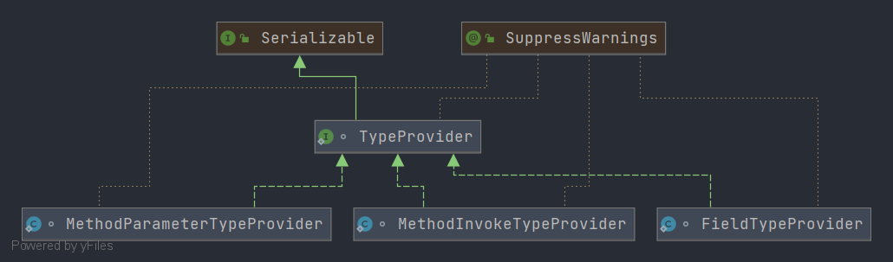

# Spring SerializableTypeWrapper
- 类全路径: `org.springframework.core.SerializableTypeWrapper`


## 成员变量

- `SerializableTypeWrapper` 中有两个成员变量


```java
final class SerializableTypeWrapper {

   /**
    * 可序列化的类型
    */
   private static final Class<?>[] SUPPORTED_SERIALIZABLE_TYPES = {
         GenericArrayType.class, ParameterizedType.class, TypeVariable.class, WildcardType.class};

   /**
    * 容器
    */
   static final ConcurrentReferenceHashMap<Type, Type> cache = new ConcurrentReferenceHashMap<>(256);
    
}
```


第一个变量`SUPPORTED_SERIALIZABLE_TYPES`是指`SerializableTypeWrapper`支持序列化的类型

第二个变量`cache`是一个容器


## 方法分析

在`SerializableTypeWrapper` 中需要关注的方法

1. `forField`
2. `forMethodParameter`
3. `forTypeProvider`
4. `unwrap`


`forField`和`forMethodParameter` 最终都指向方法`forTypeProvider` 前面两个方法就直接贴一贴代码跳过, 下面直接对 `forTypeProvider`展开分析


### forField

- 方法签名: `org.springframework.core.SerializableTypeWrapper#forField`

```java
/**
* Return a {@link Serializable} variant of {@link Field#getGenericType()}.
*/
@Nullable
public static Type forField(Field field) {
    return forTypeProvider(new FieldTypeProvider(field));
}
```


### forMethodParameter

- 方法签名: `org.springframework.core.SerializableTypeWrapper#forMethodParameter`

```java
/**
 * Return a {@link Serializable} variant of
 * {@link MethodParameter#getGenericParameterType()}.
 */
@Nullable
public static Type forMethodParameter(MethodParameter methodParameter) {
   return forTypeProvider(new MethodParameterTypeProvider(methodParameter));
}
```


在这里引出两个类

1. `FieldTypeProvider`
2. `MethodParameterTypeProvider`

两个类都实现了`TypeProvider`下面看一下类图





先看接口`TypeProvider`


### TypeProvider

- 类全路径: `org.springframework.core.SerializableTypeWrapper.TypeProvider`

<details>
<summary>TypeProvider 详细代码</summary>

```java
/**
 * A {@link Serializable} interface providing access to a {@link Type}.
 */
@SuppressWarnings("serial")
interface TypeProvider extends Serializable {

   /**
    * Return the (possibly non {@link Serializable}) {@link Type}.
    */
   @Nullable
   Type getType();

   /**
    * Return the source of the type, or {@code null} if not known.
    * <p>The default implementations returns {@code null}.
    */
   @Nullable
   default Object getSource() {
      return null;
   }
}
```


</details>


### FieldTypeProvider

- 类全路径: `org.springframework.core.SerializableTypeWrapper.FieldTypeProvider`

- 类作用

  `FieldTypeProvider` 保存了字段(**`Field`**)和**Type**的关系


#### 字段

```java
static class FieldTypeProvider implements TypeProvider {
   /**
    * 字段名称(属性名称)
    */
   private final String fieldName;

   /**
    * 字段类型(属性类型)
    */
   private final Class<?> declaringClass;

   /**
    * 字段对象
    */
   private transient Field field;
}
```


#### 方法分析

##### 构造函数

- 通过构造函数来了解字段和 `Field` 对象的关系

```java
public FieldTypeProvider(Field field) {
   this.fieldName = field.getName();
   this.declaringClass = field.getDeclaringClass();
   this.field = field;
}
```


### MethodParameterTypeProvider

- 类全路径: `org.springframework.core.SerializableTypeWrapper.MethodParameterTypeProvider`


#### 字段

```java
@SuppressWarnings("serial")
static class MethodParameterTypeProvider implements TypeProvider {
   /**
    * 方法名称
    */
   @Nullable
   private final String methodName;

   /**
    * 方法的参数类型列表
    */
   private final Class<?>[] parameterTypes;

   /**
    * Executable 类型
    * 1. 构造函数 {@link Constructor}
    * 2. 函数 {@link Method}
    */
   private final Class<?> declaringClass;

   private final int parameterIndex;

   private transient MethodParameter methodParameter;
}
```


### MethodInvokeTypeProvider

- 类全路径: `org.springframework.core.SerializableTypeWrapper.MethodInvokeTypeProvider`


#### 字段

```java
static class MethodInvokeTypeProvider implements TypeProvider {

   /**
    *  {@link Type} 提供接口
    */
   private final TypeProvider provider;

   /**
    * 方法名称
    */
   private final String methodName;

   /**
    * method class
    */
   private final Class<?> declaringClass;

   private final int index;

   /**
    * method
    */
   private transient Method method;

   @Nullable
   private transient volatile Object result;
}
```


#### 方法分析

##### 构造函数

- 通过构造函数来了解字段和 构造函数中的关系

```java
public MethodInvokeTypeProvider(TypeProvider provider, Method method, int index) {
   this.provider = provider;
   this.methodName = method.getName();
   this.declaringClass = method.getDeclaringClass();
   this.index = index;
   this.method = method;
}
```


##### getType

- 方法签名: `org.springframework.core.SerializableTypeWrapper.MethodInvokeTypeProvider#getType`


```java
@Override
@Nullable
public Type getType() {
   Object result = this.result;
   if (result == null) {
      // Lazy invocation of the target method on the provided type
      result = ReflectionUtils.invokeMethod(this.method, this.provider.getType());
      // Cache the result for further calls to getType()
      this.result = result;
   }
   return (result instanceof Type[] ? ((Type[]) result)[this.index] : (Type) result);
}
```


method 调用 刷新数据`result`


### unwrap

- 方法签名: `org.springframework.core.SerializableTypeWrapper#unwrap`

- 方法作用: 解析 Type


```java
@SuppressWarnings("unchecked")
public static <T extends Type> T unwrap(T type) {
   Type unwrapped = null;
   if (type instanceof SerializableTypeProxy) {
      unwrapped = ((SerializableTypeProxy) type).getTypeProvider().getType();
   }
   return (unwrapped != null ? (T) unwrapped : type);
}
```


### forTypeProvider

- 方法签名: `org.springframework.core.SerializableTypeWrapper#forTypeProvider`
- 方法作用: 从`TypeProvider`得到 `Type`对象


```java
@Nullable
static Type forTypeProvider(TypeProvider provider) {
   // 提取 type
   Type providedType = provider.getType();
   // 非空和类型验证
   if (providedType == null || providedType instanceof Serializable) {
      // No serializable type wrapping necessary (e.g. for java.lang.Class)
      return providedType;
   }
   if (GraalDetector.inImageCode() || !Serializable.class.isAssignableFrom(Class.class)) {
      // Let's skip any wrapping attempts if types are generally not serializable in
      // the current runtime environment (even java.lang.Class itself, e.g. on Graal)
      return providedType;
   }

   // Obtain a serializable type proxy for the given provider...
   // 缓存中获取
   Type cached = cache.get(providedType);
   if (cached != null) {
      return cached;
   }
   // 循环支持类型
   for (Class<?> type : SUPPORTED_SERIALIZABLE_TYPES) {
      if (type.isInstance(providedType)) {
         ClassLoader classLoader = provider.getClass().getClassLoader();
         // 创建 接口类列表
         Class<?>[] interfaces = new Class<?>[] {type, SerializableTypeProxy.class, Serializable.class};
         // TypeProxyInvocationHandler 的处理
         InvocationHandler handler = new TypeProxyInvocationHandler(provider);
         // 代理创建
         cached = (Type) Proxy.newProxyInstance(classLoader, interfaces, handler);
         cache.put(providedType, cached);
         return cached;
      }
   }
   throw new IllegalArgumentException("Unsupported Type class: " + providedType.getClass().getName());
}
```


### TypeProxyInvocationHandler

- 类全路径: `org.springframework.core.SerializableTypeWrapper.TypeProxyInvocationHandler`


`TypeProxyInvocationHandler` 重要的方法是 `invoke` 直接开看


#### invoke

- 方法签名: `org.springframework.core.SerializableTypeWrapper.TypeProxyInvocationHandler#invoke`

这个方法笔者很难做出什么分析, 这里请各位自行阅读吧. 

```java
@Override
@Nullable
public Object invoke(Object proxy, Method method, @Nullable Object[] args) throws Throwable {
   if (method.getName().equals("equals") && args != null) {
      Object other = args[0];
      // Unwrap proxies for speed
      if (other instanceof Type) {
         // other 解开
         other = unwrap((Type) other);
      }
      return ObjectUtils.nullSafeEquals(this.provider.getType(), other);
   }
   else if (method.getName().equals("hashCode")) {
      return ObjectUtils.nullSafeHashCode(this.provider.getType());
   }
   else if (method.getName().equals("getTypeProvider")) {
      return this.provider;
   }

   if (Type.class == method.getReturnType() && args == null) {
      return forTypeProvider(new MethodInvokeTypeProvider(this.provider, method, -1));
   }
   else if (Type[].class == method.getReturnType() && args == null) {
      Type[] result = new Type[((Type[]) method.invoke(this.provider.getType())).length];
      for (int i = 0; i < result.length; i++) {
         result[i] = forTypeProvider(new MethodInvokeTypeProvider(this.provider, method, i));
      }
      return result;
   }

   try {
      return method.invoke(this.provider.getType(), args);
   }
   catch (InvocationTargetException ex) {
      throw ex.getTargetException();
   }
}
```