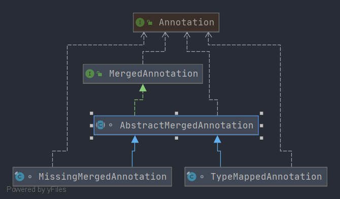

# Spring AbstractMergedAnnotation
- 类全路径: `org.springframework.core.annotation.AbstractMergedAnnotation`

- `AbstractMergedAnnotation` 提供了两个抽象方法交给子类实现
    1. getAttributeValue
    2. createSynthesized
    
- 类图

    


- 父接口: `MergedAnnotation`分析文章: [MergedAnnotation](./Spring-MergedAnnotation-未完成.md)

整个类就不具体展开分析了. 下面贴出代码各位有兴趣的可以进行阅读


```java
abstract class AbstractMergedAnnotation<A extends Annotation> implements MergedAnnotation<A> {

   @Nullable
   private volatile A synthesizedAnnotation;


   @Override
   public boolean isDirectlyPresent() {
      return isPresent() && getDistance() == 0;
   }

   @Override
   public boolean isMetaPresent() {
      return isPresent() && getDistance() > 0;
   }

   @Override
   public boolean hasNonDefaultValue(String attributeName) {
      return !hasDefaultValue(attributeName);
   }

   @Override
   public byte getByte(String attributeName) {
      return getRequiredAttributeValue(attributeName, Byte.class);
   }

   @Override
   public byte[] getByteArray(String attributeName) {
      return getRequiredAttributeValue(attributeName, byte[].class);
   }

   @Override
   public boolean getBoolean(String attributeName) {
      return getRequiredAttributeValue(attributeName, Boolean.class);
   }

   @Override
   public boolean[] getBooleanArray(String attributeName) {
      return getRequiredAttributeValue(attributeName, boolean[].class);
   }

   @Override
   public char getChar(String attributeName) {
      return getRequiredAttributeValue(attributeName, Character.class);
   }

   @Override
   public char[] getCharArray(String attributeName) {
      return getRequiredAttributeValue(attributeName, char[].class);
   }

   @Override
   public short getShort(String attributeName) {
      return getRequiredAttributeValue(attributeName, Short.class);
   }

   @Override
   public short[] getShortArray(String attributeName) {
      return getRequiredAttributeValue(attributeName, short[].class);
   }

   @Override
   public int getInt(String attributeName) {
      return getRequiredAttributeValue(attributeName, Integer.class);
   }

   @Override
   public int[] getIntArray(String attributeName) {
      return getRequiredAttributeValue(attributeName, int[].class);
   }

   @Override
   public long getLong(String attributeName) {
      return getRequiredAttributeValue(attributeName, Long.class);
   }

   @Override
   public long[] getLongArray(String attributeName) {
      return getRequiredAttributeValue(attributeName, long[].class);
   }

   @Override
   public double getDouble(String attributeName) {
      return getRequiredAttributeValue(attributeName, Double.class);
   }

   @Override
   public double[] getDoubleArray(String attributeName) {
      return getRequiredAttributeValue(attributeName, double[].class);
   }

   @Override
   public float getFloat(String attributeName) {
      return getRequiredAttributeValue(attributeName, Float.class);
   }

   @Override
   public float[] getFloatArray(String attributeName) {
      return getRequiredAttributeValue(attributeName, float[].class);
   }

   @Override
   public String getString(String attributeName) {
      return getRequiredAttributeValue(attributeName, String.class);
   }

   @Override
   public String[] getStringArray(String attributeName) {
      return getRequiredAttributeValue(attributeName, String[].class);
   }

   @Override
   public Class<?> getClass(String attributeName) {
      return getRequiredAttributeValue(attributeName, Class.class);
   }

   @Override
   public Class<?>[] getClassArray(String attributeName) {
      return getRequiredAttributeValue(attributeName, Class[].class);
   }

   @Override
   public <E extends Enum<E>> E getEnum(String attributeName, Class<E> type) {
      Assert.notNull(type, "Type must not be null");
      return getRequiredAttributeValue(attributeName, type);
   }

   @Override
   @SuppressWarnings("unchecked")
   public <E extends Enum<E>> E[] getEnumArray(String attributeName, Class<E> type) {
      Assert.notNull(type, "Type must not be null");
      Class<?> arrayType = Array.newInstance(type, 0).getClass();
      return (E[]) getRequiredAttributeValue(attributeName, arrayType);
   }

   @Override
   public Optional<Object> getValue(String attributeName) {
      return getValue(attributeName, Object.class);
   }

   @Override
   public <T> Optional<T> getValue(String attributeName, Class<T> type) {
      return Optional.ofNullable(getAttributeValue(attributeName, type));
   }

   @Override
   public Optional<Object> getDefaultValue(String attributeName) {
      return getDefaultValue(attributeName, Object.class);
   }

   @Override
   public MergedAnnotation<A> filterDefaultValues() {
      return filterAttributes(this::hasNonDefaultValue);
   }

   @Override
   public AnnotationAttributes asAnnotationAttributes(Adapt... adaptations) {
      return asMap(mergedAnnotation -> new AnnotationAttributes(mergedAnnotation.getType()), adaptations);
   }

   @Override
   public Optional<A> synthesize(Predicate<? super MergedAnnotation<A>> condition)
         throws NoSuchElementException {

      return (condition.test(this) ? Optional.of(synthesize()) : Optional.empty());
   }

   @Override
   public A synthesize() {
      if (!isPresent()) {
         throw new NoSuchElementException("Unable to synthesize missing annotation");
      }
      A synthesized = this.synthesizedAnnotation;
      if (synthesized == null) {
         synthesized = createSynthesized();
         this.synthesizedAnnotation = synthesized;
      }
      return synthesized;
   }

   private <T> T getRequiredAttributeValue(String attributeName, Class<T> type) {
      T value = getAttributeValue(attributeName, type);
      if (value == null) {
         throw new NoSuchElementException("No attribute named '" + attributeName +
               "' present in merged annotation " + getType().getName());
      }
      return value;
   }

   /**
    * Get the underlying attribute value.
    * @param attributeName the attribute name
    * @param type the type to return (see {@link MergedAnnotation} class
    * documentation for details)
    * @return the attribute value or {@code null} if the value is not found and
    * is not required
    * @throws IllegalArgumentException if the source type is not compatible
    * @throws NoSuchElementException if the value is required but not found
    */
   @Nullable
   protected abstract <T> T getAttributeValue(String attributeName, Class<T> type);

   /**
    * Factory method used to create the synthesized annotation.
    */
   protected abstract A createSynthesized();

}
```