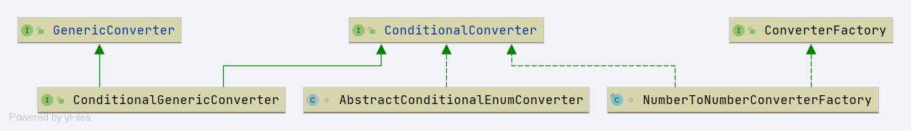

# Spring ConditionalConverter

- 类全路径: `org.springframework.core.convert.converter.ConditionalConverter`
- 类图



- 完整代码如下

```java
public interface ConditionalConverter {

	/**
	 * Should the conversion from {@code sourceType} to {@code targetType} currently under
	 * consideration be selected?
	 * 比较
	 * @param sourceType the type descriptor of the field we are converting from
	 * @param targetType the type descriptor of the field we are converting to
	 * @return true if conversion should be performed, false otherwise
	 */
	boolean matches(TypeDescriptor sourceType, TypeDescriptor targetType);

}
```