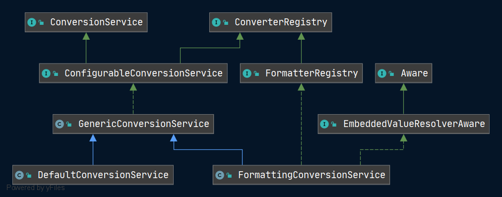

# Spring ConfigurableConversionService
- 类路径: `org.springframework.core.convert.support.ConfigurableConversionService`

- 类图




代码如下

```java
public interface ConfigurableConversionService extends ConversionService, ConverterRegistry {

}
```


- 从代码上可以看出这是一个复合接口. 
  - `ConversionService`方法
    1. 是否能够转换
    2. 转换
  - `ConverterRegistry`方法
    1. 添加转换器


实现类分析

1. [Spring-GenericConversionService](./Spring-GenericConversionService.md)
2. [Spring-FormattingConversionService](./Spring-FormattingConversionService.md)
   1. [DefaultFormattingConversionService](Spring-DefaultFormattingConversionService.md)
3. [Spring-DefaultConversionService.md](./Spring-DefaultConversionService.md)