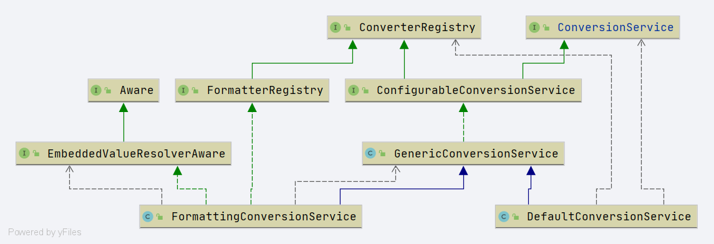

# Spring ConversionService
- 类全路径: `org.springframework.core.convert.ConversionService`
- 接口作用:
    1. 判断是否可以进行转换
    2. 转换对象
    
- 完整代码如下

```java
public interface ConversionService {

	/**
	 * Return {@code true} if objects of {@code sourceType} can be converted to the {@code targetType}.
	 * <p>If this method returns {@code true}, it means {@link #convert(Object, Class)} is capable
	 * of converting an instance of {@code sourceType} to {@code targetType}.
	 * <p>Special note on collections, arrays, and maps types:
	 * For conversion between collection, array, and map types, this method will return {@code true}
	 * even though a convert invocation may still generate a {@link ConversionException} if the
	 * underlying elements are not convertible. Callers are expected to handle this exceptional case
	 * when working with collections and maps.
	 *
	 * 是否能够转换
	 * @param sourceType the source type to convert from (may be {@code null} if source is {@code null})
	 * @param targetType the target type to convert to (required)
	 * @return {@code true} if a conversion can be performed, {@code false} if not
	 * @throws IllegalArgumentException if {@code targetType} is {@code null}
	 */
	boolean canConvert(@Nullable Class<?> sourceType, Class<?> targetType);

	/**
	 * Return {@code true} if objects of {@code sourceType} can be converted to the {@code targetType}.
	 * The TypeDescriptors provide additional context about the source and target locations
	 * where conversion would occur, often object fields or property locations.
	 * <p>If this method returns {@code true}, it means {@link #convert(Object, TypeDescriptor, TypeDescriptor)}
	 * is capable of converting an instance of {@code sourceType} to {@code targetType}.
	 * <p>Special note on collections, arrays, and maps types:
	 * For conversion between collection, array, and map types, this method will return {@code true}
	 * even though a convert invocation may still generate a {@link ConversionException} if the
	 * underlying elements are not convertible. Callers are expected to handle this exceptional case
	 * when working with collections and maps.
	 * 是否能够转换
	 * @param sourceType context about the source type to convert from
	 * (may be {@code null} if source is {@code null})
	 * @param targetType context about the target type to convert to (required)
	 * @return {@code true} if a conversion can be performed between the source and target types,
	 * {@code false} if not
	 * @throws IllegalArgumentException if {@code targetType} is {@code null}
	 */
	boolean canConvert(@Nullable TypeDescriptor sourceType, TypeDescriptor targetType);

	/**
	 * Convert the given {@code source} to the specified {@code targetType}.
	 * 转换
	 * @param source the source object to convert (may be {@code null})
	 * @param targetType the target type to convert to (required)
	 * @return the converted object, an instance of targetType
	 * @throws ConversionException if a conversion exception occurred
	 * @throws IllegalArgumentException if targetType is {@code null}
	 */
	@Nullable
	<T> T convert(@Nullable Object source, Class<T> targetType);

	/**
	 * Convert the given {@code source} to the specified {@code targetType}.
	 * The TypeDescriptors provide additional context about the source and target locations
	 * where conversion will occur, often object fields or property locations.
	 * 转换
	 * @param source the source object to convert (may be {@code null})
	 * @param sourceType context about the source type to convert from
	 * (may be {@code null} if source is {@code null})
	 * @param targetType context about the target type to convert to (required)
	 * @return the converted object, an instance of {@link TypeDescriptor#getObjectType() targetType}
	 * @throws ConversionException if a conversion exception occurred
	 * @throws IllegalArgumentException if targetType is {@code null},
	 * or {@code sourceType} is {@code null} but source is not {@code null}
	 */
	@Nullable
	Object convert(@Nullable Object source, @Nullable TypeDescriptor sourceType, TypeDescriptor targetType);

}
```

- 类图




## 实现类分析
- [GenericConversionService](/doc/book/core/convert/Spring-GenericConversionService.md)
