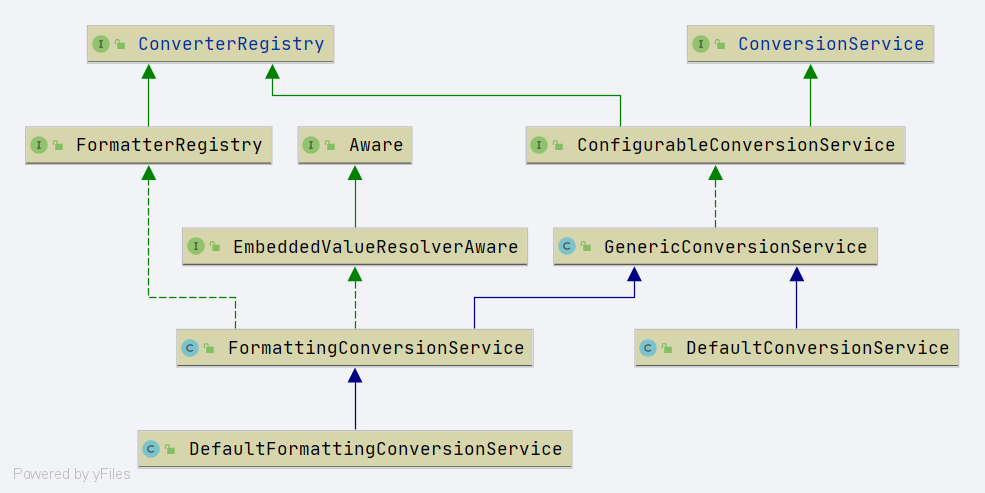

# Spring ConverterRegistry
- 类全路径: `org.springframework.core.convert.converter.ConverterRegistry`

- 类作用: Convert 的添加删除操作


```java
public interface ConverterRegistry {

   /**
    * Add a plain converter to this registry.
    * The convertible source/target type pair is derived from the Converter's parameterized types.
    *
    * 添加转换器
    * @throws IllegalArgumentException if the parameterized types could not be resolved
    */
   void addConverter(Converter<?, ?> converter);

   /**
    * Add a plain converter to this registry.
    * The convertible source/target type pair is specified explicitly.
    * <p>Allows for a Converter to be reused for multiple distinct pairs without
    * having to create a Converter class for each pair.
    * 添加转换器
    * @since 3.1
    */
   <S, T> void addConverter(Class<S> sourceType, Class<T> targetType, Converter<? super S, ? extends T> converter);

   /**
    * Add a generic converter to this registry.
    *
    * 添加 GenericConverter 转换器
    */
   void addConverter(GenericConverter converter);

   /**
    * Add a ranged converter factory to this registry.
    * The convertible source/target type pair is derived from the ConverterFactory's parameterized types.
    * 添加转换器工厂
    * @throws IllegalArgumentException if the parameterized types could not be resolved
    */
   void addConverterFactory(ConverterFactory<?, ?> factory);

   /**
    * Remove any converters from {@code sourceType} to {@code targetType}.
    * 移除转换器
    * @param sourceType the source type
    * @param targetType the target type
    */
   void removeConvertible(Class<?> sourceType, Class<?> targetType);

}
```


类图:

