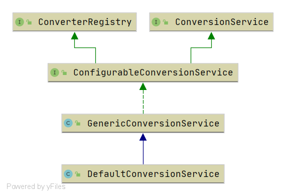

# Spring DefaultConversionService

- 类全路径: `org.springframework.core.convert.support.DefaultConversionService`
- 类图




- 构造方法分析
  - `org.springframework.core.convert.support.DefaultConversionService#DefaultConversionService`

```JAVA
public DefaultConversionService() {
   addDefaultConverters(this);
}

	public static void addDefaultConverters(ConverterRegistry converterRegistry) {
		addScalarConverters(converterRegistry);
		addCollectionConverters(converterRegistry);

		converterRegistry.addConverter(new ByteBufferConverter((ConversionService) converterRegistry));
		converterRegistry.addConverter(new StringToTimeZoneConverter());
		converterRegistry.addConverter(new ZoneIdToTimeZoneConverter());
		converterRegistry.addConverter(new ZonedDateTimeToCalendarConverter());

		converterRegistry.addConverter(new ObjectToObjectConverter());
		converterRegistry.addConverter(new IdToEntityConverter((ConversionService) converterRegistry));
		converterRegistry.addConverter(new FallbackObjectToStringConverter());
		converterRegistry.addConverter(new ObjectToOptionalConverter((ConversionService) converterRegistry));
	}
```


- 从类图上我们可以知道 `DefaultConversionService` 实现了`ConverterRegistry` ,  这这里构建阶段的时候会放入spring中编写好的convert实现类. 方便后续使用


- 该类还有一个对外方法 `getSharedInstance`


```java
public static ConversionService getSharedInstance() {
   DefaultConversionService cs = sharedInstance;
   if (cs == null) {
      synchronized (DefaultConversionService.class) {
         cs = sharedInstance;
         if (cs == null) {
            cs = new DefaultConversionService();
            sharedInstance = cs;
         }
      }
   }
   return cs;
}
```


- 从代码上也不难看出也是创建 `DefaultConversionService` 将spring中编写好的convert放入容器等待后续使用.