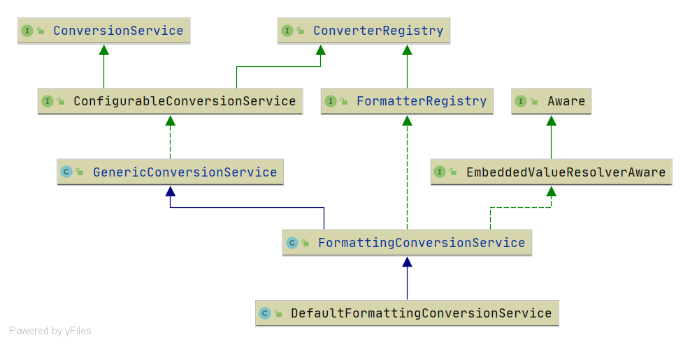
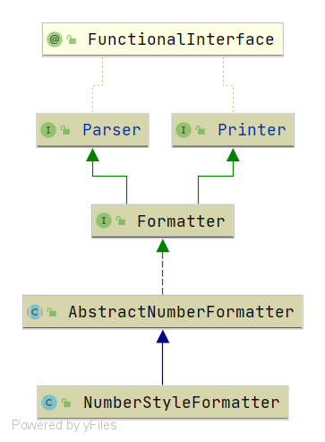

# Spring FormattingConversionService
- 类全路径: `org.springframework.format.support.FormattingConversionService`

- 类图

  


## getFieldType

- getFieldType 用来获泛型标记

- 在测试类:`org.springframework.format.support.FormattingConversionServiceTests` 中有方法如下

  ```java
  @Test
  public void introspectedParser() {
     formattingService.addParser(new NumberStyleFormatter("#,#00.0#"));
     assertThat(formattingService.convert("123.0", Integer.class)).isEqualTo(123);
     assertThat(formattingService.convert(123, String.class)).isEqualTo("123");
  }
  ```

  在第一行代码的调用链路中会去执行`getFieldType`

  - 执行代码如下,其中最重要的是第一行代码.

  ```java
  private static <T> Class<?> getFieldType(T instance, Class<T> genericInterface) {
     // 从 instance 上获取 genericInterface 的泛型标记
     Class<?> fieldType = GenericTypeResolver.resolveTypeArgument(instance.getClass(), genericInterface);
     if (fieldType == null && instance instanceof DecoratingProxy) {
        fieldType = GenericTypeResolver.resolveTypeArgument(
              ((DecoratingProxy) instance).getDecoratedClass(), genericInterface);
     }
     Assert.notNull(fieldType, () -> "Unable to extract the parameterized field type from " +
           ClassUtils.getShortName(genericInterface) + " [" + instance.getClass().getName() +
           "]; does the class parameterize the <T> generic type?");
     return fieldType;
  }
  ```

  通过类图来介绍第一行代码的作用

  


- 通过上图我们可以得到下面三个类， 其中泛型为:`Number`

```java
public class NumberStyleFormatter extends AbstractNumberFormatter {}
public abstract class AbstractNumberFormatter implements Formatter<Number>{}
public interface Formatter<T> extends Printer<T>, Parser<T> {}

```

- `Class<?> fieldType = GenericTypeResolver.resolveTypeArgument(instance.getClass(), genericInterface);`代码返回值就是 `Number.class`


## getAnnotationType

- 获取注解类型

- 同样的通过测试类进行了解方法作用. 测试代码如下

  ```java
  @Test
  public void formatFieldForAnnotation() throws Exception {
     formattingService.addFormatterForFieldAnnotation(new JodaDateTimeFormatAnnotationFormatterFactory());
     doTestFormatFieldForAnnotation(Model.class, false);
  }
  ```

  首先 `getAnnotationType` 接受一个 `AnnotationFormatterFactory<? extends Annotation> factory` 通过上文getFieldType 可以大致推论出这个方法返回的就是注解的实际值 , 测试用例中指向的是注解:`DateTimeFormat`


## addFormatterForFieldType

```java
@Override
public void addFormatterForFieldType(Class<?> fieldType, Formatter<?> formatter) {
   addConverter(new PrinterConverter(fieldType, formatter, this));
   addConverter(new ParserConverter(fieldType, formatter, this));
}
```

- 这个方法将 formatter 转换成`PrinterConverter`和`ParserConverter`分别加入缓存, 接下来了解一下这两个类


## PrinterConverter

### convert

- 转换方法
  1. source 对象转换
  2. 将source 转换成 print 对象

```java
@Override
@SuppressWarnings("unchecked")
public Object convert(@Nullable Object source, TypeDescriptor sourceType, TypeDescriptor targetType) {
   if (!sourceType.isAssignableTo(this.printerObjectType)) {
      // 值转换
      source = this.conversionService.convert(source, sourceType, this.printerObjectType);
   }
   if (source == null) {
      return "";
   }
   // 获取 print 值
   return this.printer.print(source, LocaleContextHolder.getLocale());
}
```


## ParserConverter

### convert

- 在parser中需要先解析成对象, 再去做转换. 

```java
@Override
@Nullable
public Object convert(@Nullable Object source, TypeDescriptor sourceType, TypeDescriptor targetType) {
   // 强制转换
   String text = (String) source;
   if (!StringUtils.hasText(text)) {
      return null;
   }
   Object result;
   try {
      // 解析器解析
      result = this.parser.parse(text, LocaleContextHolder.getLocale());
   }
   catch (IllegalArgumentException ex) {
      throw ex;
   }
   catch (Throwable ex) {
      throw new IllegalArgumentException("Parse attempt failed for value [" + text + "]", ex);
   }
   // 获取类型描述
   TypeDescriptor resultType = TypeDescriptor.valueOf(result.getClass());
   if (!resultType.isAssignableTo(targetType)) {
      // 转换
      result = this.conversionService.convert(result, resultType, targetType);
   }
   return result;
}
```


## addFormatterForFieldAnnotation

- 添加一个 AnnotationFormatterFactory 

```java
@Override
public void addFormatterForFieldAnnotation(AnnotationFormatterFactory<? extends Annotation> annotationFormatterFactory) {
   // 获取 annotationFormatterFactory 的注解类型
   Class<? extends Annotation> annotationType = getAnnotationType(annotationFormatterFactory);
   if (this.embeddedValueResolver != null && annotationFormatterFactory instanceof EmbeddedValueResolverAware) {
      // 设置字符串解析类
      ((EmbeddedValueResolverAware) annotationFormatterFactory).setEmbeddedValueResolver(this.embeddedValueResolver);
   }
   // 调用 AnnotationFormatterFactory 获取字段类型
   Set<Class<?>> fieldTypes = annotationFormatterFactory.getFieldTypes();
   for (Class<?> fieldType : fieldTypes) {
      // 设置 converter
      // 1. 设置 printer
      addConverter(new AnnotationPrinterConverter(annotationType, annotationFormatterFactory, fieldType));
      // 2. 设置 parser
      addConverter(new AnnotationParserConverter(annotationType, annotationFormatterFactory, fieldType));
   }
}
```


通过上述代码我们看到了两个新的类. 

	1. AnnotationPrinterConverter
 	2. AnnotationParserConverter


## AnnotationPrinterConverter

- 内部属性

  ```
  private final Class<? extends Annotation> annotationType;
  
  @SuppressWarnings("rawtypes")
  private final AnnotationFormatterFactory annotationFormatterFactory;
  
  private final Class<?> fieldType;
  ```

- 三个属性都是从 addFormatterForFieldAnnotation 的过程中获取. 通过构造函数进行设置。
- 其中我们主要关注内部方法 convert 方法


### convert

- 执行流程
  1. 获取注解. 构造缓存key对象
  2. 从缓存中获取
     1. 缓存中不存在，将 缓存key和 printer 构造后放入缓存
     2. 缓存中存在，执行convert进行转换.

```java
@Override
@SuppressWarnings("unchecked")
@Nullable
public Object convert(@Nullable Object source, TypeDescriptor sourceType, TypeDescriptor targetType) {
   Annotation ann = sourceType.getAnnotation(this.annotationType);
   if (ann == null) {
      throw new IllegalStateException(
            "Expected [" + this.annotationType.getName() + "] to be present on " + sourceType);
   }
   // 缓存key
   AnnotationConverterKey converterKey = new AnnotationConverterKey(ann, sourceType.getObjectType());
   // 从缓存中获取
   GenericConverter converter = cachedPrinters.get(converterKey);
   if (converter == null) {
      Printer<?> printer = this.annotationFormatterFactory.getPrinter(
            converterKey.getAnnotation(), converterKey.getFieldType());
      // 创建缓存value
      converter = new PrinterConverter(this.fieldType, printer, FormattingConversionService.this);
      // 设置缓存
      cachedPrinters.put(converterKey, converter);
   }
   // 执行转换
   return converter.convert(source, sourceType, targetType);
}
```


其实 `AnnotationParserConverter` 类的处理方式大相径庭, 内部只是接口上的差异

从`PrinterConverter`换成了`ParserConverter`

```java
@Override
@SuppressWarnings("unchecked")
@Nullable
public Object convert(@Nullable Object source, TypeDescriptor sourceType, TypeDescriptor targetType) {
   Annotation ann = targetType.getAnnotation(this.annotationType);
   if (ann == null) {
      throw new IllegalStateException(
            "Expected [" + this.annotationType.getName() + "] to be present on " + targetType);
   }
   AnnotationConverterKey converterKey = new AnnotationConverterKey(ann, targetType.getObjectType());
   GenericConverter converter = cachedParsers.get(converterKey);
   if (converter == null) {
      Parser<?> parser = this.annotationFormatterFactory.getParser(
            converterKey.getAnnotation(), converterKey.getFieldType());
      converter = new ParserConverter(this.fieldType, parser, FormattingConversionService.this);
      cachedParsers.put(converterKey, converter);
   }
   return converter.convert(source, sourceType, targetType);
}
```


