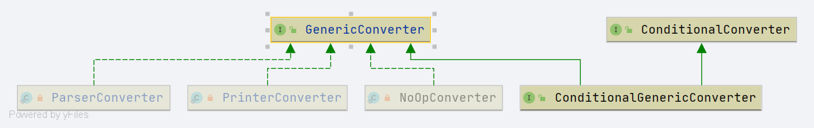

# Spring GenericConverter
- 类全路径: `org.springframework.core.convert.converter.GenericConverter`
- 类图



```java

public interface GenericConverter {

	/**
	 * 返回对象 ConvertiblePair , ConvertiblePair 中包含了 原类型和目标类型
	 */
	@Nullable
	Set<ConvertiblePair> getConvertibleTypes();

	/**
	 * 类型转换
	 */
	@Nullable
	Object convert(@Nullable Object source, TypeDescriptor sourceType, TypeDescriptor targetType);

}
```

## ConvertiblePair
- 类全路径: `org.springframework.core.convert.converter.GenericConverter.ConvertiblePair`

```java
	final class ConvertiblePair {
		/**
		 * 原类型
		 */
		private final Class<?> sourceType;

		/**
		 * 目标类型
		 */
		private final Class<?> targetType;
}
```