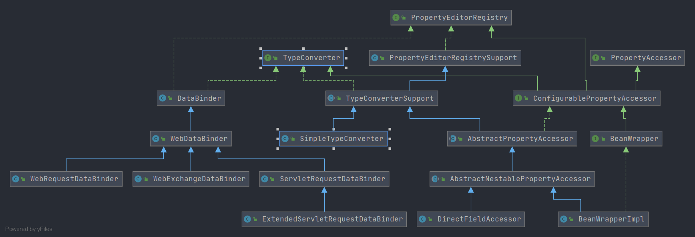

# Spring TypeConverter 
- 类全路径: `org.springframework.beans.TypeConverter`
- 类图
    
- `TypeConverter` 主要用来做对象转换, `TypeConverter` 接口具备如下几个方法

## 方法列表

```java
public interface TypeConverter {

	/**
	 * 将 value 转换成 requiredType 类型
	 */
	@Nullable
	<T> T convertIfNecessary(@Nullable Object value, @Nullable Class<T> requiredType) throws TypeMismatchException;

	/**
     * 将 value 转换成 requiredType 类型, 并且传递 转换方法和转换参数
	 */
	@Nullable
	<T> T convertIfNecessary(@Nullable Object value, @Nullable Class<T> requiredType,
			@Nullable MethodParameter methodParam) throws TypeMismatchException;

	/**
	 */
	@Nullable
	<T> T convertIfNecessary(@Nullable Object value, @Nullable Class<T> requiredType, @Nullable Field field)
			throws TypeMismatchException;

	/**
	 */
	@Nullable
	default <T> T convertIfNecessary(@Nullable Object value, @Nullable Class<T> requiredType,
			@Nullable TypeDescriptor typeDescriptor) throws TypeMismatchException {

		throw new UnsupportedOperationException("TypeDescriptor resolution not supported");
	}

}
```


## 实现类分析
- [TypeConverterSupport](/doc/book/core/convert/TypeConverter/Spring-TypeConverterSupport.md)

