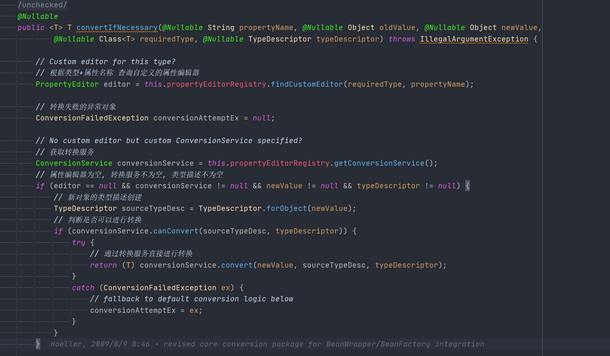
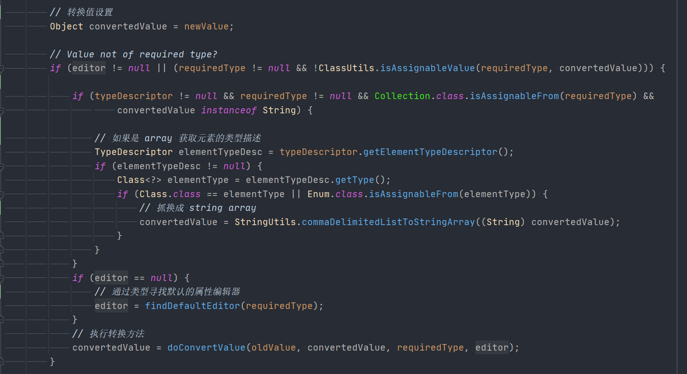
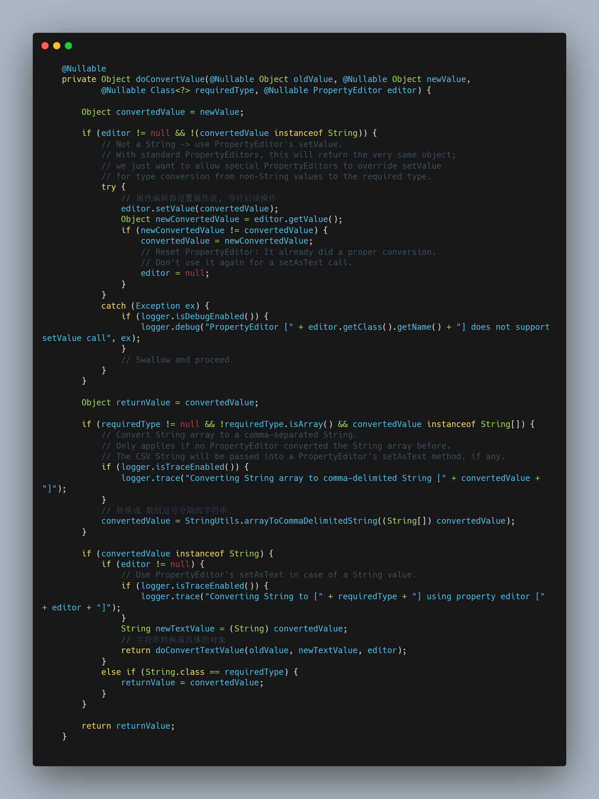
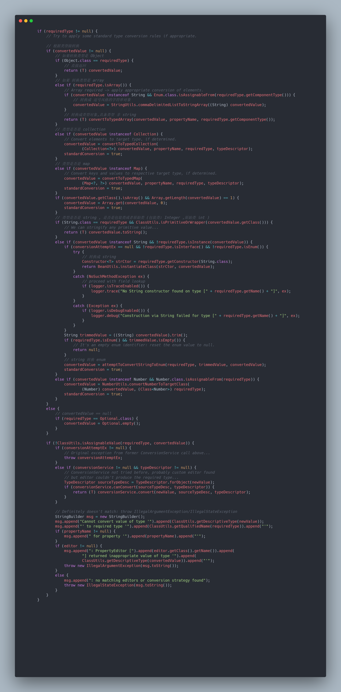

# Spring TypeConverterDelegate
- 类全路径: `org.springframework.beans.TypeConverterDelegate`
- `TypeConverterDelegate` 提供对象转换的功能, 内部存在两个属性
    1. [PropertyEditorRegistrySupport](/doc/book/bean/propertyEditor/Spring-PropertyEditorRegistrySupport.md)
    2. Object

## 成员变量

```java

	private final PropertyEditorRegistrySupport propertyEditorRegistry;

	@Nullable
	private final Object targetObject;
```


## 方法分析

- 整个`TypeConverterDelegate`最核心的方法为`org.springframework.beans.TypeConverterDelegate#convertIfNecessary(java.lang.String, java.lang.Object, java.lang.Object, java.lang.Class<T>, org.springframework.core.convert.TypeDescriptor)` 承担了整个转换方法的实现


​	接下来对这个方法做详细的分析


先看第一部分内容




第一部分代码逻辑如下

1. 找属性编辑器`PropertyEditor`和转换服务接口`ConversionService` 

   1. 做判断

      属性编辑器为空, 转换服务不为空, 类型描述不为空

      判断是否可以转换

      1. 可以转换通过 转换服务直接进行转换

         ```JAVA
         return (T) conversionService.convert(newValue, sourceTypeDesc, typeDescriptor);
         ```


第二部分内容如下



第二部分代码主要做了两种形式的转换

1. 转换成 字符串数组

   简单说就是根据逗号`,`进行 split 得到结果

2. 执行 `doConvertValue` 方法的转换


### doConvertValue 分析

代码逻辑

1. 属性编辑器设置数据
2. 属性编辑器中获取数据
3. 对比两个数据是否相同
4. 是否是 array 类型
   1. 逗号切分
5. 是否是 String 类型
6. 转换成字符串数据

- 完整代码如下




- 第三部分代码分析


第三部分代码关于 Java 提供的类型做了转换方法的编码

1. convertToTypedArray
2. convertToTypedCollection
3. convertToTypedMap
4. attemptToConvertStringToEnum




### convertToTypedArray

- 转换成 array

```java
	/**
	 * 转换对象列表
	 */
	private Object convertToTypedArray(Object input, @Nullable String propertyName, Class<?> componentType) {
		if (input instanceof Collection) {
			// Convert Collection elements to array elements.
			Collection<?> coll = (Collection<?>) input;
			// 创建新的 collection
			Object result = Array.newInstance(componentType, coll.size());
			int i = 0;

			for (Iterator<?> it = coll.iterator(); it.hasNext(); i++) {
				// 获取所有元素
				Object value = convertIfNecessary(
						buildIndexedPropertyName(propertyName, i), null, it.next(), componentType);
				// 放入 集合
				Array.set(result, i, value);
			}
			return result;
		}
		// 输入对象是 array 类型
		else if (input.getClass().isArray()) {
			// Convert array elements, if necessary.
			// 元素类型是否和 input 中的元素类型相同
			// 属性编辑器中是否可以通过 属性名称+元素类型 的属性编辑器
			if (componentType.equals(input.getClass().getComponentType()) &&
					!this.propertyEditorRegistry.hasCustomEditorForElement(componentType, propertyName)) {
				return input;
			}
			int arrayLength = Array.getLength(input);
			Object result = Array.newInstance(componentType, arrayLength);
			for (int i = 0; i < arrayLength; i++) {
				Object value = convertIfNecessary(
						buildIndexedPropertyName(propertyName, i), null, Array.get(input, i), componentType);
				Array.set(result, i, value);
			}
			return result;
		}
		else {
			// A plain value: convert it to an array with a single component.
			Object result = Array.newInstance(componentType, 1);
			Object value = convertIfNecessary(
					buildIndexedPropertyName(propertyName, 0), null, input, componentType);
			Array.set(result, 0, value);
			return result;
		}
	}

```


### convertToTypedCollection

- 转换成collection

```java
	/**
	 * collection 的转换
	 */
	@SuppressWarnings("unchecked")
	private Collection<?> convertToTypedCollection(Collection<?> original, @Nullable String propertyName,
			Class<?> requiredType, @Nullable TypeDescriptor typeDescriptor) {

		// 类型是否相同或者来自
		if (!Collection.class.isAssignableFrom(requiredType)) {
			return original;
		}


		// 值类似 概念 org.springframework.core.CollectionFactory.approximableCollectionTypes 中存储的对象
		boolean approximable = CollectionFactory.isApproximableCollectionType(requiredType);
		// 是否值类似
		// 判断类型是否可以创建
		if (!approximable && !canCreateCopy(requiredType)) {
			if (logger.isDebugEnabled()) {
				logger.debug("Custom Collection type [" + original.getClass().getName() +
						"] does not allow for creating a copy - injecting original Collection as-is");
			}
			return original;
		}

		// 实现类判断
		boolean originalAllowed = requiredType.isInstance(original);
		// 创建 元素的类型描述对象
		TypeDescriptor elementType = (typeDescriptor != null ? typeDescriptor.getElementTypeDescriptor() : null);
		// 元素类型描述是否存在
		// 是否是实现类
		// 是否找到属性编辑器
		if (elementType == null && originalAllowed &&
				!this.propertyEditorRegistry.hasCustomEditorForElement(null, propertyName)) {
			return original;
		}

		Iterator<?> it;
		try {
			it = original.iterator();
		}
		catch (Throwable ex) {
			if (logger.isDebugEnabled()) {
				logger.debug("Cannot access Collection of type [" + original.getClass().getName() +
						"] - injecting original Collection as-is: " + ex);
			}
			return original;
		}

		Collection<Object> convertedCopy;
		try {
			if (approximable) {
				// 创建 collection 对象, 直接类型创建
				convertedCopy = CollectionFactory.createApproximateCollection(original, original.size());
			}
			else {
				// 创建 collection 对象 反射创建
				convertedCopy = (Collection<Object>)
						ReflectionUtils.accessibleConstructor(requiredType).newInstance();
			}
		}
		catch (Throwable ex) {
			if (logger.isDebugEnabled()) {
				logger.debug("Cannot create copy of Collection type [" + original.getClass().getName() +
						"] - injecting original Collection as-is: " + ex);
			}
			return original;
		}

		for (int i = 0; it.hasNext(); i++) {
			// 获取元素
			Object element = it.next();
			// 获取元素名称
			String indexedPropertyName = buildIndexedPropertyName(propertyName, i);
			// 转换元素
			Object convertedElement = convertIfNecessary(indexedPropertyName, null, element,
					(elementType != null ? elementType.getType() : null), elementType
			);
			try {
				// 放入容器
				convertedCopy.add(convertedElement);
			}
			catch (Throwable ex) {
				if (logger.isDebugEnabled()) {
					logger.debug("Collection type [" + original.getClass().getName() +
							"] seems to be read-only - injecting original Collection as-is: " + ex);
				}
				return original;
			}
			originalAllowed = originalAllowed && (element == convertedElement);
		}
		return (originalAllowed ? original : convertedCopy);
	}

```


### convertToTypedMap

- 转换成map

```java
	/**
	 * map 的转换
	 */
	@SuppressWarnings("unchecked")
	private Map<?, ?> convertToTypedMap(Map<?, ?> original, @Nullable String propertyName,
			Class<?> requiredType, @Nullable TypeDescriptor typeDescriptor) {

		// 类型是否相同或者来自
		if (!Map.class.isAssignableFrom(requiredType)) {
			return original;
		}

		// requiredType 是否是类似值
		boolean approximable = CollectionFactory.isApproximableMapType(requiredType);
		if (!approximable && !canCreateCopy(requiredType)) {
			if (logger.isDebugEnabled()) {
				logger.debug("Custom Map type [" + original.getClass().getName() +
						"] does not allow for creating a copy - injecting original Map as-is");
			}
			return original;
		}

		boolean originalAllowed = requiredType.isInstance(original);
		TypeDescriptor keyType = (typeDescriptor != null ? typeDescriptor.getMapKeyTypeDescriptor() : null);
		TypeDescriptor valueType = (typeDescriptor != null ? typeDescriptor.getMapValueTypeDescriptor() : null);
		if (keyType == null && valueType == null && originalAllowed &&
				!this.propertyEditorRegistry.hasCustomEditorForElement(null, propertyName)) {
			return original;
		}

		Iterator<?> it;
		try {
			it = original.entrySet().iterator();
		}
		catch (Throwable ex) {
			if (logger.isDebugEnabled()) {
				logger.debug("Cannot access Map of type [" + original.getClass().getName() +
						"] - injecting original Map as-is: " + ex);
			}
			return original;
		}

		Map<Object, Object> convertedCopy;
		try {
			if (approximable) {
				// 非反射创建
				convertedCopy = CollectionFactory.createApproximateMap(original, original.size());
			}
			else {
				// 反射创建
				convertedCopy = (Map<Object, Object>)
						ReflectionUtils.accessibleConstructor(requiredType).newInstance();
			}
		}
		catch (Throwable ex) {
			if (logger.isDebugEnabled()) {
				logger.debug("Cannot create copy of Map type [" + original.getClass().getName() +
						"] - injecting original Map as-is: " + ex);
			}
			return original;
		}

		while (it.hasNext()) {
			// 获取 kv 进行转换后放入容器
			Map.Entry<?, ?> entry = (Map.Entry<?, ?>) it.next();
			Object key = entry.getKey();
			Object value = entry.getValue();
			String keyedPropertyName = buildKeyedPropertyName(propertyName, key);
			Object convertedKey = convertIfNecessary(keyedPropertyName, null, key,
					(keyType != null ? keyType.getType() : null), keyType
			);
			Object convertedValue = convertIfNecessary(keyedPropertyName, null, value,
					(valueType != null ? valueType.getType() : null), valueType
			);
			try {
				convertedCopy.put(convertedKey, convertedValue);
			}
			catch (Throwable ex) {
				if (logger.isDebugEnabled()) {
					logger.debug("Map type [" + original.getClass().getName() +
							"] seems to be read-only - injecting original Map as-is: " + ex);
				}
				return original;
			}
			originalAllowed = originalAllowed && (key == convertedKey) && (value == convertedValue);
		}
		return (originalAllowed ? original : convertedCopy);
	}

```


### attemptToConvertStringToEnum

- 字符串转换成枚举的方法

```
/**
 * string to enum
 */
private Object attemptToConvertStringToEnum(Class<?> requiredType, String trimmedValue, Object currentConvertedValue) {
   Object convertedValue = currentConvertedValue;

   if (Enum.class == requiredType && this.targetObject != null) {
      // target type is declared as raw enum, treat the trimmed value as <enum.fqn>.FIELD_NAME
      int index = trimmedValue.lastIndexOf('.');
      if (index > -1) {
         String enumType = trimmedValue.substring(0, index);
         String fieldName = trimmedValue.substring(index + 1);
         ClassLoader cl = this.targetObject.getClass().getClassLoader();
         try {
            Class<?> enumValueType = ClassUtils.forName(enumType, cl);
            Field enumField = enumValueType.getField(fieldName);
            convertedValue = enumField.get(null);
         }
         catch (ClassNotFoundException ex) {
            if (logger.isTraceEnabled()) {
               logger.trace("Enum class [" + enumType + "] cannot be loaded", ex);
            }
         }
         catch (Throwable ex) {
            if (logger.isTraceEnabled()) {
               logger.trace("Field [" + fieldName + "] isn't an enum value for type [" + enumType + "]", ex);
            }
         }
      }
   }

   if (convertedValue == currentConvertedValue) {
      // Try field lookup as fallback: for JDK 1.5 enum or custom enum
      // with values defined as static fields. Resulting value still needs
      // to be checked, hence we don't return it right away.
      try {
         Field enumField = requiredType.getField(trimmedValue);
         ReflectionUtils.makeAccessible(enumField);
         convertedValue = enumField.get(null);
      }
      catch (Throwable ex) {
         if (logger.isTraceEnabled()) {
            logger.trace("Field [" + convertedValue + "] isn't an enum value", ex);
         }
      }
   }

   return convertedValue;
}
```


### 额外概念

- 在 `convertToTypedMap` 和 `convertToTypedCollection` 都出现了一个类似方法 判断是否是类似值. 

  ```java
  boolean approximable = CollectionFactory.isApproximableCollectionType(requiredType);
  ```

  ```java
  boolean approximable = CollectionFactory.isApproximableMapType(requiredType);
  ```

  

这里的值类似判断其实是判断是否在`set`集合中,与之相关的类: `org.springframework.core.CollectionFactory`


```java
	private static final Set<Class<?>> approximableCollectionTypes = new HashSet<>();

	private static final Set<Class<?>> approximableMapTypes = new HashSet<>();


	static {
		// Standard collection interfaces
		approximableCollectionTypes.add(Collection.class);
		approximableCollectionTypes.add(List.class);
		approximableCollectionTypes.add(Set.class);
		approximableCollectionTypes.add(SortedSet.class);
		approximableCollectionTypes.add(NavigableSet.class);
		approximableMapTypes.add(Map.class);
		approximableMapTypes.add(SortedMap.class);
		approximableMapTypes.add(NavigableMap.class);

		// Common concrete collection classes
		approximableCollectionTypes.add(ArrayList.class);
		approximableCollectionTypes.add(LinkedList.class);
		approximableCollectionTypes.add(HashSet.class);
		approximableCollectionTypes.add(LinkedHashSet.class);
		approximableCollectionTypes.add(TreeSet.class);
		approximableCollectionTypes.add(EnumSet.class);
		approximableMapTypes.add(HashMap.class);
		approximableMapTypes.add(LinkedHashMap.class);
		approximableMapTypes.add(TreeMap.class);
		approximableMapTypes.add(EnumMap.class);
	}
```

