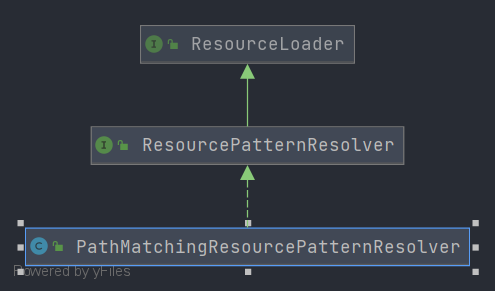

# Spring PathMatchingResourcePatternResolver
- 类全路径: `org.springframework.core.io.support.PathMatchingResourcePatternResolver`


- 类图

  


`PathMatchingResourcePatternResolver` 作为`ResourcePatternResolver`的实现类我们需要重点关注`Resource[] getResources(String locationPattern) throws IOException;`方法. 

不过在阅读`Resource[] getResources(String locationPattern) throws IOException;`方法之前我们需要对成员变量进行了解


## 成员变量

```java
public class PathMatchingResourcePatternResolver implements ResourcePatternResolver {
    
	/**
	 * org.eclipse.core.runtime.FileLocator#resolve 方法
	 */
	@Nullable
	private static Method equinoxResolveMethod;
    
    
	/**
	 * 资源加载器
	 */
	private final ResourceLoader resourceLoader;

	/**
	 * 正则匹配
	 */
	private PathMatcher pathMatcher = new AntPathMatcher();
}
```


- `equinoxResolveMethod` 被 `static` 修饰, 同样的在 `static` 代码块中有关于`equinoxResolveMethod`的初始化方式


- `equinoxResolveMethod` 的初始化

```java
static {
   try {
      // Detect Equinox OSGi (e.g. on WebSphere 6.1)
      Class<?> fileLocatorClass = ClassUtils.forName("org.eclipse.core.runtime.FileLocator",
            PathMatchingResourcePatternResolver.class.getClassLoader());
      equinoxResolveMethod = fileLocatorClass.getMethod("resolve", URL.class);
      logger.trace("Found Equinox FileLocator for OSGi bundle URL resolution");
   }
   catch (Throwable ex) {
      equinoxResolveMethod = null;
   }
}
```


### 方法分析

### getResources

- 方法签名: `org.springframework.core.io.support.PathMatchingResourcePatternResolver#getResources`

- 方法作用: 根据地址通配符(匹配符) 得到 资源列表


获取时分为两种情况. 

1. 参数以`classpath*:`开头

   <details>
       <summary>以 `classpath*:` 开头的处理</summary>

   
   ```java
   if (locationPattern.startsWith(CLASSPATH_ALL_URL_PREFIX)) {
      // a class path resource (multiple resources for same name possible)
      // 正则验证是否通过
      // 判断是否包含 * 和 ？
      if (getPathMatcher().isPattern(locationPattern.substring(CLASSPATH_ALL_URL_PREFIX.length()))) {
         // a class path resource pattern
         // 解析 locationPattern 转换成资源接口
         return findPathMatchingResources(locationPattern);
      }
      else {
         // all class path resources with the given name
         // 寻找所有资源路径
         return findAllClassPathResources(locationPattern.substring(CLASSPATH_ALL_URL_PREFIX.length()));
      }
   }
```
   
   </details>

2. 除`classpath*:`开头的参数外

   <details>
       <summary>非 classpath*: 开头</summary>
   
   
   
   
   
   ```java
   else {
      // Generally only look for a pattern after a prefix here,
      // and on Tomcat only after the "*/" separator for its "war:" protocol.
      // 前缀寻找模式
      // 查询 war * : 三种
      int prefixEnd = (locationPattern.startsWith("war:") ? locationPattern.indexOf("*/") + 1 :
            locationPattern.indexOf(':') + 1);
      if (getPathMatcher().isPattern(locationPattern.substring(prefixEnd))) {
         // a file pattern
         // 寻找匹配的资源路径
         return findPathMatchingResources(locationPattern);
      }
      else {
         // a single resource with the given name
         // 通过 ResourceLoader 解析得到这资源列表
         return new Resource[] {getResourceLoader().getResource(locationPattern)};
      }
   }
   ```


</details>


稍微总结一下这里需要处理那些内容. 

1. 地址以`classpath*:`开始的处理方式
   1. 地址中包含 `*` 和 `?`  使用 `findPathMatchingResources`方法进行搜索资源
   2. 不满足👆条件采取`findAllClassPathResources`方法进行搜索，即根据给定路径进行搜索
2. 地址不是以`classpath*:`开始的处理方式
   1. 地址中包含`war:` 后的处理`findPathMatchingResources`
   2. 不满足👆条件采取 ResourceLoader 进行获取


下面我们对`findPathMatchingResources`方法和`findAllClassPathResources`方法展开分析


### findPathMatchingResources

- 方法签名: `org.springframework.core.io.support.PathMatchingResourcePatternResolver#findPathMatchingResources`


- 方法作用: 查询匹配（资源地址匹配）的资源.


```java
protected Resource[] findPathMatchingResources(String locationPattern) throws IOException {
   // 确定 root 路径地址
   String rootDirPath = determineRootDir(locationPattern);
   // 切掉root地址留下真实地址
   String subPattern = locationPattern.substring(rootDirPath.length());

   // 第二部分
   // 获取 root 下的资源
   Resource[] rootDirResources = getResources(rootDirPath);
   Set<Resource> result = new LinkedHashSet<>(16);
   // 循环处理 root 下的资源对象
   for (Resource rootDirResource : rootDirResources) {
      // 解析资源
      // 目前而言spring没有做额外处理. 属于预留方法
      rootDirResource = resolveRootDirResource(rootDirResource);
      URL rootDirUrl = rootDirResource.getURL();
      /// 判断协议 是否是 bundle
      if (equinoxResolveMethod != null && rootDirUrl.getProtocol().startsWith("bundle")) {
         // equinoxResolveMethod 方法执行
         URL resolvedUrl = (URL) ReflectionUtils.invokeMethod(equinoxResolveMethod, null, rootDirUrl);
         if (resolvedUrl != null) {
            rootDirUrl = resolvedUrl;
         }
         // 解成 UrlResource 对象
         rootDirResource = new UrlResource(rootDirUrl);
      }
      // 协议是否是 vfs
      if (rootDirUrl.getProtocol().startsWith(ResourceUtils.URL_PROTOCOL_VFS)) {
         // 添加 vfs 相关资源
         result.addAll(VfsResourceMatchingDelegate.findMatchingResources(rootDirUrl, subPattern, getPathMatcher()));
      }
      // 协议是否是 jar
      else if (ResourceUtils.isJarURL(rootDirUrl) || isJarResource(rootDirResource)) {
         // 添加 jar 相关资源
         result.addAll(doFindPathMatchingJarResources(rootDirResource, rootDirUrl, subPattern));
      }
      else {
         // 文件协议处理
         result.addAll(doFindPathMatchingFileResources(rootDirResource, subPattern));
      }
   }
   if (logger.isTraceEnabled()) {
      logger.trace("Resolved location pattern [" + locationPattern + "] to resources " + result);
   }
   return result.toArray(new Resource[0]);
}
```


在处理资源对象时, 资源对象初始是接口在这里的for循环中会处理成具体的resource资源对象

在循环中会处理成下面几种类型的资源对象

1. `UrlResource`

   处理方法：`new UrlResource(rootDirUrl)`

2. `VfsResource`

   处理方法：`VfsResourceMatchingDelegate.findMatchingResources`

3. `FileSystemResource`

   处理方法：`doFindPathMatchingFileResources(rootDirResource, subPattern)`


- 有关源码细节可以阅读下面的文档


### doFindPathMatchingJarResources

- 方法签名: `org.springframework.core.io.support.PathMatchingResourcePatternResolver#doFindPathMatchingJarResources`	


```JAVA
protected Set<Resource> doFindPathMatchingJarResources(Resource rootDirResource, URL rootDirURL, String subPattern)
      throws IOException {

   URLConnection con = rootDirURL.openConnection();
   JarFile jarFile;
   String jarFileUrl;
   String rootEntryPath;
   boolean closeJarFile;

   // 是否是 jar 连接
   if (con instanceof JarURLConnection) {
      // Should usually be the case for traditional JAR files.
      JarURLConnection jarCon = (JarURLConnection) con;
      ResourceUtils.useCachesIfNecessary(jarCon);
      jarFile = jarCon.getJarFile();
      jarFileUrl = jarCon.getJarFileURL().toExternalForm();
      JarEntry jarEntry = jarCon.getJarEntry();
      rootEntryPath = (jarEntry != null ? jarEntry.getName() : "");
      closeJarFile = !jarCon.getUseCaches();
   }
   else {
      // No JarURLConnection -> need to resort to URL file parsing.
      // We'll assume URLs of the format "jar:path!/entry", with the protocol
      // being arbitrary as long as following the entry format.
      // We'll also handle paths with and without leading "file:" prefix.
      String urlFile = rootDirURL.getFile();
      try {
         // 确定是否是 war
         int separatorIndex = urlFile.indexOf(ResourceUtils.WAR_URL_SEPARATOR);
         if (separatorIndex == -1) {
            // 确定是否是 jar
            separatorIndex = urlFile.indexOf(ResourceUtils.JAR_URL_SEPARATOR);
         }
         // jar war 都不是的处理
         // 将 url 直接转换成 jarFile 对象
         if (separatorIndex != -1) {
            jarFileUrl = urlFile.substring(0, separatorIndex);
            rootEntryPath = urlFile.substring(separatorIndex + 2);  // both separators are 2 chars
            jarFile = getJarFile(jarFileUrl);
         }
         else {
            jarFile = new JarFile(urlFile);
            jarFileUrl = urlFile;
            rootEntryPath = "";
         }
         closeJarFile = true;
      }
      catch (ZipException ex) {
         if (logger.isDebugEnabled()) {
            logger.debug("Skipping invalid jar classpath entry [" + urlFile + "]");
         }
         return Collections.emptySet();
      }
   }

   try {
      if (logger.isTraceEnabled()) {
         logger.trace("Looking for matching resources in jar file [" + jarFileUrl + "]");
      }
      if (!"".equals(rootEntryPath) && !rootEntryPath.endsWith("/")) {
         // Root entry path must end with slash to allow for proper matching.
         // The Sun JRE does not return a slash here, but BEA JRockit does.
         rootEntryPath = rootEntryPath + "/";
      }
      Set<Resource> result = new LinkedHashSet<>(8);
      // 循环 jar file 得到资源对象
      for (Enumeration<JarEntry> entries = jarFile.entries(); entries.hasMoreElements();) {
         JarEntry entry = entries.nextElement();
         String entryPath = entry.getName();
         if (entryPath.startsWith(rootEntryPath)) {
            String relativePath = entryPath.substring(rootEntryPath.length());
            if (getPathMatcher().match(subPattern, relativePath)) {
               result.add(rootDirResource.createRelative(relativePath));
            }
         }
      }
      return result;
   }
   finally {
      if (closeJarFile) {
         jarFile.close();
      }
   }
}
```


### doFindPathMatchingFileResources

- 方法签名: `org.springframework.core.io.support.PathMatchingResourcePatternResolver#doFindPathMatchingFileResources`


```java
protected Set<Resource> doFindPathMatchingFileResources(Resource rootDirResource, String subPattern)
      throws IOException {

   File rootDir;
   try {
      // 绝对路径文件
      rootDir = rootDirResource.getFile().getAbsoluteFile();
   }
   catch (FileNotFoundException ex) {
      if (logger.isDebugEnabled()) {
         logger.debug("Cannot search for matching files underneath " + rootDirResource +
               " in the file system: " + ex.getMessage());
      }
      return Collections.emptySet();
   }
   catch (Exception ex) {
      if (logger.isInfoEnabled()) {
         logger.info("Failed to resolve " + rootDirResource + " in the file system: " + ex);
      }
      return Collections.emptySet();
   }
   // 查询匹配的文件系统资源
   return doFindMatchingFileSystemResources(rootDir, subPattern);
}
```


- 在`doFindMatchingFileSystemResources`中有一个文件`File`转换成`FileSystemResource`的方法


### doFindMatchingFileSystemResources

- 方法签名: `org.springframework.core.io.support.PathMatchingResourcePatternResolver#doFindMatchingFileSystemResources`


```java
protected Set<Resource> doFindMatchingFileSystemResources(File rootDir, String subPattern) throws IOException {
   if (logger.isTraceEnabled()) {
      logger.trace("Looking for matching resources in directory tree [" + rootDir.getPath() + "]");
   }
   // 搜索匹配文件
   Set<File> matchingFiles = retrieveMatchingFiles(rootDir, subPattern);
   Set<Resource> result = new LinkedHashSet<>(matchingFiles.size());
   for (File file : matchingFiles) {
      // 系统文件资源添加到结果容器
      result.add(new FileSystemResource(file));
   }
   return result;
}
```


在`doFindMatchingFileSystemResources`中的处理方式

1. 搜索匹配文件
2. 将 File 转换成 FileSystemResource


下面我们来详细了解搜索匹配文件的代码`retrieveMatchingFiles`


### retrieveMatchingFiles

- 方法签名: `org.springframework.core.io.support.PathMatchingResourcePatternResolver#retrieveMatchingFiles`


```JAVA
protected Set<File> retrieveMatchingFiles(File rootDir, String pattern) throws IOException {
   // 目录不能存在
   if (!rootDir.exists()) {
      // Silently skip non-existing directories.
      if (logger.isDebugEnabled()) {
         logger.debug("Skipping [" + rootDir.getAbsolutePath() + "] because it does not exist");
      }
      return Collections.emptySet();
   }
   // 不是目录
   if (!rootDir.isDirectory()) {
      // Complain louder if it exists but is no directory.
      if (logger.isInfoEnabled()) {
         logger.info("Skipping [" + rootDir.getAbsolutePath() + "] because it does not denote a directory");
      }
      return Collections.emptySet();
   }
   // 不可读
   if (!rootDir.canRead()) {
      if (logger.isInfoEnabled()) {
         logger.info("Skipping search for matching files underneath directory [" + rootDir.getAbsolutePath() +
               "] because the application is not allowed to read the directory");
      }
      return Collections.emptySet();
   }
   // 转换成全路径
   String fullPattern = StringUtils.replace(rootDir.getAbsolutePath(), File.separator, "/");
   if (!pattern.startsWith("/")) {
      fullPattern += "/";
   }
   // 转换成全路径
   fullPattern = fullPattern + StringUtils.replace(pattern, File.separator, "/");

   // 最终结果容器
   Set<File> result = new LinkedHashSet<>(8);
   // 搜索匹配的文件
   doRetrieveMatchingFiles(fullPattern, rootDir, result);
   return result;
}
```


在`retrieveMatchingFiles`中有下面几种情况返回空集合

1. 目录不存在
2. 不是目录
3. 不可读


- 最终的搜索匹配方式依靠`doRetrieveMatchingFiles`


### doRetrieveMatchingFiles

- 方法签名: `org.springframework.core.io.support.PathMatchingResourcePatternResolver#doRetrieveMatchingFiles`


```java
protected void doRetrieveMatchingFiles(String fullPattern, File dir, Set<File> result) throws IOException {
   if (logger.isTraceEnabled()) {
      logger.trace("Searching directory [" + dir.getAbsolutePath() +
            "] for files matching pattern [" + fullPattern + "]");
   }
   // 循环文件夹下的所有文件
   for (File content : listDirectory(dir)) {
      // 当前需要处理的文件路径
      String currPath = StringUtils.replace(content.getAbsolutePath(), File.separator, "/");
      // 当前文件 是否是目录
      // 当前文件是否是以 根路径开头
      if (content.isDirectory() && getPathMatcher().matchStart(fullPattern, currPath + "/")) {
         if (!content.canRead()) {
            if (logger.isDebugEnabled()) {
               logger.debug("Skipping subdirectory [" + dir.getAbsolutePath() +
                     "] because the application is not allowed to read the directory");
            }
         }
         else {
            // 递归查询文件夹下的文件
            doRetrieveMatchingFiles(fullPattern, content, result);
         }
      }
      // 匹配放入数据
      if (getPathMatcher().match(fullPattern, currPath)) {
         result.add(content);
      }
   }
}
```


