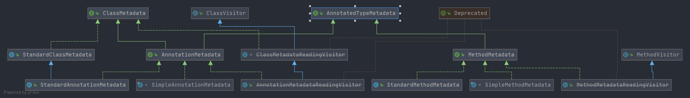

# Spring AnnotatedTypeMetadata
- 类全路径: `org.springframework.core.type.AnnotatedTypeMetadata`
- 类图
    
- `AnnotatedTypeMetadata` 接口主要用来描述 注解的元信息. 接下来对 `AnnotatedTypeMetadata` 进行方法说明


## 方法列表

```java

public interface AnnotatedTypeMetadata {

    /**
     * 获取所有注解
     */
    MergedAnnotations getAnnotations();

    /**
     * 是否有注解, 是否被参数注解修饰
     */
    default boolean isAnnotated(String annotationName) {
        return getAnnotations().isPresent(annotationName);
    }

    /**
     * 获取注解的属性
     */
    @Nullable
    default Map<String, Object> getAnnotationAttributes(String annotationName) {
        return getAnnotationAttributes(annotationName, false);
    }

    /**
	 * 获取注解属性表
     */
    @Nullable
    default Map<String, Object> getAnnotationAttributes(String annotationName,
            boolean classValuesAsString) {

        MergedAnnotation<Annotation> annotation = getAnnotations().get(annotationName,
                null, MergedAnnotationSelectors.firstDirectlyDeclared());
        if (!annotation.isPresent()) {
            return null;
        }
        return annotation.asAnnotationAttributes(Adapt.values(classValuesAsString, true));
    }

    /**
	 * 获取注解的属性表
     */
    @Nullable
    default MultiValueMap<String, Object> getAllAnnotationAttributes(String annotationName) {
        return getAllAnnotationAttributes(annotationName, false);
    }

    /**
	 * 获取注解属性表
     */
    @Nullable
    default MultiValueMap<String, Object> getAllAnnotationAttributes(
            String annotationName, boolean classValuesAsString) {

        Adapt[] adaptations = Adapt.values(classValuesAsString, true);
        return getAnnotations().stream(annotationName)
                .filter(MergedAnnotationPredicates.unique(MergedAnnotation::getMetaTypes))
                .map(MergedAnnotation::withNonMergedAttributes)
                .collect(MergedAnnotationCollectors.toMultiValueMap(map ->
                        map.isEmpty() ? null : map, adaptations));
    }

}
```