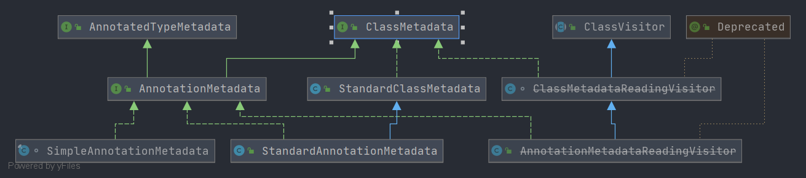

# Spring ClassMetadata
- 类全路径: `org.springframework.core.type.ClassMetadata`
- `ClassMetadata` 接口主要用来描述 类的元信息. 接下来对 `ClassMetadata` 进行方法说明
- 类图
    

## 方法列表


```java
public interface ClassMetadata {

    /**
     * 类名
     */
    String getClassName();

    /**
     * 是否是接口
     */
    boolean isInterface();

    /**
     * 是否是注解
     */
    boolean isAnnotation();

    /**
     * 是否是超类
     */
    boolean isAbstract();

    /**
     * 是否允许创建,实例化
     */
    default boolean isConcrete() {
        return !(isInterface() || isAbstract());
    }

    /**
     * 是否有final修饰
     */
    boolean isFinal();

    /**
     * 是否独立
     */
    boolean isIndependent();

    /**
     * 是否有内部类
     */
    default boolean hasEnclosingClass() {
        return (getEnclosingClassName() != null);
    }

    /**
     * 获取内部类名称
     */
    @Nullable
    String getEnclosingClassName();

    /**
     * 是否有父类
     */
    default boolean hasSuperClass() {
        return (getSuperClassName() != null);
    }

    /**
     * 父类名称
     */
    @Nullable
    String getSuperClassName();

    /**
     * 实现接口列表
     */
    String[] getInterfaceNames();

    /**
     * 成员列表
     */
    String[] getMemberClassNames();

}
```


简单概述方法实现思路: 由于是 `Class` 的元信息,必然少不了 Java Class 这个对象的调用. 通过调用 JDK带给我们的方法来实现这个接口. 


## 实现类分析
- 这里过期的类就不进行分析了

- AnnotationMetadata
    - SimpleAnnotationMetadata
    - StandardAnnotationMetadata
    - AnnotationMetadataReadingVisitor
- [Spring-StandardClassMetadata](./ClassMetadata/Spring-StandardClassMetadata.md)
    - StandardAnnotationMetadata
- ClassMetadataReadingVisitor
    - AnnotationMetadataReadingVisitor