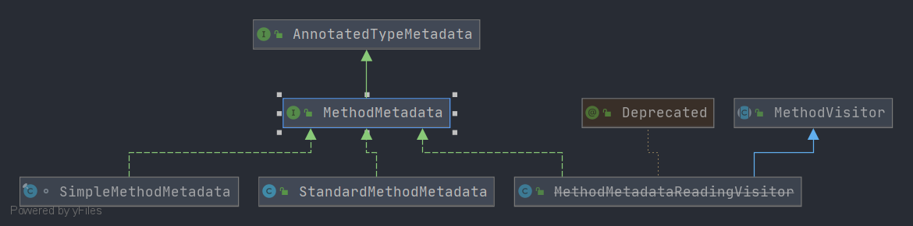

# Spring MethodMetadata
- 类全路径: `org.springframework.core.type.MethodMetadata`

- 类图
    
- `MethodMetadata` 主要用来描述 方法元信息 , 接下来对方法列表进行说明


## 方法列表

```java
public interface MethodMetadata extends AnnotatedTypeMetadata {

    /**
     * 方法名称
     */
    String getMethodName();

    /**
     * 方法全路径
     */
    String getDeclaringClassName();

    /**
     * 返回值类型
     */
    String getReturnTypeName();

    /**
     * 是不是 abstract 修饰
     */
    boolean isAbstract();

    /**
     * 是否 static 修饰
     */
    boolean isStatic();

    /**
     * 是否 final 修饰
     */
    boolean isFinal();

    /**
     * 是否重载
     */
    boolean isOverridable();

}
```