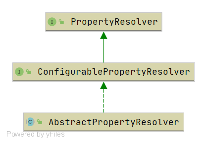

# Spring AbstractPropertyResolver
- 类全路径: `org.springframework.core.env.AbstractPropertyResolver`
- 类图



- 内部属性


```java
/**
 * 配置过的 转换服务
 */
@Nullable
private volatile ConfigurableConversionService conversionService;

/**
 * 占位符解析工具
 */
@Nullable
private PropertyPlaceholderHelper nonStrictHelper;

/**
 * 占位符解析工具
 */
@Nullable
private PropertyPlaceholderHelper strictHelper;

/**
 * 遇到无法解析的占位符是否需要抛出异常
 */
private boolean ignoreUnresolvableNestedPlaceholders = false;

/**
 * 前缀
 */
private String placeholderPrefix = SystemPropertyUtils.PLACEHOLDER_PREFIX;

/**
 * 后缀
 */
private String placeholderSuffix = SystemPropertyUtils.PLACEHOLDER_SUFFIX;

/**
 * 值分割符号
 */
@Nullable
private String valueSeparator = SystemPropertyUtils.VALUE_SEPARATOR;
```


`AbstractPropertyResolver` 的实现方法围绕上文提到的内部属性进行操作. 例如设置前缀


```java
@Override
public void setPlaceholderPrefix(String placeholderPrefix) {
   Assert.notNull(placeholderPrefix, "'placeholderPrefix' must not be null");
   this.placeholderPrefix = placeholderPrefix;
}
```


整体上这个类更多的是提供抽象方法和通用方法, 跟多细节交给子类去完成.例如下面这段代码

```java
@Override
@Nullable
public String getProperty(String key) {
   return getProperty(key, String.class);
}
```

- 执行路线
  - `org.springframework.core.env.PropertySourcesPropertyResolver#getProperty(java.lang.String)`
    - `org.springframework.core.env.PropertySourcesPropertyResolver#getProperty(java.lang.String, java.lang.Class<T>, boolean)`