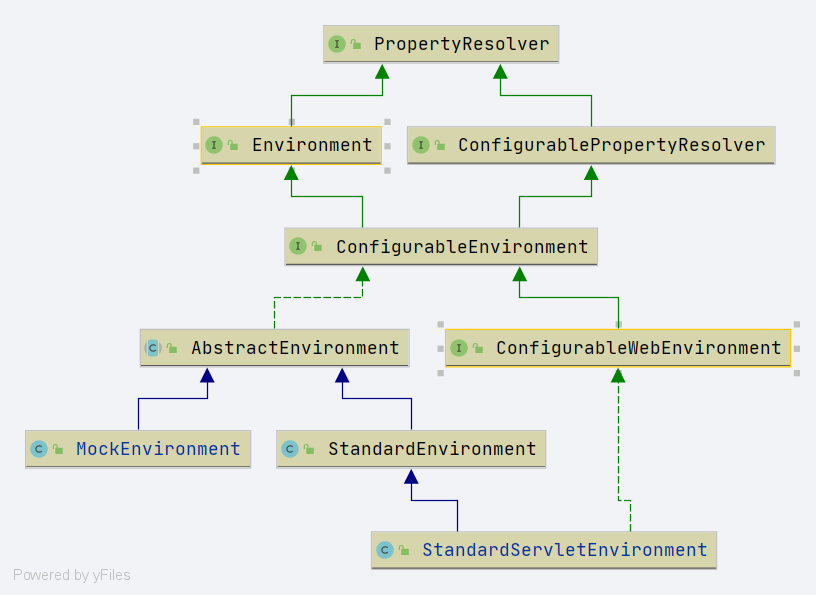

# Spring Environment
- Author: [HuiFer](https://github.com/huifer)
- 源码阅读仓库: [SourceHot-spring](https://github.com/SourceHot/spring-framework-read)


```java
public interface Environment extends PropertyResolver {

	/**
	 * Return the set of profiles explicitly made active for this environment. Profiles
	 * are used for creating logical groupings of bean definitions to be registered
	 * conditionally, for example based on deployment environment. Profiles can be
	 * activated by setting {@linkplain AbstractEnvironment#ACTIVE_PROFILES_PROPERTY_NAME
	 * "spring.profiles.active"} as a system property or by calling
	 * {@link ConfigurableEnvironment#setActiveProfiles(String...)}.
	 * <p>If no profiles have explicitly been specified as active, then any
	 * {@linkplain #getDefaultProfiles() default profiles} will automatically be activated.
	 *
	 * 获取已经激活的文件列表
	 * @see #getDefaultProfiles
	 * @see ConfigurableEnvironment#setActiveProfiles
	 * @see AbstractEnvironment#ACTIVE_PROFILES_PROPERTY_NAME
	 */
	String[] getActiveProfiles();

	/**
	 * Return the set of profiles to be active by default when no active profiles have
	 * been set explicitly.
	 * 获取默认的文件列表
	 * @see #getActiveProfiles
	 * @see ConfigurableEnvironment#setDefaultProfiles
	 * @see AbstractEnvironment#DEFAULT_PROFILES_PROPERTY_NAME
	 */
	String[] getDefaultProfiles();

	/**
	 * Return whether one or more of the given profiles is active or, in the case of no
	 * explicit active profiles, whether one or more of the given profiles is included in
	 * the set of default profiles. If a profile begins with '!' the logic is inverted,
	 * i.e. the method will return {@code true} if the given profile is <em>not</em> active.
	 * For example, {@code env.acceptsProfiles("p1", "!p2")} will return {@code true} if
	 * profile 'p1' is active or 'p2' is not active.
	 * @throws IllegalArgumentException if called with zero arguments
	 * or if any profile is {@code null}, empty, or whitespace only
	 * profiles 是否在 激活的 profile 中.
	 * @see #getActiveProfiles
	 * @see #getDefaultProfiles
	 * @see #acceptsProfiles(Profiles)
	 * @deprecated as of 5.1 in favor of {@link #acceptsProfiles(Profiles)}
	 */
	@Deprecated
	boolean acceptsProfiles(String... profiles);

	/**
	 * Return whether the {@linkplain #getActiveProfiles() active profiles}
	 * match the given {@link Profiles} predicate.
	 *
	 * profiles 是否激活
	 */
	boolean acceptsProfiles(Profiles profiles);

}
```


类图




