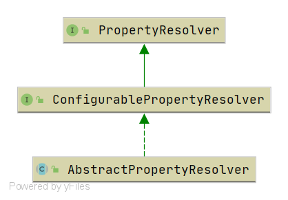

# Spring PropertyResolver 

- Author: [HuiFer](https://github.com/huifer)
- 源码阅读仓库: [SourceHot-spring](https://github.com/SourceHot/spring-framework-read)


- 类全路径: `org.springframework.core.env.PropertyResolver`

- 接口的主要作用是用来获取属性,有下面几种获取方式.
  1. 输入属性名称获取属性值.
  2. 输入属性名称+默认值获取属性值
  3. 输入属性名称+值类型获取属性值

```java
public interface PropertyResolver {

   /**
    * Return whether the given property key is available for resolution,
    * i.e. if the value for the given key is not {@code null}.
    *
    * 是否存在属性key
    */
   boolean containsProperty(String key);

   /**
    * Return the property value associated with the given key,
    * or {@code null} if the key cannot be resolved.
    *
    * 获取属性值
    * @param key the property name to resolve
    * @see #getProperty(String, String)
    * @see #getProperty(String, Class)
    * @see #getRequiredProperty(String)
    */
   @Nullable
   String getProperty(String key);

   /**
    * Return the property value associated with the given key, or
    * {@code defaultValue} if the key cannot be resolved.
    *
    * 获取属性值带默认值
    * @param key the property name to resolve
    * @param defaultValue the default value to return if no value is found
    * @see #getRequiredProperty(String)
    * @see #getProperty(String, Class)
    */
   String getProperty(String key, String defaultValue);

   /**
    * Return the property value associated with the given key,
    * or {@code null} if the key cannot be resolved.
    * 带有泛型的属性获取
    * @param key the property name to resolve
    * @param targetType the expected type of the property value
    * @see #getRequiredProperty(String, Class)
    */
   @Nullable
   <T> T getProperty(String key, Class<T> targetType);

   /**
    * Return the property value associated with the given key,
    * or {@code defaultValue} if the key cannot be resolved.
    * 泛型+默认值获取属性
    * @param key the property name to resolve
    * @param targetType the expected type of the property value
    * @param defaultValue the default value to return if no value is found
    * @see #getRequiredProperty(String, Class)
    */
   <T> T getProperty(String key, Class<T> targetType, T defaultValue);

   /**
    * Return the property value associated with the given key (never {@code null}).
    * @throws IllegalStateException if the key cannot be resolved
    * @see #getRequiredProperty(String, Class)
    */
   String getRequiredProperty(String key) throws IllegalStateException;

   /**
    * Return the property value associated with the given key, converted to the given
    * targetType (never {@code null}).
    * @throws IllegalStateException if the given key cannot be resolved
    */
   <T> T getRequiredProperty(String key, Class<T> targetType) throws IllegalStateException;

   /**
    * Resolve ${...} placeholders in the given text, replacing them with corresponding
    * property values as resolved by {@link #getProperty}. Unresolvable placeholders with
    * no default value are ignored and passed through unchanged.
    * @param text the String to resolve
    * @return the resolved String (never {@code null})
    * @throws IllegalArgumentException if given text is {@code null}
    * @see #resolveRequiredPlaceholders
    * @see org.springframework.util.SystemPropertyUtils#resolvePlaceholders(String)
    */
   String resolvePlaceholders(String text);

   /**
    * Resolve ${...} placeholders in the given text, replacing them with corresponding
    * property values as resolved by {@link #getProperty}. Unresolvable placeholders with
    * no default value will cause an IllegalArgumentException to be thrown.
    * @return the resolved String (never {@code null})
    * @throws IllegalArgumentException if given text is {@code null}
    * or if any placeholders are unresolvable
    * @see org.springframework.util.SystemPropertyUtils#resolvePlaceholders(String, boolean)
    */
   String resolveRequiredPlaceholders(String text) throws IllegalArgumentException;

}
```


类图


## 寻找入口

- 通过查询 `containsProperty` 有哪些类实现了,有如下几个类.(绿色是测试类)


- 进入到 `org.springframework.core.env.AbstractEnvironment#containsProperty`看到如下代码

  ```java
  @Override
  public boolean containsProperty(String key) {
     return this.propertyResolver.containsProperty(key);
  }
  ```

  成员变量`propertyResolver`在调用`containsProperty`方法. 此时我们关注到代码

  ```java
  private final ConfigurablePropertyResolver propertyResolver =
        new PropertySourcesPropertyResolver(this.propertySources);
  ```


- 到这一步我们发现了`PropertySourcesPropertyResolver`和`MutablePropertySources`两个关键信息. 接下来的内容将是围绕这两个类的展开
- [PropertySourcesPropertyResolver](./Spring-PropertySourcesPropertyResolver.md)


- [MutablePropertySources 解析](./Spring-PropertySources.md)


在这里还需要关注接口: **ConfigurablePropertyResolver**


## PropertySourcesPropertyResolver

- 全路径: `org.springframework.core.env.PropertySourcesPropertyResolver`

- 类图




- 内部属性

  ```java
  @Nullable
  private final PropertySources propertySources;
  ```


关于 PropertySources 的操作就具体讲解了, 详细内容在[PropertySource](/doc/env/PropertyResolver)


### getProperty

- `org.springframework.core.env.PropertySourcesPropertyResolver#getProperty(java.lang.String, java.lang.Class<T>, boolean)`


```java
@Nullable
protected <T> T getProperty(String key, Class<T> targetValueType, boolean resolveNestedPlaceholders) {
   if (this.propertySources != null) {
      // 循环
      for (PropertySource<?> propertySource : this.propertySources) {
         if (logger.isTraceEnabled()) {
            logger.trace("Searching for key '" + key + "' in PropertySource '" +
                  propertySource.getName() + "'");
         }
         // 获取对象结果
         Object value = propertySource.getProperty(key);
         if (value != null) {
            // 是否需要处理嵌套
            // 是否是 string 类型
            if (resolveNestedPlaceholders && value instanceof String) {
               // 嵌套获取数据
               value = resolveNestedPlaceholders((String) value);
            }
            // 日志
            logKeyFound(key, propertySource, value);
            // 类型转换
            return convertValueIfNecessary(value, targetValueType);
         }
      }
   }
   if (logger.isTraceEnabled()) {
      logger.trace("Could not find key '" + key + "' in any property source");
   }
   return null;
}
```


这个类的解析详情: [PropertySourcesPropertyResolver](./Spring-PropertySourcesPropertyResolver.md)

