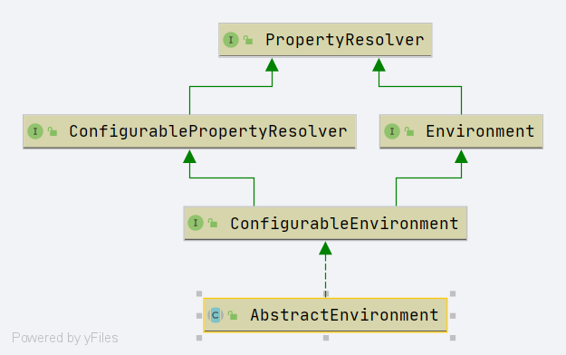

# Spring AbstractEnvironment
- 类全路径: `org.springframework.core.env.AbstractEnvironment`

- 类图



## 类属性


```java
/**
 * System property that instructs Spring to ignore system environment variables,
 * i.e. to never attempt to retrieve such a variable via {@link System#getenv()}.
 * <p>The default is "false", falling back to system environment variable checks if a
 * Spring environment property (e.g. a placeholder in a configuration String) isn't
 * resolvable otherwise. Consider switching this flag to "true" if you experience
 * log warnings from {@code getenv} calls coming from Spring, e.g. on WebSphere
 * with strict SecurityManager settings and AccessControlExceptions warnings.
 *
 * Spring 忽略的系统变量
 * @see #suppressGetenvAccess()
 */
public static final String IGNORE_GETENV_PROPERTY_NAME = "spring.getenv.ignore";

/**
 * Name of property to set to specify active profiles: {@value}. Value may be comma
 * delimited.
 * <p>Note that certain shell environments such as Bash disallow the use of the period
 * character in variable names. Assuming that Spring's {@link SystemEnvironmentPropertySource}
 * is in use, this property may be specified as an environment variable as
 * {@code SPRING_PROFILES_ACTIVE}.
 * @see ConfigurableEnvironment#setActiveProfiles
 */
public static final String ACTIVE_PROFILES_PROPERTY_NAME = "spring.profiles.active";

/**
 * Name of property to set to specify profiles active by default: {@value}. Value may
 * be comma delimited.
 * <p>Note that certain shell environments such as Bash disallow the use of the period
 * character in variable names. Assuming that Spring's {@link SystemEnvironmentPropertySource}
 * is in use, this property may be specified as an environment variable as
 * {@code SPRING_PROFILES_DEFAULT}.
 * @see ConfigurableEnvironment#setDefaultProfiles
 */
public static final String DEFAULT_PROFILES_PROPERTY_NAME = "spring.profiles.default";

/**
 * Name of reserved default profile name: {@value}. If no default profile names are
 * explicitly and no active profile names are explicitly set, this profile will
 * automatically be activated by default.
 * @see #getReservedDefaultProfiles
 * @see ConfigurableEnvironment#setDefaultProfiles
 * @see ConfigurableEnvironment#setActiveProfiles
 * @see AbstractEnvironment#DEFAULT_PROFILES_PROPERTY_NAME
 * @see AbstractEnvironment#ACTIVE_PROFILES_PROPERTY_NAME
 */
protected static final String RESERVED_DEFAULT_PROFILE_NAME = "default";


protected final Log logger = LogFactory.getLog(getClass());

/**
 * 激活的 profile
 */
private final Set<String> activeProfiles = new LinkedHashSet<>();

/**
 * 默认的 profile
 */
private final Set<String> defaultProfiles = new LinkedHashSet<>(getReservedDefaultProfiles());

/**
 * 属性源集合
 */
private final MutablePropertySources propertySources = new MutablePropertySources();
```


## 方法


### customizePropertySources

- 抽象方法
- 自动移除颗粒 PropertySources


```java
protected void customizePropertySources(MutablePropertySources propertySources) {
}
```


### getReservedDefaultProfiles

- 抽象方法

- 获取默认的 profile 名称

```java
protected Set<String> getReservedDefaultProfiles() {
   return Collections.singleton(RESERVED_DEFAULT_PROFILE_NAME);
}
```


### getActiveProfiles

- 获取激活的 prifile name


```java
public String[] getActiveProfiles() {
   return StringUtils.toStringArray(doGetActiveProfiles());
}
```


### doGetActiveProfiles

- 获取激活的 profile 


```java
protected Set<String> doGetActiveProfiles() {
   synchronized (this.activeProfiles) {
      if (this.activeProfiles.isEmpty()) {
         // 通过 PropertySourcesPropertyResolver 获取prfiles
         String profiles = getProperty(ACTIVE_PROFILES_PROPERTY_NAME);
         if (StringUtils.hasText(profiles)) {
            // 设置 profile
            // 1. 按照逗号切分
            // 2. 设置
            setActiveProfiles(StringUtils.commaDelimitedListToStringArray(
                  StringUtils.trimAllWhitespace(profiles)));
         }
      }
      return this.activeProfiles;
   }
}
```


### setActiveProfiles

- 设置 激活的 profile 

```java
@Override
public void setActiveProfiles(String... profiles) {
   Assert.notNull(profiles, "Profile array must not be null");
   if (logger.isDebugEnabled()) {
      logger.debug("Activating profiles " + Arrays.asList(profiles));
   }
   synchronized (this.activeProfiles) {
      this.activeProfiles.clear();
      for (String profile : profiles) {
         // profile 验证
         validateProfile(profile);
         this.activeProfiles.add(profile);
      }
   }
}
```


### validateProfile

- 验证profile是否合法

```java
protected void validateProfile(String profile) {
   // 是否存在
   if (!StringUtils.hasText(profile)) {
      throw new IllegalArgumentException("Invalid profile [" + profile + "]: must contain text");
   }
   // 是否有 !
   if (profile.charAt(0) == '!') {
      throw new IllegalArgumentException("Invalid profile [" + profile + "]: must not begin with ! operator");
   }
}
```


### addActiveProfile

- 添加激活的profile


```java
@Override
public void addActiveProfile(String profile) {
   if (logger.isDebugEnabled()) {
      logger.debug("Activating profile '" + profile + "'");
   }
   // 验证
   validateProfile(profile);
   // 设置 profile
   doGetActiveProfiles();
   synchronized (this.activeProfiles) {
      // 添加 profile
      this.activeProfiles.add(profile);
   }
}
```


### getDefaultProfiles

- 获取默认的profile


```java
@Override
public String[] getDefaultProfiles() {
   return StringUtils.toStringArray(doGetDefaultProfiles());
}
```


### doGetDefaultProfiles

- 获取默认的profile


```java
protected Set<String> doGetDefaultProfiles() {
   synchronized (this.defaultProfiles) {
      // 1. 获取默认的 profile
      if (this.defaultProfiles.equals(getReservedDefaultProfiles())) {
         String profiles = getProperty(DEFAULT_PROFILES_PROPERTY_NAME);
         if (StringUtils.hasText(profiles)) {
            // 设置默认的 profile
            setDefaultProfiles(StringUtils.commaDelimitedListToStringArray(
                  StringUtils.trimAllWhitespace(profiles)));
         }
      }
      return this.defaultProfiles;
   }
}
```


### setDefaultProfiles

- 设置默认的 profile 

```java
@Override
public void setDefaultProfiles(String... profiles) {
   Assert.notNull(profiles, "Profile array must not be null");
   synchronized (this.defaultProfiles) {
      this.defaultProfiles.clear();
      for (String profile : profiles) {
         // 验证
         validateProfile(profile);
         this.defaultProfiles.add(profile);
      }
   }
}
```


### acceptsProfiles

- profiles 是否在 激活的 profile 中.


```java
@Override
@Deprecated
public boolean acceptsProfiles(String... profiles) {
   Assert.notEmpty(profiles, "Must specify at least one profile");
   for (String profile : profiles) {
      if (StringUtils.hasLength(profile) && profile.charAt(0) == '!') {
         // 判断是否激活
         if (!isProfileActive(profile.substring(1))) {
            return true;
         }
      }
      else if (isProfileActive(profile)) {
         return true;
      }
   }
   return false;
}
```


### isProfileActive

- 是否激活

```java
protected boolean isProfileActive(String profile) {
   validateProfile(profile);
   // 当前激活的profile
   Set<String> currentActiveProfiles = doGetActiveProfiles();
   // 当前激活的profile 中是否包含 参数profile
   // 当前激活的 profile 是否为空
   // 当前激活的profile 中是否包含 参数profile
   return (currentActiveProfiles.contains(profile) ||
         (currentActiveProfiles.isEmpty() && doGetDefaultProfiles().contains(profile)));
}
```


### getSystemProperties

- 获取系统属性

```java
@Override
@SuppressWarnings({"rawtypes", "unchecked"})
public Map<String, Object> getSystemProperties() {
   try {
      // 获取系统属性
      return (Map) System.getProperties();
   }
   catch (AccessControlException ex) {
      return (Map) new ReadOnlySystemAttributesMap() {
         @Override
         @Nullable
         protected String getSystemAttribute(String attributeName) {
            try {
               // 获取系统属性
               return System.getProperty(attributeName);
            }
            catch (AccessControlException ex) {
               if (logger.isInfoEnabled()) {
                  logger.info("Caught AccessControlException when accessing system property '" +
                        attributeName + "'; its value will be returned [null]. Reason: " + ex.getMessage());
               }
               return null;
            }
         }
      };
   }
}
```


### getSystemEnvironment

- 读取系统环境

```java
@Override
@SuppressWarnings({"rawtypes", "unchecked"})
public Map<String, Object> getSystemEnvironment() {
   if (suppressGetenvAccess()) {
      return Collections.emptyMap();
   }
   try {
      return (Map) System.getenv();
   }
   catch (AccessControlException ex) {
      return (Map) new ReadOnlySystemAttributesMap() {
         @Override
         @Nullable
         protected String getSystemAttribute(String attributeName) {
            try {
               return System.getenv(attributeName);
            }
            catch (AccessControlException ex) {
               if (logger.isInfoEnabled()) {
                  logger.info("Caught AccessControlException when accessing system environment variable '" +
                        attributeName + "'; its value will be returned [null]. Reason: " + ex.getMessage());
               }
               return null;
            }
         }
      };
   }
}
```


### suppressGetenvAccess

- 读取spring中spring.getenv.ignore的属性

```java
protected boolean suppressGetenvAccess() {
   // 读取spring中spring.getenv.ignore的属性
   return SpringProperties.getFlag(IGNORE_GETENV_PROPERTY_NAME);
}
```


### merge

- 合并属性

```java
@Override
public void merge(ConfigurableEnvironment parent) {
   for (PropertySource<?> ps : parent.getPropertySources()) {
      if (!this.propertySources.contains(ps.getName())) {
         this.propertySources.addLast(ps);
      }
   }
   String[] parentActiveProfiles = parent.getActiveProfiles();
   if (!ObjectUtils.isEmpty(parentActiveProfiles)) {
      synchronized (this.activeProfiles) {
         Collections.addAll(this.activeProfiles, parentActiveProfiles);
      }
   }
   String[] parentDefaultProfiles = parent.getDefaultProfiles();
   if (!ObjectUtils.isEmpty(parentDefaultProfiles)) {
      synchronized (this.defaultProfiles) {
         this.defaultProfiles.remove(RESERVED_DEFAULT_PROFILE_NAME);
         Collections.addAll(this.defaultProfiles, parentDefaultProfiles);
      }
   }
}
```


- 在该类中还有其他的方法主要围绕`ConfigurablePropertyResolver`接口做处理.