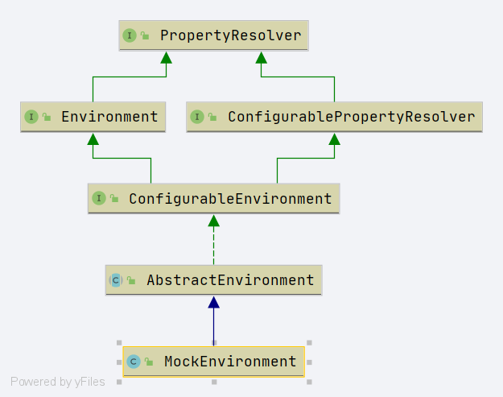

# Spring MockEnvironment 
- 类全路径: `org.springframework.mock.env.MockEnvironment`

- 类图




```java

public class MockEnvironment extends AbstractEnvironment {

	/**
	 * mock 属性表
	 */
	private final MockPropertySource propertySource = new MockPropertySource();

	/**
	 * Create a new {@code MockEnvironment} with a single {@link MockPropertySource}.
	 */
	public MockEnvironment() {
		// 获取属性对象添加
		getPropertySources().addLast(this.propertySource);
	}

	/**
	 * Set a property on the underlying {@link MockPropertySource} for this environment.
	 */
	public void setProperty(String key, String value) {
		// 属性对象添加 k v 
		this.propertySource.setProperty(key, value);
	}

	/**
	 * Convenient synonym for {@link #setProperty} that returns the current instance.
	 * Useful for method chaining and fluent-style use.
	 * @return this {@link MockEnvironment} instance
	 * @see MockPropertySource#withProperty
	 */
	public MockEnvironment withProperty(String key, String value) {
		// 属性对象添加 k v 
		this.setProperty(key, value);
		return this;
	}

}
```