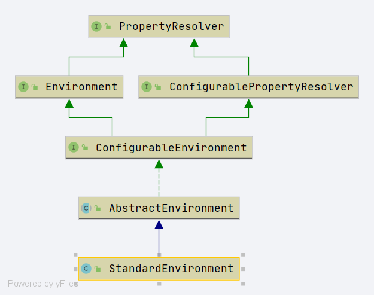

# Spring StandardEnvironment
- 类全路径: `org.springframework.core.env.StandardEnvironment`


- 类图


## customizePropertySources 
- 处理属性源
    1. 获取 system property 放入资源对象
    1. 获取 system environment 放入资源对象
    
```java

	@Override
	protected void customizePropertySources(MutablePropertySources propertySources) {
		propertySources.addLast(
				new PropertiesPropertySource(SYSTEM_PROPERTIES_PROPERTY_SOURCE_NAME, getSystemProperties()));
		propertySources.addLast(
				new SystemEnvironmentPropertySource(SYSTEM_ENVIRONMENT_PROPERTY_SOURCE_NAME, getSystemEnvironment()));
	}

```