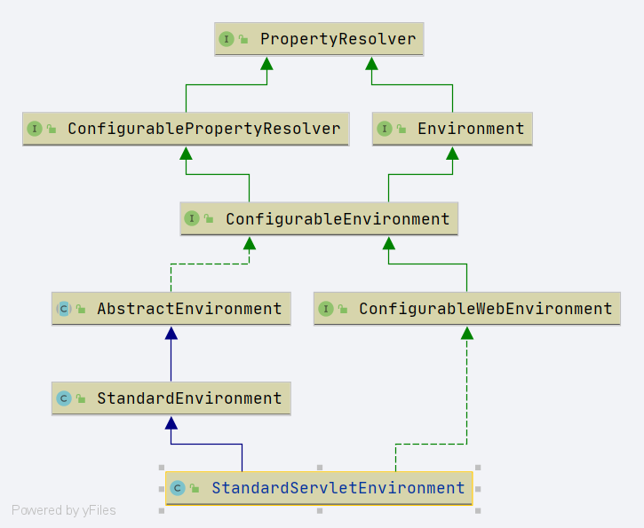

# Spring StandardServletEnvironment
- 类全路径: `org.springframework.web.context.support.StandardServletEnvironment`

- 类图


```java
public class StandardServletEnvironment extends StandardEnvironment implements ConfigurableWebEnvironment {

	/** Servlet context init parameters property source name: {@value}. */
	public static final String SERVLET_CONTEXT_PROPERTY_SOURCE_NAME = "servletContextInitParams";

	/** Servlet config init parameters property source name: {@value}. */
	public static final String SERVLET_CONFIG_PROPERTY_SOURCE_NAME = "servletConfigInitParams";

	/** JNDI property source name: {@value}. */
	public static final String JNDI_PROPERTY_SOURCE_NAME = "jndiProperties";


	@Override
	protected void customizePropertySources(MutablePropertySources propertySources) {
		// 添加属性对象, 注意值为空
		propertySources.addLast(new StubPropertySource(SERVLET_CONFIG_PROPERTY_SOURCE_NAME));
		// 添加属性对象, 注意值为空
		propertySources.addLast(new StubPropertySource(SERVLET_CONTEXT_PROPERTY_SOURCE_NAME));

		// 是否是 jndi 默认的激活环境
		// jndi -> java name directory interface
		if (JndiLocatorDelegate.isDefaultJndiEnvironmentAvailable()) {
			// 添加属性
			propertySources.addLast(new JndiPropertySource(JNDI_PROPERTY_SOURCE_NAME));
		}
		// 调用父类
		super.customizePropertySources(propertySources);
	}

	/**
	 * 初始化 属性值
	 */
	@Override
	public void initPropertySources(@Nullable ServletContext servletContext, @Nullable ServletConfig servletConfig) {
		WebApplicationContextUtils.initServletPropertySources(getPropertySources(), servletContext, servletConfig);
	}

}
```


- 详细方法

```java
	public static void initServletPropertySources(MutablePropertySources sources,
			@Nullable ServletContext servletContext, @Nullable ServletConfig servletConfig) {

		Assert.notNull(sources, "'propertySources' must not be null");
		String name = StandardServletEnvironment.SERVLET_CONTEXT_PROPERTY_SOURCE_NAME;
		if (servletContext != null && sources.contains(name) && sources.get(name) instanceof StubPropertySource) {
			sources.replace(name, new ServletContextPropertySource(name, servletContext));
		}
		name = StandardServletEnvironment.SERVLET_CONFIG_PROPERTY_SOURCE_NAME;
		if (servletConfig != null && sources.contains(name) && sources.get(name) instanceof StubPropertySource) {
			sources.replace(name, new ServletConfigPropertySource(name, servletConfig));
		}
	}

```