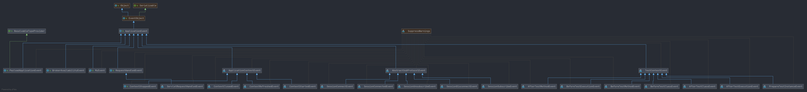
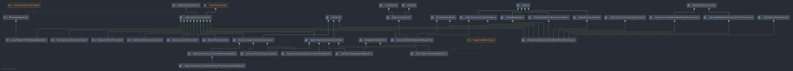

# Spring Event 阅读指南

- 资料: https://docs.spring.io/spring-framework/docs/current/reference/html/core.html#context-functionality-events

- 作者: [Huifer](https://github.com/huifer)

## 核心类

1. ApplicationEvent: 事件对象
1. ApplicationListener: 事件监听器
1. ApplicationEventPublisher: 事件发布者


## Spring 所提供的事件类

- 资料来自: https://docs.spring.io/spring-framework/docs/current/reference/html/core.html#context-functionality-events

| Event                        | Explanation                                                  | 作用                                 |
| :--------------------------- | :----------------------------------------------------------- | ------------------------------------ |
| `ContextRefreshedEvent`      | Published when the `ApplicationContext` is initialized or refreshed (for example, by using the `refresh()` method on the `ConfigurableApplicationContext` interface). Here, “initialized” means that all beans are loaded, post-processor beans are detected and activated, singletons are pre-instantiated, and the `ApplicationContext` object is ready for use. As long as the context has not been closed, a refresh can be triggered multiple times, provided that the chosen `ApplicationContext` actually supports such “hot” refreshes. For example, `XmlWebApplicationContext` supports hot refreshes, but `GenericApplicationContext` does not. | 上下文刷新事件                       |
| `ContextStartedEvent`        | Published when the `ApplicationContext` is started by using the `start()` method on the `ConfigurableApplicationContext` interface. Here, “started” means that all `Lifecycle` beans receive an explicit start signal. Typically, this signal is used to restart beans after an explicit stop, but it may also be used to start components that have not been configured for autostart (for example, components that have not already started on initialization). | 上下文初始化事件                     |
| `ContextStoppedEvent`        | Published when the `ApplicationContext` is stopped by using the `stop()` method on the `ConfigurableApplicationContext` interface. Here, “stopped” means that all `Lifecycle` beans receive an explicit stop signal. A stopped context may be restarted through a `start()` call. | 上下文停止事件                       |
| `ContextClosedEvent`         | Published when the `ApplicationContext` is being closed by using the `close()` method on the `ConfigurableApplicationContext` interface or via a JVM shutdown hook. Here, "closed" means that all singleton beans will be destroyed. Once the context is closed, it reaches its end of life and cannot be refreshed or restarted. | 上下文关闭事件                       |
| `RequestHandledEvent`        | A web-specific event telling all beans that an HTTP request has been serviced. This event is published after the request is complete. This event is only applicable to web applications that use Spring’s `DispatcherServlet`. | 请求处理事件                         |
| `ServletRequestHandledEvent` | A subclass of `RequestHandledEvent` that adds Servlet-specific context information. | 对于 `RequestHandledEvent`的增强事件 |


## 阅读事件相关源码

- 首先我们对核心类进行基本分析， 事件一般包括事件本体、事件处理者、事件发布者. Spring 中的事件核心类如何和前三者进行映射
  1. ApplicationEvent: 事件本体
  1. ApplicationListener: 事件处理者
  1. ApplicationEventPublisher: 事件发布者

### ApplicationEvent

首先我们来看 `ApplicationEvent` 

下面是一张关于 `ApplicationEvent` 的类图




看一下`ApplicationEvent`成员变量的信息

1. `timestamp`： 事件发生的时间戳
2. `source`: 事件传递的信息 (由 JDK 中 `EventObject` 提供)


### ApplicationListener

其次我们来看`ApplicationListener`对象

这是一个处理事件的接口， 详细代码如下

```java
@FunctionalInterface
public interface ApplicationListener<E extends ApplicationEvent> extends EventListener {

   /**
    * Handle an application event.
    * 处理事件
    * @param event the event to respond to
    */
   void onApplicationEvent(E event);

}
```





- 在这产生一个疑问: 这么多实现类如何找到对应的事件和事件处理类
  - 从 `ApplicationListener` 的泛型上可以得到一定的信息. 比如我需要查询`ContextRefreshedEvent`的事件处理有哪些形式，那么我们只需要去搜索 `ApplicationListener<ContextRefreshedEvent>` 在那些地方出现即可


`org.springframework.web.servlet.resource.ResourceUrlProvider#onApplicationEvent` 实现


```java
@Override
public void onApplicationEvent(ContextRefreshedEvent event) {
   if (isAutodetect()) {
      this.handlerMap.clear();
      detectResourceHandlers(event.getApplicationContext());
      if (!this.handlerMap.isEmpty()) {
         this.autodetect = false;
      }
   }
}
```


- 其他的事件和事件处理类也通过同样的方式进行搜索即可


### ApplicationEventPublisher

- 最后我们来看`ApplicationEventPublisher` 事件发布者

```java
@FunctionalInterface
public interface ApplicationEventPublisher {

   /**
    * 推送事件
    */
   default void publishEvent(ApplicationEvent event) {
      publishEvent((Object) event);
   }

   /**
    * 推送事件
    */
   void publishEvent(Object event);

}
```


### ApplicationEventMulticaster

- 处理事件的核心类


```
public interface ApplicationEventMulticaster {

   /**
    * 添加应用监听器
    */
   void addApplicationListener(ApplicationListener<?> listener);

   /**
    * 添加应用监听器的名称
    */
   void addApplicationListenerBean(String listenerBeanName);

   /**
    * 移除一个应用监听器
    */
   void removeApplicationListener(ApplicationListener<?> listener);

   /**
    * 移除一个应用监听器的名称
    */
   void removeApplicationListenerBean(String listenerBeanName);

   /**
    * 移除所有的应用监听器
    */
   void removeAllListeners();

   /**
    * 广播事件
    */
   void multicastEvent(ApplicationEvent event);

   /**
    * 广播事件
    */
   void multicastEvent(ApplicationEvent event, @Nullable ResolvableType eventType);

}
```


前几个方法不是很重要 宅这里着重对 **广播事件** 方法进行分析


- 核心逻辑就是从容器中找到 事件对应的处理器列表(ApplicationListener) , 循环处理每个事件

```java
@Override
public void multicastEvent(final ApplicationEvent event, @Nullable ResolvableType eventType) {
   ResolvableType type = (eventType != null ? eventType : resolveDefaultEventType(event));
   Executor executor = getTaskExecutor();
   for (ApplicationListener<?> listener : getApplicationListeners(event, type)) {
      if (executor != null) {
         executor.execute(() -> invokeListener(listener, event));
      }
      else {
         invokeListener(listener, event);
      }
   }
}
```


- `doInvokeListener` 执行`ApplicationListener` 方法


```java
@SuppressWarnings({"rawtypes", "unchecked"})
private void doInvokeListener(ApplicationListener listener, ApplicationEvent event) {
   try {
      listener.onApplicationEvent(event);
   }
   catch (ClassCastException ex) {
      String msg = ex.getMessage();
      if (msg == null || matchesClassCastMessage(msg, event.getClass())) {
         // Possibly a lambda-defined listener which we could not resolve the generic event type for
         // -> let's suppress the exception and just log a debug message.
         Log logger = LogFactory.getLog(getClass());
         if (logger.isTraceEnabled()) {
            logger.trace("Non-matching event type for listener: " + listener, ex);
         }
      }
      else {
         throw ex;
      }
   }
}
```


到此 Spring-Event 相关的整体流程分析完成, 细节方法等待笔者后续的文字吧


## 其他

- 仓库地址
  - [GitHub](https://github.com/huifer/spring-analysis)
  - [Gitee](https://gitee.com/pychfarm_admin/spring-analysis)