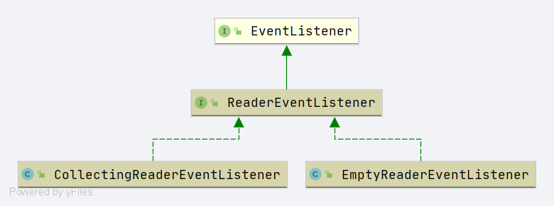

# Spring ReaderEventListener


- 全路径: `org.springframework.beans.factory.parsing.ReaderEventListener`


```java
public interface ReaderEventListener extends EventListener {

   /**
    * Notification that the given defaults has been registered.
    *
    * 默认 bean definition 注册
    * @param defaultsDefinition a descriptor for the defaults
    *
    * @see org.springframework.beans.factory.xml.DocumentDefaultsDefinition
    */
   void defaultsRegistered(DefaultsDefinition defaultsDefinition);

   /**
    * Notification that the given component has been registered.
    * component 注册
    * @param componentDefinition a descriptor for the new component
    *
    * @see BeanComponentDefinition
    */
   void componentRegistered(ComponentDefinition componentDefinition);

   /**
    * Notification that the given alias has been registered.
    *
    * 别名事件触发
    *
    * @param aliasDefinition a descriptor for the new alias
    */
      void aliasRegistered(AliasDefinition aliasDefinition);

   /**
    * Notification that the given import has been processed.
    * <p>
    * import 事件触发, 通知执行 import 事件
    *
    * @param importDefinition a descriptor for the import
    */
   void importProcessed(ImportDefinition importDefinition);

}
```


类图




## EmptyReaderEventListener

- 空实现


```java
public class EmptyReaderEventListener implements ReaderEventListener {

   @Override
   public void defaultsRegistered(DefaultsDefinition defaultsDefinition) {
      // no-op
   }

   @Override
   public void componentRegistered(ComponentDefinition componentDefinition) {
      // no-op
   }

   @Override
   public void aliasRegistered(AliasDefinition aliasDefinition) {
      // no-op
   }

   @Override
   public void importProcessed(ImportDefinition importDefinition) {
      // no-op
   }

}
```


## CollectingReaderEventListener


```java
public class CollectingReaderEventListener implements ReaderEventListener {

   private final List<DefaultsDefinition> defaults = new LinkedList<>();

   /**
    * key: beanName
    * value:{@link ComponentDefinition}
    */
   private final Map<String, ComponentDefinition> componentDefinitions = new LinkedHashMap<>(8);

   /**
    * key: beanName
    * value: 别名定义列表
    */
   private final Map<String, List<AliasDefinition>> aliasMap = new LinkedHashMap<>(8);

   /**
    * import 定义列表
    */
   private final List<ImportDefinition> imports = new LinkedList<>();


   @Override
   public void defaultsRegistered(DefaultsDefinition defaultsDefinition) {
      this.defaults.add(defaultsDefinition);
   }

   public List<DefaultsDefinition> getDefaults() {
      return Collections.unmodifiableList(this.defaults);
   }

   @Override
   public void componentRegistered(ComponentDefinition componentDefinition) {
      this.componentDefinitions.put(componentDefinition.getName(), componentDefinition);
   }

   public ComponentDefinition getComponentDefinition(String name) {
      return this.componentDefinitions.get(name);
   }

   public ComponentDefinition[] getComponentDefinitions() {
      Collection<ComponentDefinition> collection = this.componentDefinitions.values();
      return collection.toArray(new ComponentDefinition[collection.size()]);
   }

   @Override
   public void aliasRegistered(AliasDefinition aliasDefinition) {
      // 获取已经注册过的beanName对应的别名
      List<AliasDefinition> aliases = this.aliasMap.get(aliasDefinition.getBeanName());
      if (aliases == null) {
         aliases = new ArrayList<>();
         // beanName 和 别名对应关系设置
         this.aliasMap.put(aliasDefinition.getBeanName(), aliases);
      }
      // 别名列表添加
      aliases.add(aliasDefinition);
   }

   public List<AliasDefinition> getAliases(String beanName) {
      List<AliasDefinition> aliases = this.aliasMap.get(beanName);
      return (aliases != null ? Collections.unmodifiableList(aliases) : null);
   }

   @Override
   public void importProcessed(ImportDefinition importDefinition) {
      this.imports.add(importDefinition);
   }

   public List<ImportDefinition> getImports() {
      return Collections.unmodifiableList(this.imports);
   }

}
```