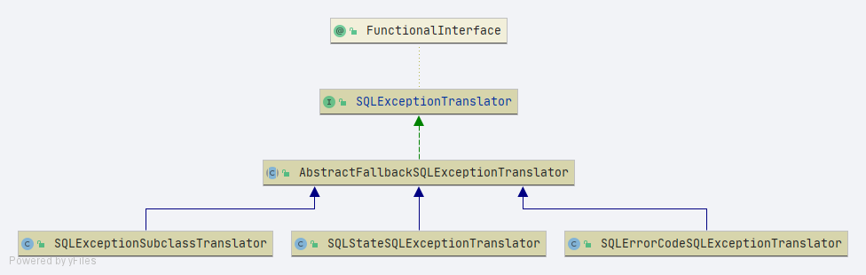

# Spring SQLExceptionTranslator 
- 类全路径: `org.springframework.jdbc.support.SQLExceptionTranslator`
- sql 异常转换接口


```java
@FunctionalInterface
public interface SQLExceptionTranslator {

	/**
	 * Translate the given {@link SQLException} into a generic {@link DataAccessException}.
	 * <p>The returned DataAccessException is supposed to contain the original
	 * {@code SQLException} as root cause. However, client code may not generally
	 * rely on this due to DataAccessExceptions possibly being caused by other resource
	 * APIs as well. That said, a {@code getRootCause() instanceof SQLException}
	 * check (and subsequent cast) is considered reliable when expecting JDBC-based
	 * access to have happened.
	 * @param task readable text describing the task being attempted
	 * @param sql the SQL query or update that caused the problem (if known)
	 * @param ex the offending {@code SQLException}
	 * @return the DataAccessException wrapping the {@code SQLException},
	 * or {@code null} if no translation could be applied
	 * (in a custom translator; the default translators always throw an
	 * {@link org.springframework.jdbc.UncategorizedSQLException} in such a case)
	 * @see org.springframework.dao.DataAccessException#getRootCause()
	 */
	@Nullable
	DataAccessException translate(String task, @Nullable String sql, SQLException ex);

}

```

- 类图
