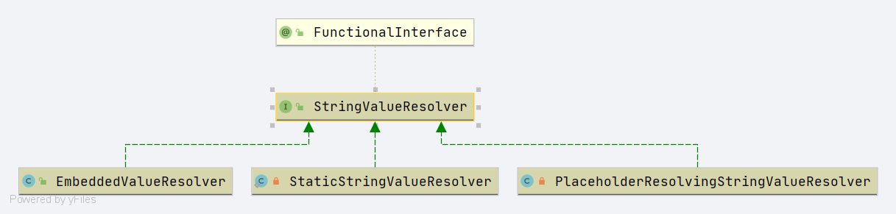

# Spring StringValueResolver
- 类全路径: `org.springframework.util.StringValueResolver`
- 类作用: 字符串值解析


```java
@FunctionalInterface
public interface StringValueResolver {

	/**
	 * Resolve the given String value, for example parsing placeholders.
	 * @param strVal the original String value (never {@code null})
	 * @return the resolved String value (may be {@code null} when resolved to a null
	 * value), possibly the original String value itself (in case of no placeholders
	 * to resolve or when ignoring unresolvable placeholders)
	 * @throws IllegalArgumentException in case of an unresolvable String value
	 */
	@Nullable
	String resolveStringValue(String strVal);

}

```

类图: 


- 子类解析
    1. [Spring-EmbeddedValueResolver](./StringValueResolver/Spring-EmbeddedValueResolver.md)
    1. [Spring-PlaceholderResolvingStringValueResolver](./StringValueResolver/Spring-PlaceholderResolvingStringValueResolver.md)
    1. [Spring-StaticStringValueResolver](./StringValueResolver/Spring-StaticStringValueResolver.md)