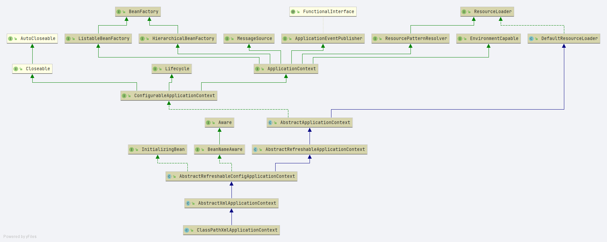
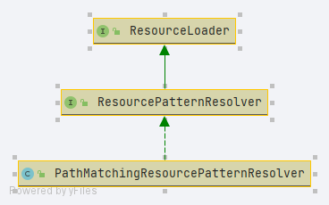
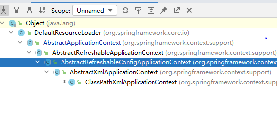
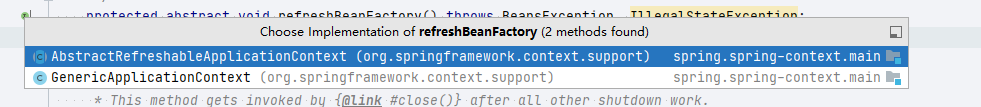
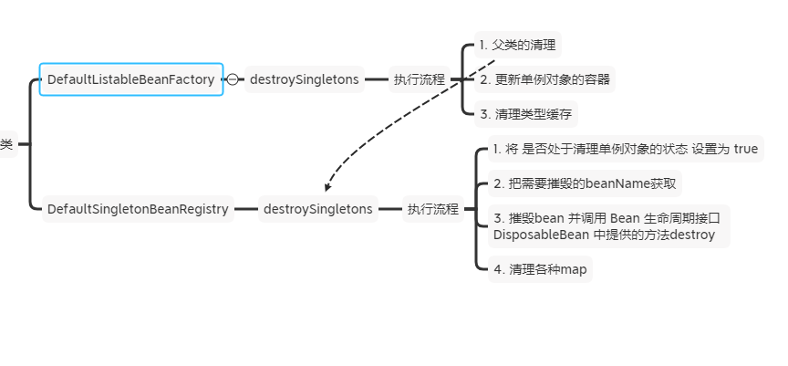

# 深入 Spring ClassPathXmlApplicationContext


## 初见 ClassPathXmlApplicationContext

- `ClassPathXmlApplicationContext` 在开始分析之前我们需要先将基础工程搭建

```xml

<?xml version="1.0" encoding="UTF-8"?>
<beans xmlns="http://www.springframework.org/schema/beans"
	   xmlns:xsi="http://www.w3.org/2001/XMLSchema-instance"
	   xsi:schemaLocation="http://www.springframework.org/schema/beans http://www.springframework.org/schema/beans/spring-beans.xsd">

</beans>
```


- 启动类

```java
public class DeepClassPathXmlApplicationContext {

	public static void main(String[] args) {


		ClassPathXmlApplicationContext classPathXmlApplicationContext
				= new ClassPathXmlApplicationContext("META-INF/deep/deep-ClassPathXmlApplicationContext.xml");

		classPathXmlApplicationContext.close();

	}
}
```


## 做什么

1. 了解`ClassPathXmlApplicationContext` 通过构造函数做了那些事.


## 构造函数分析

- 下面这段代码是我们通过构造函数直接看到的

```java
public ClassPathXmlApplicationContext(String configLocation) throws BeansException {
   this(new String[] {configLocation}, true, null);
}
```


👆参数

- `configLocation` 配置文件的地址


- 继续往下: 进入 `this(new String[] {configLocation}, true, null);` 方法


```java
public ClassPathXmlApplicationContext(
      String[] configLocations, boolean refresh, @Nullable ApplicationContext parent)
      throws BeansException {

   super(parent);
   // 设置本地配置信息
   setConfigLocations(configLocations);
   if (refresh) {
      refresh();
   }
}
```


👆 参数

1. configLocations 配置文件列表
2. refresh 是否刷新
3. parent 父上下文


- 先了解类图

  


## super(parent) 做了什么

- 在`ClassPathXmlApplicationContext`中的`super(parent)`真正的执行方法: `org.springframework.context.support.AbstractApplicationContext#AbstractApplicationContext(org.springframework.context.ApplicationContext)`


- 执行代码 👇

```java
public AbstractApplicationContext(@Nullable ApplicationContext parent) {
    this();
    setParent(parent);
}
```


`this()` 👇

```java
/**
 * Create a new AbstractApplicationContext with no parent.
 */
public AbstractApplicationContext() {
    this.resourcePatternResolver = getResourcePatternResolver();
}
```


`getResourcePatternResolver()` 方法

```java
protected ResourcePatternResolver getResourcePatternResolver() {
    return new PathMatchingResourcePatternResolver(this);
}
```


- 这是一个资源加载器(匹配性质的)





`setParent` 做了什么

1. 成员变量的赋值
2. 环境信息的合并(当前环境信息和父上下文的环境信息合并)


```java
@Override
public void setParent(@Nullable ApplicationContext parent) {
    this.parent = parent;
    if (parent != null) {
       // 获取 父上下文的环境信息
        Environment parentEnvironment = parent.getEnvironment();
        // 当环境信息是ConfigurableEnvironment 进行合并
        if (parentEnvironment instanceof ConfigurableEnvironment) {
            getEnvironment().merge((ConfigurableEnvironment) parentEnvironment);
        }
    }
}
```


## setConfigLocations(configLocations)做了什么

- 真正的方法地址： `org.springframework.context.support.AbstractRefreshableConfigApplicationContext#setConfigLocations`


- 方法详情 👇

```java
public void setConfigLocations(@Nullable String... locations) {
   if (locations != null) {
      Assert.noNullElements(locations, "Config locations must not be null");
      this.configLocations = new String[locations.length];
      for (int i = 0; i < locations.length; i++) {
         this.configLocations[i] = resolvePath(locations[i]).trim();
      }
   }
   else {
      this.configLocations = null;
   }
}
```


- 处理方法: `resolvePath` (`org.springframework.context.support.AbstractRefreshableConfigApplicationContext#resolvePath`)
- 调用链路: 
  - `org.springframework.context.support.AbstractRefreshableConfigApplicationContext#resolvePath`
    - `org.springframework.core.env.PropertyResolver#resolveRequiredPlaceholders**`**
      - **`org.springframework.core.env.AbstractPropertyResolver#resolveRequiredPlaceholders`**  最重要的方法


```java
@Override
public String resolveRequiredPlaceholders(String text) throws IllegalArgumentException {
   if (this.strictHelper == null) {
      this.strictHelper = createPlaceholderHelper(false);
   }
   return doResolvePlaceholders(text, this.strictHelper);
}
```

上面方法做的事情

1. 创建占位符解析器`PropertyPlaceholderHelper`

2. 执行解析


```java
private String doResolvePlaceholders(String text, PropertyPlaceholderHelper helper) {
   return helper.replacePlaceholders(text, this::getPropertyAsRawString);
}
```


## PropertyPlaceholderHelper 

- 占位符解析器


- 根据上面一步步进入到下面方法
  - 方法签名: `org.springframework.util.PropertyPlaceholderHelper#replacePlaceholders(java.lang.String, org.springframework.util.PropertyPlaceholderHelper.PlaceholderResolver)`

```
public String replacePlaceholders(String value, PlaceholderResolver placeholderResolver) {
   Assert.notNull(value, "'value' must not be null");
   return parseStringValue(value, placeholderResolver, null);
}
```


<details>
    <summary> 真正的解析方法 </summary>


```java
protected String parseStringValue(
      String value, PlaceholderResolver placeholderResolver, @Nullable Set<String> visitedPlaceholders) {

   // 占位符所在位置
   int startIndex = value.indexOf(this.placeholderPrefix);
   if (startIndex == -1) {
      return value;
   }

   // 返回值
   StringBuilder result = new StringBuilder(value);
   while (startIndex != -1) {
      // 寻找结尾占位符
      int endIndex = findPlaceholderEndIndex(result, startIndex);
      if (endIndex != -1) {
         // 返回值切分留下中间内容
         String placeholder = result.substring(startIndex + this.placeholderPrefix.length(), endIndex);
         String originalPlaceholder = placeholder;
         if (visitedPlaceholders == null) {
            visitedPlaceholders = new HashSet<>(4);
         }
         if (!visitedPlaceholders.add(originalPlaceholder)) {
            throw new IllegalArgumentException(
                  "Circular placeholder reference '" + originalPlaceholder + "' in property definitions");
         }
         // Recursive invocation, parsing placeholders contained in the placeholder key.
         // 递归获取占位符内容
         placeholder = parseStringValue(placeholder, placeholderResolver, visitedPlaceholders);
         // Now obtain the value for the fully resolved key...
         // 解析占位符内容获得真正的属性值
         String propVal = placeholderResolver.resolvePlaceholder(placeholder);
         if (propVal == null && this.valueSeparator != null) {
            int separatorIndex = placeholder.indexOf(this.valueSeparator);
            if (separatorIndex != -1) {
               String actualPlaceholder = placeholder.substring(0, separatorIndex);
               String defaultValue = placeholder.substring(separatorIndex + this.valueSeparator.length());
               propVal = placeholderResolver.resolvePlaceholder(actualPlaceholder);
               if (propVal == null) {
                  propVal = defaultValue;
               }
            }
         }
         if (propVal != null) {
            // Recursive invocation, parsing placeholders contained in the
            // previously resolved placeholder value.
            propVal = parseStringValue(propVal, placeholderResolver, visitedPlaceholders);
            result.replace(startIndex, endIndex + this.placeholderSuffix.length(), propVal);
            if (logger.isTraceEnabled()) {
               logger.trace("Resolved placeholder '" + placeholder + "'");
            }
            startIndex = result.indexOf(this.placeholderPrefix, startIndex + propVal.length());
         }
         else if (this.ignoreUnresolvablePlaceholders) {
            // Proceed with unprocessed value.
            startIndex = result.indexOf(this.placeholderPrefix, endIndex + this.placeholderSuffix.length());
         }
         else {
            throw new IllegalArgumentException("Could not resolve placeholder '" +
                  placeholder + "'" + " in value \"" + value + "\"");
         }
         visitedPlaceholders.remove(originalPlaceholder);
      }
      else {
         startIndex = -1;
      }
   }
   return result.toString();
}
```

</details>


例子: 

待解析占位符文本:  `META-INF/deep/deep-ClassPathXmlApplicationContext.xml`

因为没有占位符:`${` 所以直接返回了


**占位符为什么是 `${`?**


看`createPlaceholderHelper`方法做了什么

1. 通过构造函数创建对象`PropertyPlaceholderHelper`

   在对象创建的时候设置了成员变量

```java
private PropertyPlaceholderHelper createPlaceholderHelper(boolean ignoreUnresolvablePlaceholders) {
   return new PropertyPlaceholderHelper(this.placeholderPrefix, this.placeholderSuffix,
         this.valueSeparator, ignoreUnresolvablePlaceholders);
}
```


<details>
    <summary>构造函数传入的参数信息具体值如下</summary>


```java
public abstract class AbstractPropertyResolver implements ConfigurablePropertyResolver {
/**
 * 前缀
 */
private String placeholderPrefix = SystemPropertyUtils.PLACEHOLDER_PREFIX;

/**
 * 后缀
 */
private String placeholderSuffix = SystemPropertyUtils.PLACEHOLDER_SUFFIX;

}

public abstract class SystemPropertyUtils {

	/**
	 *
	 * Prefix for system property placeholders: "${".
	 * 前缀占位符
	 * */
	public static final String PLACEHOLDER_PREFIX = "${";

	/**
	 *  Suffix for system property placeholders: "}".
	 *  后缀占位符
	 * */
	public static final String PLACEHOLDER_SUFFIX = "}";
}
```

</details>


## refresh


- `refresh` 主要处理下面几个流程
  1. **准备刷新上下文** , `prepareRefresh()`
  2. **创建或者获取 BeanFactory**  , `obtainFreshBeanFactory()`
  3. **准备 BeanFactory , 为 BeanFactory 设置属性,**  `prepareBeanFactory(beanFactory)`
  4. try
     1. **在 BeanFactory 准备好后子类可以为其定制后置操作**, `postProcessBeanFactory(beanFactory)`
     2. **`BeanFactoryPostProcessor` 接口集合的调用**, `invokeBeanFactoryPostProcessors(beanFactory)`
     3. **注册`BeanPostProcessor`接口**, `registerBeanPostProcessors(beanFactory)`
     4. **实例化 message source** , `initMessageSource`
     5. **实例化应用事件传播器,** `initApplicationEventMulticaster()`
     6. **子类的刷新操作,用于实例化特定的 bean** , `onRefresh()`
     7. **注册监听器**, `registerListeners()`
     8. 完成 BeanFactory 的实例化, 即**实例化非延迟加载的单例对象**, `finishBeanFactoryInitialization(beanFactory)`
     9. **完成刷新方法, 发布部分事件**, `finishRefresh()`
  5. catch
     1. **摧毁以及创建的bean对象**, `destroyBeans()`
     2. **取消刷新,设置 `active` 为 `false`,** `cancelRefresh(ex)`
  6. finally
     1. 重置通用缓存,`resetCommonCaches()`


### 准备刷新上下文

- 方法签名: `org.springframework.context.support.AbstractApplicationContext#prepareRefresh`

- 方法内的执行逻辑

    1. 设置开始时间
    2. 设置关闭状态
    3. 设置激活状态
    4.  初始化属性, 占位符资源等数据处理
    5. 进行数据必填性验证
    6. 早期应用监听器列表属性设置

   	


###  **创建或者获取 BeanFactory**


```java
protected ConfigurableListableBeanFactory obtainFreshBeanFactory() {
    // 刷新 beanFactory , 子类实现
    refreshBeanFactory();
    // 获取 beanFactory , 子类实现
    return getBeanFactory();
}
```


- 两个方法都是抽象方法子类实现
- **如何定位实现类？**


当前阅读的根类是 `ClassPathXmlApplicationContext` 

在IDEA中查看类图、或者继承关系





- 同时观察`refreshBeanFactory` 方法的实现类 进行对比来确定我们需要找到的类是谁 (这里是`AbstractRefreshableApplicationContext`)





- 真正执行的逻辑如下

    1. 当beanFactory存在的情况下
        1. 摧毁bean
        2. 清空BeanFactory
    1. 创建 BeanFactory
    2. 设置序列号id
    3. 执行定制工厂
    4. 加载 bean 定义
    5. 设置成员变量 BeanFactory


下面开始对下面代码中提到的每个方法进行细节分析


```java
@Override
protected final void refreshBeanFactory() throws BeansException {
   // 是否存在 beanFactory
   if (hasBeanFactory()) {
      // 如果存在 beanFactory 则清空 bean 相关信息
      // 摧毁bean
      destroyBeans();
      // 清空 beanFactory
      closeBeanFactory();
   }
   try {
      // 创建 BeanFactory
      DefaultListableBeanFactory beanFactory = createBeanFactory();
      // 设置序列化id
      beanFactory.setSerializationId(getId());
      // 定制工厂的处理
      // 设置两个属性值
      //     1. allowBeanDefinitionOverriding
      //  2. allowCircularReferences
      customizeBeanFactory(beanFactory);
      // 加载 bean定义
      loadBeanDefinitions(beanFactory);
      // 上锁设置 beanFactory
      synchronized (this.beanFactoryMonitor) {
         this.beanFactory = beanFactory;
      }
   }
   catch (IOException ex) {
      throw new ApplicationContextException("I/O error parsing bean definition source for " + getDisplayName(), ex);
   }
}
```


#### hasBeanFactory

判断是否存在BeanFactory


#### destroyBeans

- 两个实现类
  - DefaultListableBeanFactory
  - DefaultSingletonBeanRegistry


`org.springframework.beans.factory.support.DefaultListableBeanFactory#destroySingletons`


```java
@Override
public void destroySingletons() {
   // 父类的摧毁方法
   super.destroySingletons();
   // 更新单例bean容器
   updateManualSingletonNames(Set::clear, set -> !set.isEmpty());
   // 清理类型缓存
   clearByTypeCache();
}
```


super 直接回到了`org.springframework.beans.factory.support.DefaultSingletonBeanRegistry#destroySingletons`方法 。 


#### destroySingletons


```java
public void destroySingletons() {
   if (logger.isTraceEnabled()) {
      logger.trace("Destroying singletons in " + this);
   }
   synchronized (this.singletonObjects) {
      this.singletonsCurrentlyInDestruction = true;
   }

   String[] disposableBeanNames;
   synchronized (this.disposableBeans) {
      disposableBeanNames = StringUtils.toStringArray(this.disposableBeans.keySet());
   }
   for (int i = disposableBeanNames.length - 1; i >= 0; i--) {
      destroySingleton(disposableBeanNames[i]);
   }

   this.containedBeanMap.clear();
   this.dependentBeanMap.clear();
   this.dependenciesForBeanMap.clear();

   clearSingletonCache();
}
```


首先看下面这段代码

```java
for (int i = disposableBeanNames.length - 1; i >= 0; i--) {
   destroySingleton(disposableBeanNames[i]);
}
```


- 上面方法的最终逻辑代码如下

```java
public void destroySingleton(String beanName) {
   // Remove a registered singleton of the given name, if any.
   // 移除单例对象
   removeSingleton(beanName);

   // Destroy the corresponding DisposableBean instance.
   // bean摧毁接口的调用
   DisposableBean disposableBean;
   synchronized (this.disposableBeans) {
      disposableBean = (DisposableBean) this.disposableBeans.remove(beanName);
   }
   destroyBean(beanName, disposableBean);
}
```

1. 移除单例对象

   ```java
   protected void removeSingleton(String beanName) {
      synchronized (this.singletonObjects) {
         this.singletonObjects.remove(beanName);
         this.singletonFactories.remove(beanName);
         this.earlySingletonObjects.remove(beanName);
         this.registeredSingletons.remove(beanName);
      }
   }
   ```

2. 移除的对象是否是`DisposableBean`接口的实现类

   如果是`DisposableBean` 那么会执行 **Bean 生命周期的接口（`DisposableBean`） 方法**


后续代码将各类容器清空


```java
this.containedBeanMap.clear();
this.dependentBeanMap.clear();
this.dependenciesForBeanMap.clear();
clearSingletonCache();

```




#### closeBeanFactory


```java
protected final void closeBeanFactory() {
   synchronized (this.beanFactoryMonitor) {
      if (this.beanFactory != null) {
         this.beanFactory.setSerializationId(null);
         this.beanFactory = null;
      }
   }
}
```

1. 序列号id 设置为null
2. beanFactory 设置为null


#### createBeanFactory


```java
protected DefaultListableBeanFactory createBeanFactory() {
   return new DefaultListableBeanFactory(getInternalParentBeanFactory());
}
```


```java
public AbstractAutowireCapableBeanFactory() {
   super();
   // 添加忽略的依赖接口(即add方法调用)
   ignoreDependencyInterface(BeanNameAware.class);
   ignoreDependencyInterface(BeanFactoryAware.class);
   ignoreDependencyInterface(BeanClassLoaderAware.class);
}
```


- 设置需要忽略的依赖接口


#### customizeBeanFactory

- 自定义 beanFactory


自定义了什么内容
	1. 设置是否允许 bean定义覆盖
	2. 设置是否允许循环引用


#### loadBeanDefinitions


loadBeanDefinitions 谁是实现类
	AbstractXmlApplicationContext
怎么加载的
关联类

