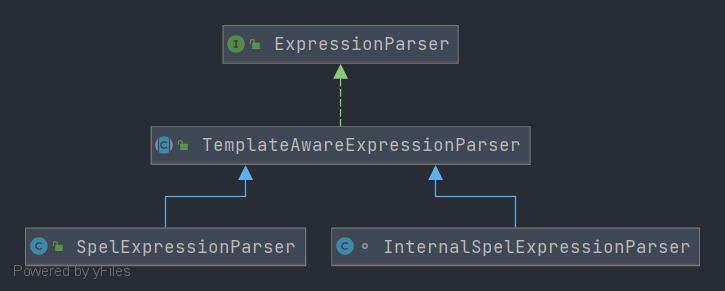

# Spring ExpressionParser
- 类全路径: `org.springframework.expression.ExpressionParser`
- 表达式解析器
- 接口定义方法作用: 将字符串表达式(el表达式)解析成 `Expression` 对象





```java
public interface ExpressionParser {

	/**
	 * 解析表达式
	 */
	Expression parseExpression(String expressionString) throws ParseException;

	/**
	 * 解析表达式
	 */
	Expression parseExpression(String expressionString, ParserContext context) throws ParseException;

}
```


- 实现类分析
  - TemplateAwareExpressionParser
    - InternalSpelExpressionParser
    - SpelExpressionParser