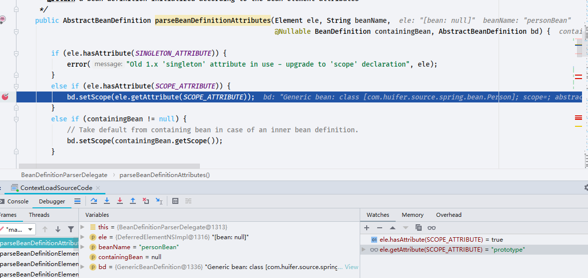
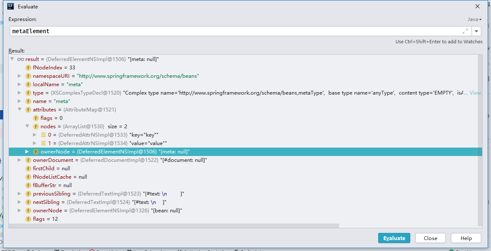
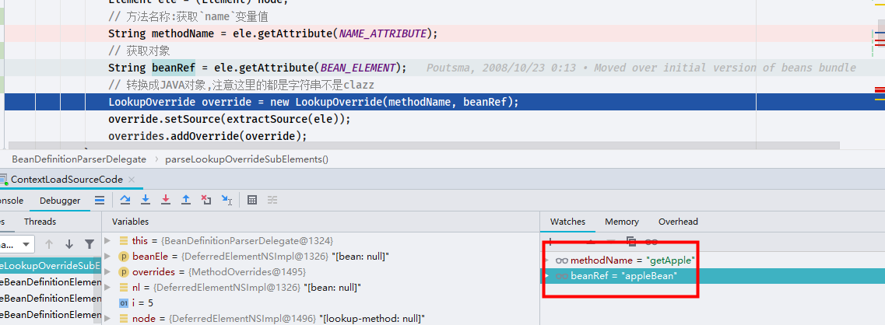
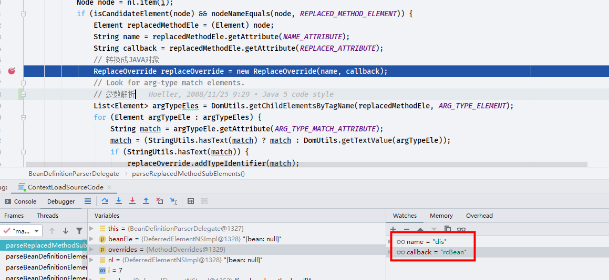
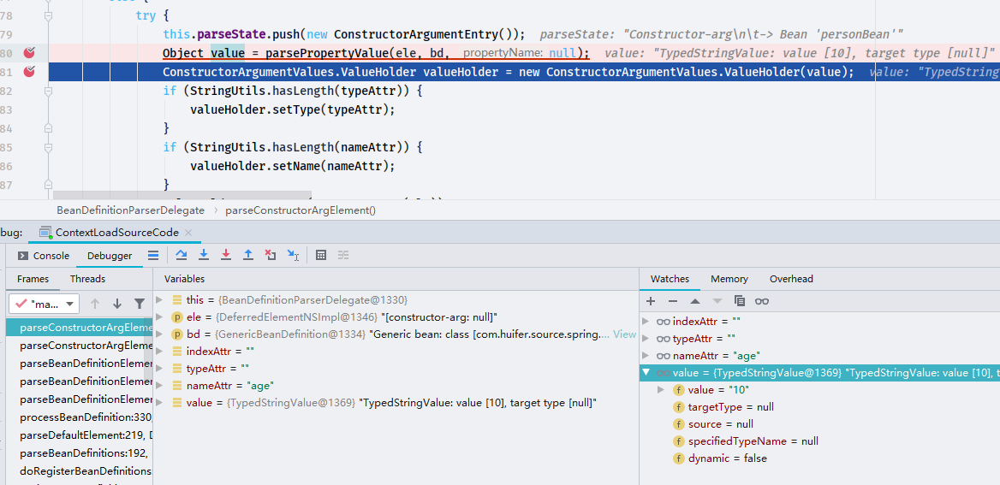
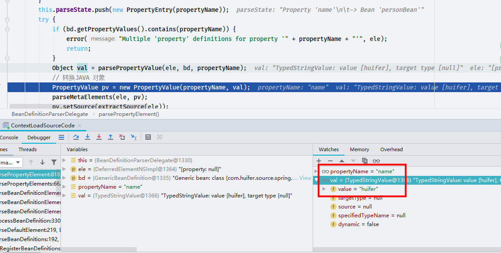
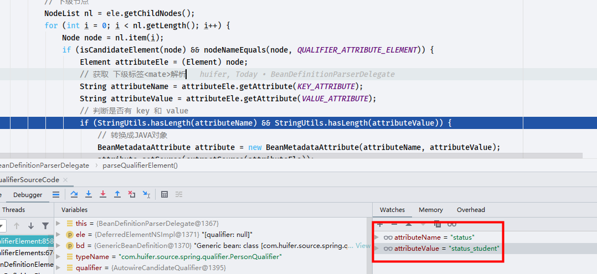
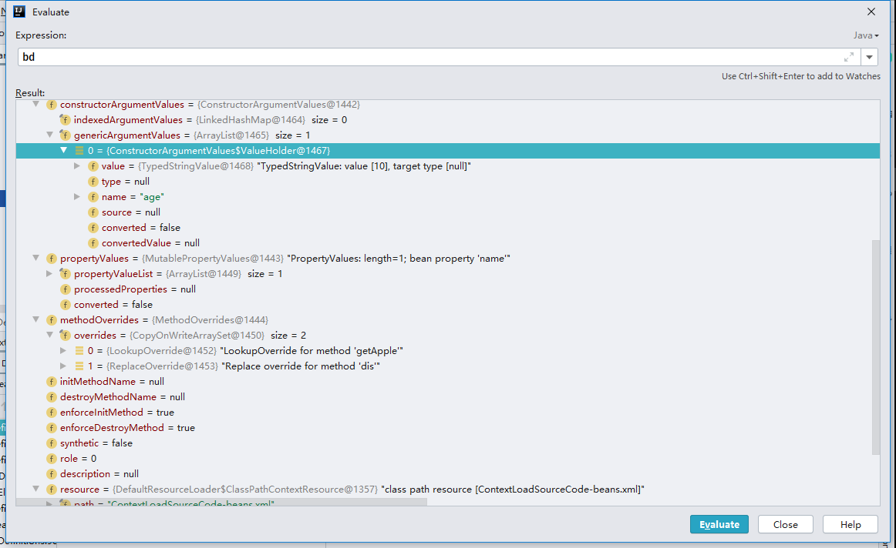
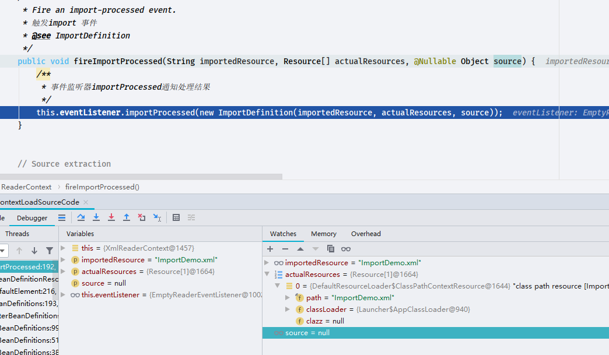

# Spring-BeanDefinitionParserDelegate
- Author: [HuiFer](https://github.com/huifer)
- 源码路径: `org.springframework.beans.factory.xml.BeanDefinitionParserDelegate`
- 源码阅读仓库: [SourceHot-spring](https://github.com/SourceHot/spring-framework-read)
- 该类的作用是将标签解析出来


- 下面这段代码是这个类的入口

```java
	@Nullable
    public BeanDefinitionHolder parseBeanDefinitionElement(Element ele, @Nullable BeanDefinition containingBean) {
        // 获取id 属性
        String id = ele.getAttribute(ID_ATTRIBUTE);
        // 获取 name 属性
        String nameAttr = ele.getAttribute(NAME_ATTRIBUTE);

        // 别名列表
        List<String> aliases = new ArrayList<>();
        if (StringUtils.hasLength(nameAttr)) {
            String[] nameArr = StringUtils.tokenizeToStringArray(nameAttr, MULTI_VALUE_ATTRIBUTE_DELIMITERS);
            aliases.addAll(Arrays.asList(nameArr));
        }

        // beanName  = <bean id=""/> 中id的属性值
        String beanName = id;
        if (!StringUtils.hasText(beanName) && !aliases.isEmpty()) {
            beanName = aliases.remove(0);
            if (logger.isTraceEnabled()) {
                logger.trace("No XML 'id' specified - using '" + beanName +
                        "' as bean name and " + aliases + " as aliases");
            }
        }

        if (containingBean == null) {
            checkNameUniqueness(beanName, aliases, ele);
        }

        // 创建对象
        AbstractBeanDefinition beanDefinition = parseBeanDefinitionElement(ele, beanName, containingBean);
        if (beanDefinition != null) {
            if (!StringUtils.hasText(beanName)) {
                try {
                    if (containingBean != null) {
                        beanName = BeanDefinitionReaderUtils.generateBeanName(
                                beanDefinition, this.readerContext.getRegistry(), true);
                    }
                    else {
                        beanName = this.readerContext.generateBeanName(beanDefinition);
                        // Register an alias for the plain bean class name, if still possible,
                        // if the generator returned the class name plus a suffix.
                        // This is expected for Spring 1.2/2.0 backwards compatibility.
                        String beanClassName = beanDefinition.getBeanClassName();
                        if (beanClassName != null &&
                                beanName.startsWith(beanClassName) && beanName.length() > beanClassName.length() &&
                                !this.readerContext.getRegistry().isBeanNameInUse(beanClassName)) {
                            aliases.add(beanClassName);
                        }
                    }
                    if (logger.isTraceEnabled()) {
                        logger.trace("Neither XML 'id' nor 'name' specified - " +
                                "using generated bean name [" + beanName + "]");
                    }
                }
                catch (Exception ex) {
                    error(ex.getMessage(), ele);
                    return null;
                }
            }
            String[] aliasesArray = StringUtils.toStringArray(aliases);
            return new BeanDefinitionHolder(beanDefinition, beanName, aliasesArray);
        }

        return null;
    }
```


该类大量的`parseXXX`开头的代码，这些方法都是对标签进行解析转换成具体的实体


### 测试用例

```xml
    <bean id="personBean" class="org.sourcehot.spring.bean.Person" scope="prototype">
        <property name="name" value="huifer"/>
        <meta key="key" value="value"/>
    </bean>

```


## parseBeanDefinitionAttributes

- 解析属性`scope`,`abstract`,`lazy-init`

```java
public AbstractBeanDefinition parseBeanDefinitionAttributes(Element ele, String beanName,
                                                                @Nullable BeanDefinition containingBean, AbstractBeanDefinition bd) {

        if (ele.hasAttribute(SINGLETON_ATTRIBUTE)) {
            error("Old 1.x 'singleton' attribute in use - upgrade to 'scope' declaration", ele);
        }
        else if (ele.hasAttribute(SCOPE_ATTRIBUTE)) {
            bd.setScope(ele.getAttribute(SCOPE_ATTRIBUTE));
        }
        else if (containingBean != null) {
            // Take default from containing bean in case of an inner bean definition.
            bd.setScope(containingBean.getScope());
        }

        if (ele.hasAttribute(ABSTRACT_ATTRIBUTE)) {
            bd.setAbstract(TRUE_VALUE.equals(ele.getAttribute(ABSTRACT_ATTRIBUTE)));
        }

        String lazyInit = ele.getAttribute(LAZY_INIT_ATTRIBUTE);
        if (isDefaultValue(lazyInit)) {
            lazyInit = this.defaults.getLazyInit();
        }
        bd.setLazyInit(TRUE_VALUE.equals(lazyInit));

        String autowire = ele.getAttribute(AUTOWIRE_ATTRIBUTE);
        bd.setAutowireMode(getAutowireMode(autowire));

        if (ele.hasAttribute(DEPENDS_ON_ATTRIBUTE)) {
            String dependsOn = ele.getAttribute(DEPENDS_ON_ATTRIBUTE);
            bd.setDependsOn(StringUtils.tokenizeToStringArray(dependsOn, MULTI_VALUE_ATTRIBUTE_DELIMITERS));
        }

        String autowireCandidate = ele.getAttribute(AUTOWIRE_CANDIDATE_ATTRIBUTE);
        if (isDefaultValue(autowireCandidate)) {
            String candidatePattern = this.defaults.getAutowireCandidates();
            if (candidatePattern != null) {
                String[] patterns = StringUtils.commaDelimitedListToStringArray(candidatePattern);
                bd.setAutowireCandidate(PatternMatchUtils.simpleMatch(patterns, beanName));
            }
        }
        else {
            bd.setAutowireCandidate(TRUE_VALUE.equals(autowireCandidate));
        }

        if (ele.hasAttribute(PRIMARY_ATTRIBUTE)) {
            bd.setPrimary(TRUE_VALUE.equals(ele.getAttribute(PRIMARY_ATTRIBUTE)));
        }

        if (ele.hasAttribute(INIT_METHOD_ATTRIBUTE)) {
            String initMethodName = ele.getAttribute(INIT_METHOD_ATTRIBUTE);
            bd.setInitMethodName(initMethodName);
        }
        else if (this.defaults.getInitMethod() != null) {
            bd.setInitMethodName(this.defaults.getInitMethod());
            bd.setEnforceInitMethod(false);
        }

        if (ele.hasAttribute(DESTROY_METHOD_ATTRIBUTE)) {
            String destroyMethodName = ele.getAttribute(DESTROY_METHOD_ATTRIBUTE);
            bd.setDestroyMethodName(destroyMethodName);
        }
        else if (this.defaults.getDestroyMethod() != null) {
            bd.setDestroyMethodName(this.defaults.getDestroyMethod());
            bd.setEnforceDestroyMethod(false);
        }

        if (ele.hasAttribute(FACTORY_METHOD_ATTRIBUTE)) {
            bd.setFactoryMethodName(ele.getAttribute(FACTORY_METHOD_ATTRIBUTE));
        }
        if (ele.hasAttribute(FACTORY_BEAN_ATTRIBUTE)) {
            bd.setFactoryBeanName(ele.getAttribute(FACTORY_BEAN_ATTRIBUTE));
        }

        return bd;
    }
```




其他的标签也同样的方式**`getAttribute`**获取

思路: 

1. 判断是否有这个标签
   1. 有直接获取,设置值
   2. 没有跳过


## parseMetaElements

```java
    /**
     * 解析Meta 元素
     * {@code <meta key="h" value="c"/>} => {@link BeanMetadataAttribute}
     * Parse the meta elements underneath the given element, if any.
     */
    public void parseMetaElements(Element ele, BeanMetadataAttributeAccessor attributeAccessor) {
        NodeList nl = ele.getChildNodes();
        for (int i = 0; i < nl.getLength(); i++) {
            Node node = nl.item(i);
            if (isCandidateElement(node) && nodeNameEquals(node, META_ELEMENT)) {
                Element metaElement = (Element) node;
                // 获取 key 属性值
                String key = metaElement.getAttribute(KEY_ATTRIBUTE);
                // 获取  value 属性值
                String value = metaElement.getAttribute(VALUE_ATTRIBUTE);
                BeanMetadataAttribute attribute = new BeanMetadataAttribute(key, value);
                attribute.setSource(extractSource(metaElement));
                attributeAccessor.addMetadataAttribute(attribute);
            }
        }
    }

```




## parseLookupOverrideSubElements

```java
    /**
     * 解析{@code <lookup-method bean="personBean2"></lookup-method>}
     * Parse lookup-override sub-elements of the given bean element.
     */
    public void parseLookupOverrideSubElements(Element beanEle, MethodOverrides overrides) {
        NodeList nl = beanEle.getChildNodes();
        for (int i = 0; i < nl.getLength(); i++) {
            Node node = nl.item(i);
            if (isCandidateElement(node) && nodeNameEquals(node, LOOKUP_METHOD_ELEMENT)) {
                Element ele = (Element) node;
                String methodName = ele.getAttribute(NAME_ATTRIBUTE);
                String beanRef = ele.getAttribute(BEAN_ELEMENT);
                // 转换成JAVA对象
                LookupOverride override = new LookupOverride(methodName, beanRef);
                override.setSource(extractSource(ele));
                overrides.addOverride(override);
            }
        }
    }

```

### 测试用例

```xml
    <bean id="personBean" class="org.sourcehot.spring.bean.Person" >
        <property name="name" value="huifer"/>
        <meta key="key" value="value"/>
        <lookup-method name="getApple" bean="appleBean"/>
    </bean>
    <bean name="appleBean" class="org.sourcehot.spring.bean.Apple">
        <property name="name" value="this is an apple !"/>
    </bean>
```




## parseReplacedMethodSubElements

```java
    /**
     * {@code <replaced-method name="" replacer=""/>}
     * Parse replaced-method sub-elements of the given bean element.
     */
    public void parseReplacedMethodSubElements(Element beanEle, MethodOverrides overrides) {
        NodeList nl = beanEle.getChildNodes();
        for (int i = 0; i < nl.getLength(); i++) {
            Node node = nl.item(i);
            if (isCandidateElement(node) && nodeNameEquals(node, REPLACED_METHOD_ELEMENT)) {
                Element replacedMethodEle = (Element) node;
                String name = replacedMethodEle.getAttribute(NAME_ATTRIBUTE);
                String callback = replacedMethodEle.getAttribute(REPLACER_ATTRIBUTE);
                // 转换成JAVA对象
                ReplaceOverride replaceOverride = new ReplaceOverride(name, callback);
                // Look for arg-type match elements.
                // 参数解析 <arg-type match=""> 解析
                List<Element> argTypeEles = DomUtils.getChildElementsByTagName(replacedMethodEle, ARG_TYPE_ELEMENT);
                for (Element argTypeEle : argTypeEles) {
                    String match = argTypeEle.getAttribute(ARG_TYPE_MATCH_ATTRIBUTE);
                    match = (StringUtils.hasText(match) ? match : DomUtils.getTextValue(argTypeEle));
                    if (StringUtils.hasText(match)) {
                        replaceOverride.addTypeIdentifier(match);
                    }
                }
                replaceOverride.setSource(extractSource(replacedMethodEle));
                overrides.addOverride(replaceOverride);
            }
        }
    }

```

### 测试用例

  编写方法`dis`

```java
public class Person {
    private String name;
    private Apple apple;
    private Integer age;

    public void dis() {
        System.out.println("dis");
    }
}
```

​	编写一个替换`dis`方法的类

```java
public class Rc implements MethodReplacer {
    @Override
    public Object reimplement(Object obj, Method method, Object[] args) throws Throwable {
        System.out.println("替换原来的方法");
        return null;
    }
}
```

xml 配置

```java
        <replaced-method name="dis" replacer="rcBean"/>
        <bean name="rcBean" class="org.sourcehot.spring.bean.Rc"/>

```




## parseConstructorArgElements

```java
    public void parseConstructorArgElements(Element beanEle, BeanDefinition bd) {
        NodeList nl = beanEle.getChildNodes();
        for (int i = 0; i < nl.getLength(); i++) {
            Node node = nl.item(i);
            if (isCandidateElement(node) && nodeNameEquals(node, CONSTRUCTOR_ARG_ELEMENT)) {
                parseConstructorArgElement((Element) node, bd);
            }
        }
    }

```

```java
    /**
     * 解析 constructor-arg 元素
     * {@code <constructor-arg name="" value="" index="" ref="" type="" />}
     * Parse a constructor-arg element.
     */
    public void parseConstructorArgElement(Element ele, BeanDefinition bd) {
        String indexAttr = ele.getAttribute(INDEX_ATTRIBUTE);
        String typeAttr = ele.getAttribute(TYPE_ATTRIBUTE);
        String nameAttr = ele.getAttribute(NAME_ATTRIBUTE);
        // 判断是否存在 index 属性
        if (StringUtils.hasLength(indexAttr)) {
            try {
                int index = Integer.parseInt(indexAttr);
                if (index < 0) {
                    error("'index' cannot be lower than 0", ele);
                }
                else {
                    try {
                        // ConstructorArgumentEntry 插入parseState
                        this.parseState.push(new ConstructorArgumentEntry(index));
                        Object value = parsePropertyValue(ele, bd, null);
                        // 转换成JAVA对象
                        ConstructorArgumentValues.ValueHolder valueHolder = new ConstructorArgumentValues.ValueHolder(value);
                        if (StringUtils.hasLength(typeAttr)) {
                            valueHolder.setType(typeAttr);
                        }
                        if (StringUtils.hasLength(nameAttr)) {
                            valueHolder.setName(nameAttr);
                        }
                        valueHolder.setSource(extractSource(ele));
                        // 不允许重复指定相同参数
                        if (bd.getConstructorArgumentValues().hasIndexedArgumentValue(index)) {
                            error("Ambiguous constructor-arg entries for index " + index, ele);
                        }
                        else {
                            bd.getConstructorArgumentValues().addIndexedArgumentValue(index, valueHolder);
                        }
                    }
                    finally {
                        this.parseState.pop();
                    }
                }
            }
            catch (NumberFormatException ex) {
                error("Attribute 'index' of tag 'constructor-arg' must be an integer", ele);
            }
        }
        else {
            try {
                this.parseState.push(new ConstructorArgumentEntry());
                Object value = parsePropertyValue(ele, bd, null);
                ConstructorArgumentValues.ValueHolder valueHolder = new ConstructorArgumentValues.ValueHolder(value);
                if (StringUtils.hasLength(typeAttr)) {
                    valueHolder.setType(typeAttr);
                }
                if (StringUtils.hasLength(nameAttr)) {
                    valueHolder.setName(nameAttr);
                }
                valueHolder.setSource(extractSource(ele));
                bd.getConstructorArgumentValues().addGenericArgumentValue(valueHolder);
            }
            finally {
                this.parseState.pop();
            }
        }
    }

```

```JAVA
    /**
     * Get the value of a property element. May be a list etc.
     * Also used for constructor arguments, "propertyName" being null in this case.
     */
    @Nullable
    public Object parsePropertyValue(Element ele, BeanDefinition bd, @Nullable String propertyName) {
        String elementName = (propertyName != null ?
                "<property> element for property '" + propertyName + "'" :
                "<constructor-arg> element");

        // Should only have one child element: ref, value, list, etc.
        NodeList nl = ele.getChildNodes();
        Element subElement = null;
        for (int i = 0; i < nl.getLength(); i++) {
            Node node = nl.item(i);
            //  不处理  element 节点名称 = description 和 meta
            if (node instanceof Element && !nodeNameEquals(node, DESCRIPTION_ELEMENT) &&
                    !nodeNameEquals(node, META_ELEMENT)) {
                // Child element is what we're looking for.
                if (subElement != null) {
                    error(elementName + " must not contain more than one sub-element", ele);
                }
                else {
                    subElement = (Element) node;
                }
            }
        }

        // 判断是否存在 ref 属性
        boolean hasRefAttribute = ele.hasAttribute(REF_ATTRIBUTE);
        // 判断是否 value 属性
        boolean hasValueAttribute = ele.hasAttribute(VALUE_ATTRIBUTE);
        // 判断1:  ref属性存在 value 属性 或者 ref 和 value 有一个存在并且有 下级节点 抛出异常
        if ((hasRefAttribute && hasValueAttribute) ||
                ((hasRefAttribute || hasValueAttribute) && subElement != null)) {
            error(elementName +
                    " is only allowed to contain either 'ref' attribute OR 'value' attribute OR sub-element", ele);
        }

        // 判断2: 存在 ref 返回 ref 的值
        if (hasRefAttribute) {
            String refName = ele.getAttribute(REF_ATTRIBUTE);
            if (!StringUtils.hasText(refName)) {
                error(elementName + " contains empty 'ref' attribute", ele);
            }
            RuntimeBeanReference ref = new RuntimeBeanReference(refName);
            ref.setSource(extractSource(ele));
            return ref;
        }
        // 判断3: 存在 value 返回 value 的值
        else if (hasValueAttribute) {
            TypedStringValue valueHolder = new TypedStringValue(ele.getAttribute(VALUE_ATTRIBUTE));
            valueHolder.setSource(extractSource(ele));
            return valueHolder;
        }
        else if (subElement != null) {
            // 下级标签解析
            return parsePropertySubElement(subElement, bd);
        }
        else {
            // 没有抛出异常
            // Neither child element nor "ref" or "value" attribute found.
            error(elementName + " must specify a ref or value", ele);
            return null;
        }
    }

```


### 测试用例

- 编辑构造函数

  ```java
  public class Person {
      private String name;
      private Apple apple;
      private Integer age;
  
      public Person() {
      }
  
      public Person(Integer age) {
          this.age = age;
      }
  
  ```

- 添加配置

  ```xml
          <constructor-arg name="age" value="10"/>
  
  ```





### constructor-arg 下级标签解析 parsePropertySubElement

- `org.springframework.beans.factory.xml.BeanDefinitionParserDelegate#parsePropertySubElement(org.w3c.dom.Element, org.springframework.beans.factory.config.BeanDefinition)`
  - `org.springframework.beans.factory.xml.BeanDefinitionParserDelegate#parsePropertySubElement(org.w3c.dom.Element, org.springframework.beans.factory.config.BeanDefinition, java.lang.String)`


```java
@Nullable
    public Object parsePropertySubElement(Element ele, @Nullable BeanDefinition bd, @Nullable String defaultValueType) {
        // 判断是否是默认命名空间
        if (!isDefaultNamespace(ele)) {
            return parseNestedCustomElement(ele, bd);
        }
        else if (nodeNameEquals(ele, BEAN_ELEMENT)) {
            // 解析 bean
            BeanDefinitionHolder nestedBd = parseBeanDefinitionElement(ele, bd);
            if (nestedBd != null) {
                nestedBd = decorateBeanDefinitionIfRequired(ele, nestedBd, bd);
            }
            return nestedBd;
        }
        else if (nodeNameEquals(ele, REF_ELEMENT)) {
            // A generic reference to any name of any bean.
            // 获取ref 属性值
            String refName = ele.getAttribute(BEAN_REF_ATTRIBUTE);
            boolean toParent = false;
            if (!StringUtils.hasLength(refName)) {
                // A reference to the id of another bean in a parent context.
                refName = ele.getAttribute(PARENT_REF_ATTRIBUTE);
                toParent = true;
                if (!StringUtils.hasLength(refName)) {
                    error("'bean' or 'parent' is required for <ref> element", ele);
                    return null;
                }
            }
            if (!StringUtils.hasText(refName)) {
                error("<ref> element contains empty target attribute", ele);
                return null;
            }
            RuntimeBeanReference ref = new RuntimeBeanReference(refName, toParent);
            ref.setSource(extractSource(ele));
            return ref;
        }
        // 解析 idref标签
        else if (nodeNameEquals(ele, IDREF_ELEMENT)) {
            return parseIdRefElement(ele);
        }
        // 解析 value 标签
        else if (nodeNameEquals(ele, VALUE_ELEMENT)) {
            return parseValueElement(ele, defaultValueType);
        }
        // 解析 null
        else if (nodeNameEquals(ele, NULL_ELEMENT)) {
            // It's a distinguished null value. Let's wrap it in a TypedStringValue
            // object in order to preserve the source location.
            TypedStringValue nullHolder = new TypedStringValue(null);
            nullHolder.setSource(extractSource(ele));
            return nullHolder;
        }
        // 解析 array
        else if (nodeNameEquals(ele, ARRAY_ELEMENT)) {
            return parseArrayElement(ele, bd);
        }
        // 解析 list
        else if (nodeNameEquals(ele, LIST_ELEMENT)) {
            return parseListElement(ele, bd);
        }
        //  解析 set
        else if (nodeNameEquals(ele, SET_ELEMENT)) {
            return parseSetElement(ele, bd);
        }
        // 解析 map
        else if (nodeNameEquals(ele, MAP_ELEMENT)) {
            return parseMapElement(ele, bd);
        }
        // 解析 props
        else if (nodeNameEquals(ele, PROPS_ELEMENT)) {
            return parsePropsElement(ele);
        }
        else {
            error("Unknown property sub-element: [" + ele.getNodeName() + "]", ele);
            return null;
        }
    }
```

```XML
<?xml version="1.0" encoding="UTF-8"?>
<beans xmlns:xsi="http://www.w3.org/2001/XMLSchema-instance"
       xmlns="http://www.springframework.org/schema/beans"
       xsi:schemaLocation="http://www.springframework.org/schema/beans http://www.springframework.org/schema/beans/spring-beans.xsd">
    <bean name="obj" class="org.sourcehot.spring.bean.JavaObjectTest">
        <constructor-arg>
            <list value-type="java.lang.String">
                <value>jasl</value>
                <value>acg</value>
            </list>
        </constructor-arg>
    </bean>

    <bean name="obj2" class="org.sourcehot.spring.bean.JavaObjectTest">
        <constructor-arg>
            <map>
                <entry value-type="java.lang.String" key="h" value="k"/>
            </map>
        </constructor-arg>
    </bean>

</beans>
```

- 先看一个list解析


### parseListElement

- list , set , array 处理逻辑相似

```java
public List<Object> parseListElement(Element collectionEle, @Nullable BeanDefinition bd) {
        // 获取 value-type 标签数据
        String defaultElementType = collectionEle.getAttribute(VALUE_TYPE_ATTRIBUTE);
        NodeList nl = collectionEle.getChildNodes();
        ManagedList<Object> target = new ManagedList<>(nl.getLength());
        target.setSource(extractSource(collectionEle));
        target.setElementTypeName(defaultElementType);
        target.setMergeEnabled(parseMergeAttribute(collectionEle));
        // 解析集合标签
        parseCollectionElements(nl, target, bd, defaultElementType);
        return target;
    }
```


### parseMapElement

```java
public Map<Object, Object> parseMapElement(Element mapEle, @Nullable BeanDefinition bd) {
        // 获取  key-type 属性
        String defaultKeyType = mapEle.getAttribute(KEY_TYPE_ATTRIBUTE);
        //  获取 value-type 属性
        String defaultValueType = mapEle.getAttribute(VALUE_TYPE_ATTRIBUTE);
        // 获取 map 下级标签
        List<Element> entryEles = DomUtils.getChildElementsByTagName(mapEle, ENTRY_ELEMENT);
        ManagedMap<Object, Object> map = new ManagedMap<>(entryEles.size());
        map.setSource(extractSource(mapEle));
        map.setKeyTypeName(defaultKeyType);
        map.setValueTypeName(defaultValueType);
        map.setMergeEnabled(parseMergeAttribute(mapEle));

        for (Element entryEle : entryEles) {
            // Should only have one value child element: ref, value, list, etc.
            // Optionally, there might be a key child element.
            NodeList entrySubNodes = entryEle.getChildNodes();
            Element keyEle = null;
            Element valueEle = null;
            for (int j = 0; j < entrySubNodes.getLength(); j++) {
                Node node = entrySubNodes.item(j);
                if (node instanceof Element) {
                    Element candidateEle = (Element) node;
                    if (nodeNameEquals(candidateEle, KEY_ELEMENT)) {
                        if (keyEle != null) {
                            error("<entry> element is only allowed to contain one <key> sub-element", entryEle);
                        }
                        else {
                            keyEle = candidateEle;
                        }
                    }
                    else {
                        // Child element is what we're looking for.
                        if (nodeNameEquals(candidateEle, DESCRIPTION_ELEMENT)) {
                            // the element is a <description> -> ignore it
                        }
                        else if (valueEle != null) {
                            error("<entry> element must not contain more than one value sub-element", entryEle);
                        }
                        else {
                            valueEle = candidateEle;
                        }
                    }
                }
            }

            // Extract key from attribute or sub-element.
            Object key = null;
            // 是否存在 key 属性
            boolean hasKeyAttribute = entryEle.hasAttribute(KEY_ATTRIBUTE);
            // 是否存在 key-ref 属性
            boolean hasKeyRefAttribute = entryEle.hasAttribute(KEY_REF_ATTRIBUTE);
            if ((hasKeyAttribute && hasKeyRefAttribute) ||
                    (hasKeyAttribute || hasKeyRefAttribute) && keyEle != null) {
                error("<entry> element is only allowed to contain either " +
                        "a 'key' attribute OR a 'key-ref' attribute OR a <key> sub-element", entryEle);
            }
            if (hasKeyAttribute) {
                // 获取 key 值
                key = buildTypedStringValueForMap(entryEle.getAttribute(KEY_ATTRIBUTE), defaultKeyType, entryEle);
            }
            else if (hasKeyRefAttribute) {
                // 获取 key-ref 属性值
                String refName = entryEle.getAttribute(KEY_REF_ATTRIBUTE);
                if (!StringUtils.hasText(refName)) {
                    error("<entry> element contains empty 'key-ref' attribute", entryEle);
                }
                RuntimeBeanReference ref = new RuntimeBeanReference(refName);
                ref.setSource(extractSource(entryEle));
                key = ref;
            }
            else if (keyEle != null) {
                key = parseKeyElement(keyEle, bd, defaultKeyType);
            }
            else {
                error("<entry> element must specify a key", entryEle);
            }

            // Extract value from attribute or sub-element.
            Object value = null;
            // 是否存在 value 标签
            boolean hasValueAttribute = entryEle.hasAttribute(VALUE_ATTRIBUTE);
            // 是否存在 value-ref 标签
            boolean hasValueRefAttribute = entryEle.hasAttribute(VALUE_REF_ATTRIBUTE);
            // 是否存在 value-type 标签
            boolean hasValueTypeAttribute = entryEle.hasAttribute(VALUE_TYPE_ATTRIBUTE);
            if ((hasValueAttribute && hasValueRefAttribute) ||
                    (hasValueAttribute || hasValueRefAttribute) && valueEle != null) {
                error("<entry> element is only allowed to contain either " +
                        "'value' attribute OR 'value-ref' attribute OR <value> sub-element", entryEle);
            }
            if ((hasValueTypeAttribute && hasValueRefAttribute) ||
                    (hasValueTypeAttribute && !hasValueAttribute) ||
                    (hasValueTypeAttribute && valueEle != null)) {
                error("<entry> element is only allowed to contain a 'value-type' " +
                        "attribute when it has a 'value' attribute", entryEle);
            }
            if (hasValueAttribute) {
                //   获取 value-type值
                String valueType = entryEle.getAttribute(VALUE_TYPE_ATTRIBUTE);
                if (!StringUtils.hasText(valueType)) {
                    valueType = defaultValueType;
                }
                // 构造value
                value = buildTypedStringValueForMap(entryEle.getAttribute(VALUE_ATTRIBUTE), valueType, entryEle);
            }
            else if (hasValueRefAttribute) {
                //  获取 value-ref 属性值
                String refName = entryEle.getAttribute(VALUE_REF_ATTRIBUTE);
                if (!StringUtils.hasText(refName)) {
                    error("<entry> element contains empty 'value-ref' attribute", entryEle);
                }
                RuntimeBeanReference ref = new RuntimeBeanReference(refName);
                ref.setSource(extractSource(entryEle));
                value = ref;
            }
            else if (valueEle != null) {
                // 继续解析下级标签
                value = parsePropertySubElement(valueEle, bd, defaultValueType);
            }
            else {
                error("<entry> element must specify a value", entryEle);
            }

            // Add final key and value to the Map.
            //  设置 map 值
            map.put(key, value);
        }

        return map;
    }
```


## parsePropertyElements

```java
public void parsePropertyElements(Element beanEle, BeanDefinition bd) {
        NodeList nl = beanEle.getChildNodes();
        for (int i = 0; i < nl.getLength(); i++) {
            Node node = nl.item(i);
            if (isCandidateElement(node) && nodeNameEquals(node, PROPERTY_ELEMENT)) {
                parsePropertyElement((Element) node, bd);
            }
        }
    }
```

```java
    /**
     * 解析 {@code <property name="" value=""/>}
     * Parse a property element.
     */
    public void parsePropertyElement(Element ele, BeanDefinition bd) {
        String propertyName = ele.getAttribute(NAME_ATTRIBUTE);
        if (!StringUtils.hasLength(propertyName)) {
            error("Tag 'property' must have a 'name' attribute", ele);
            return;
        }
        this.parseState.push(new PropertyEntry(propertyName));
        try {
            if (bd.getPropertyValues().contains(propertyName)) {
                error("Multiple 'property' definitions for property '" + propertyName + "'", ele);
                return;
            }
            Object val = parsePropertyValue(ele, bd, propertyName);
            // 转换JAVA 对象
            PropertyValue pv = new PropertyValue(propertyName, val);
            parseMetaElements(ele, pv);
            pv.setSource(extractSource(ele));
            bd.getPropertyValues().addPropertyValue(pv);
        }
        finally {
            this.parseState.pop();
        }
    }

```

### 测试用例

xml

```xml
 <bean id="personBean" class="org.sourcehot.spring.bean.Person">
        <property name="name" value="huifer"/>
    </bean>
```





## parseQualifierElements

```java
public void parseQualifierElements(Element beanEle, AbstractBeanDefinition bd) {
        NodeList nl = beanEle.getChildNodes();
        for (int i = 0; i < nl.getLength(); i++) {
            Node node = nl.item(i);
            if (isCandidateElement(node) && nodeNameEquals(node, QUALIFIER_ELEMENT)) {
                parseQualifierElement((Element) node, bd);
            }
        }
    }
```

```java
    /**
     * Parse a qualifier element.
     */
    public void parseQualifierElement(Element ele, AbstractBeanDefinition bd) {
        String typeName = ele.getAttribute(TYPE_ATTRIBUTE);
        // 判断是否有类型
        if (!StringUtils.hasLength(typeName)) {
            error("Tag 'qualifier' must have a 'type' attribute", ele);
            return;
        }
        // 创建并且放入 parseState
        this.parseState.push(new QualifierEntry(typeName));
        try {
            AutowireCandidateQualifier qualifier = new AutowireCandidateQualifier(typeName);
            qualifier.setSource(extractSource(ele));
            String value = ele.getAttribute(VALUE_ATTRIBUTE);
            // 判断是否有值
            if (StringUtils.hasLength(value)) {
                qualifier.setAttribute(AutowireCandidateQualifier.VALUE_KEY, value);
            }
            // 下级节点
            NodeList nl = ele.getChildNodes();
            for (int i = 0; i < nl.getLength(); i++) {
                Node node = nl.item(i);
                if (isCandidateElement(node) && nodeNameEquals(node, QUALIFIER_ATTRIBUTE_ELEMENT)) {
                    Element attributeEle = (Element) node;
                    // 获取 下级biao'qia
                    String attributeName = attributeEle.getAttribute(KEY_ATTRIBUTE);
                    String attributeValue = attributeEle.getAttribute(VALUE_ATTRIBUTE);
                    // 判断是否有 key 和 value
                    if (StringUtils.hasLength(attributeName) && StringUtils.hasLength(attributeValue)) {
                        // 转换成JAVA对象
                        BeanMetadataAttribute attribute = new BeanMetadataAttribute(attributeName, attributeValue);
                        attribute.setSource(extractSource(attributeEle));
                        qualifier.addMetadataAttribute(attribute);
                    }
                    else {
                        // 没有抛出异常
                        error("Qualifier 'attribute' tag must have a 'name' and 'value'", attributeEle);
                        return;
                    }
                }
            }
            bd.addQualifier(qualifier);
        }
        finally {
            this.parseState.pop();
        }
    }

```


### 测试用例

- 编写一个注解

```java
/**
 * 在spring-config.xml中配置 ,使用时通过 status + quality 来引入具体的bean
 */
@Target({ElementType.FIELD, ElementType.METHOD,
        ElementType.TYPE, ElementType.PARAMETER})
@Retention(RetentionPolicy.RUNTIME)
@Qualifier
public @interface PersonQualifier {

    String status();

    String quality();
} 
```

```JAVA
public class PersonS {
    private String personName;

    public String getPersonName() {
        return personName;
    }

    public void setPersonName(String personName) {
        this.personName = personName;
    }
} 
```

```JAVA

import org.springframework.beans.factory.annotation.Autowired;

public class PersonService {
    @Autowired
//    @PersonQualifier(status = "status_teacher", quality = "quality_teacher")
    @PersonQualifier(status = "status_student", quality = "quality_student")
    private PersonS personS;

    public PersonS getPerson() {
        return personS;
    }

    public void setPerson(PersonS person) {
        this.personS = person;
    }
} 
```

```JAVA
public class Student extends PersonS {
    private String stdLocation;

    public String getStdLocation() {
        return stdLocation;
    }

    public void setStdLocation(String stdLocation) {
        this.stdLocation = stdLocation;
    }
}
```

```JAVA
public class Teacher extends PersonS {
    private String subject;

    public String getSubject() {
        return subject;
    }

    public void setSubject(String subject) {
        this.subject = subject;
    }
} 
```

```JAVA
public class QualifierSourceCode {
    public static void main(String[] args) {
        AbstractApplicationContext context = new ClassPathXmlApplicationContext("QualifierSourceCode-beans.xml");
        PersonService service = context.getBean(PersonService.class);
        System.out.println(service.getPerson().getPersonName());
        context.close();
    }
}

```

```XML
<?xml version="1.0" encoding="UTF-8"?>
<beans xmlns:xsi="http://www.w3.org/2001/XMLSchema-instance"
       xmlns:context="http://www.springframework.org/schema/context"
       xmlns="http://www.springframework.org/schema/beans"
       xsi:schemaLocation="http://www.springframework.org/schema/beans http://www.springframework.org/schema/beans/spring-beans.xsd http://www.springframework.org/schema/context https://www.springframework.org/schema/context/spring-context.xsd">
    <context:annotation-config/>

    <context:annotation-config/>
    <bean class="org.sourcehot.spring.qualifier.PersonService"/>

    <bean class="org.sourcehot.spring.qualifier.Student">
        <qualifier type="org.sourcehot.spring.qualifier.PersonQualifier">
            <attribute key="status" value="status_student"/>
            <attribute key="quality" value="quality_student"/>
        </qualifier>
        <property name="personName" value="Student sName"/>
    </bean>

    <bean class="org.sourcehot.spring.qualifier.Teacher">
        <qualifier type="org.sourcehot.spring.qualifier.PersonQualifier">
            <attribute key="status" value="status_teacher"/>
            <attribute key="quality" value="quality_teacher"/>
        </qualifier>
        <property name="personName" value="Teacher tName"/>
    </bean>
</beans>
```




### Bean解析结果




## importBeanDefinitionResource

```JAVA
    /**
     * 解析{@code <import>} 标签
     * Parse an "import" element and load the bean definitions
     * from the given resource into the bean factory.
     */
    protected void importBeanDefinitionResource(Element ele) {
        // 获取 resource 属性
        String location = ele.getAttribute(RESOURCE_ATTRIBUTE);
        // 是否有 resource 属性
        if (!StringUtils.hasText(location)) {
            getReaderContext().error("Resource location must not be empty", ele);
            return;
        }

        // Resolve system properties: e.g. "${user.dir}"
        // 获取系统环境,解析路径
        /**
         * 1. getReaderContext() 获取{@link XmlReaderContext}
         * 2. getEnvironment() 获取环境
         * 3. resolveRequiredPlaceholders(location) 解析占位符${...}
         */
        location = getReaderContext().getEnvironment().resolveRequiredPlaceholders(location);

        // 资源存放集合
        Set<Resource> actualResources = new LinkedHashSet<>(4);

        // Discover whether the location is an absolute or relative URI
        // 相对路径 绝对路径的判断
        boolean absoluteLocation = false;
        try {
            // 判断是相对路径还是绝对路径
            absoluteLocation = ResourcePatternUtils.isUrl(location) || ResourceUtils.toURI(location).isAbsolute();
        }
        catch (URISyntaxException ex) {
            // cannot convert to an URI, considering the location relative
            // unless it is the well-known Spring prefix "classpath*:"
        }

        // Absolute or relative?
        if (absoluteLocation) {
            try {
                // 获取import中的数量
                int importCount = getReaderContext().getReader().loadBeanDefinitions(location, actualResources);
                if (logger.isTraceEnabled()) {
                    logger.trace("Imported " + importCount + " bean definitions from URL location [" + location + "]");
                }
            }
            catch (BeanDefinitionStoreException ex) {
                getReaderContext().error(
                        "Failed to import bean definitions from URL location [" + location + "]", ele, ex);
            }
        }
        else {
            // No URL -> considering resource location as relative to the current file.
            try {
                int importCount;
                // 本地地址
                Resource relativeResource = getReaderContext().getResource().createRelative(location);
                if (relativeResource.exists()) {
                    // 此处调用方式和加载一个xml文件相同
                    importCount = getReaderContext().getReader().loadBeanDefinitions(relativeResource);

                    actualResources.add(relativeResource);
                }
                else {
                    String baseLocation = getReaderContext().getResource().getURL().toString();
                    importCount = getReaderContext().getReader().loadBeanDefinitions(
                            StringUtils.applyRelativePath(baseLocation, location), actualResources);
                }
                if (logger.isTraceEnabled()) {
                    logger.trace("Imported " + importCount + " bean definitions from relative location [" + location + "]");
                }
            }
            catch (IOException ex) {
                getReaderContext().error("Failed to resolve current resource location", ele, ex);
            }
            catch (BeanDefinitionStoreException ex) {
                getReaderContext().error(
                        "Failed to import bean definitions from relative location [" + location + "]", ele, ex);
            }
        }
        // 转换数组
        Resource[] actResArray = actualResources.toArray(new Resource[0]);
        /***
         * fireImportProcessed()触发import事件,
         * 并且通过{@link org.springframework.beans.factory.parsing.ReaderEventListener#importProcessed(ImportDefinition)} 宣布处理结果
         */
        getReaderContext().fireImportProcessed(location, actResArray, extractSource(ele));
    }

```

### 测试用例

```xml
    <import resource="ImportDemo.xml"/>
```





