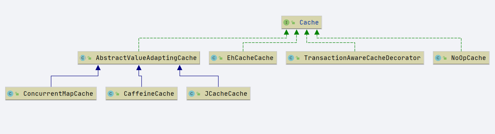
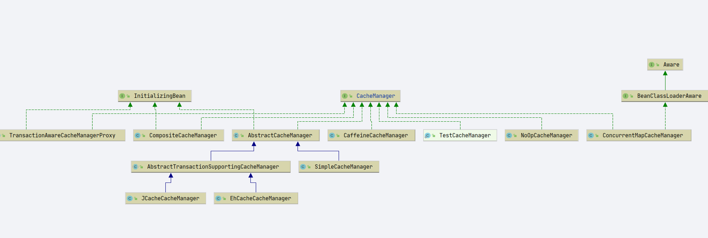
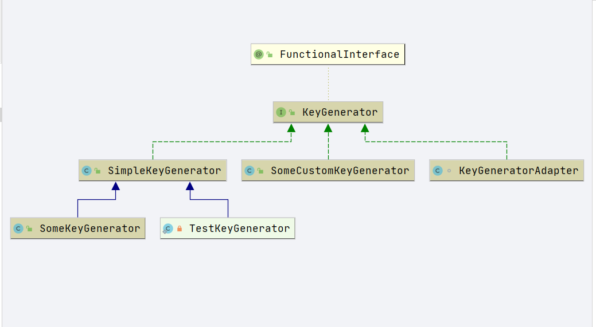
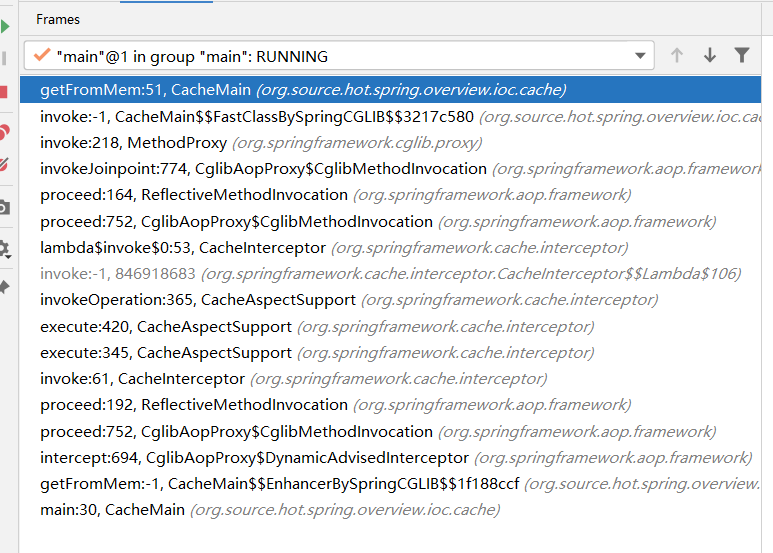

# Spring Cache 
- Author: [HuiFer](https://github.com/huifer)
- 源码阅读仓库: [SourceHot-spring](https://github.com/SourceHot/spring-framework-read)

## Cache
```java
public interface Cache {

	/**
     * 获取缓存名称
	 */
	String getName();

	/**
     * 获取缓存
	 */
	Object getNativeCache();

	/**
     * 获取值的包装
	 */
	@Nullable
	ValueWrapper get(Object key);

	/**
     * 获取值
	 */
	@Nullable
	<T> T get(Object key, @Nullable Class<T> type);

	/**
	 */
	@Nullable
	<T> T get(Object key, Callable<T> valueLoader);

	/**
     * 设置值
	 */
	void put(Object key, @Nullable Object value);

	@Nullable
	default ValueWrapper putIfAbsent(Object key, @Nullable Object value) {
		ValueWrapper existingValue = get(key);
		if (existingValue == null) {
			put(key, value);
		}
		return existingValue;
	}

	/**
     * 删除一个缓存
	 */
	void evict(Object key);

	/**
	 */
	default boolean evictIfPresent(Object key) {
		evict(key);
		return false;
	}

	/**

	 */
	void clear();

	/**
	 */
	default boolean invalidate() {
		clear();
		return false;
	}


	/**
	 * A (wrapper) object representing a cache value.
     *
     * 对象包装
	 */
	@FunctionalInterface
	interface ValueWrapper {

	
		@Nullable
		Object get();
	}


	/**
     * 值检索异常
	 */
	@SuppressWarnings("serial")
	class ValueRetrievalException extends RuntimeException {

		@Nullable
		private final Object key;

		public ValueRetrievalException(@Nullable Object key, Callable<?> loader, Throwable ex) {
			super(String.format("Value for key '%s' could not be loaded using '%s'", key, loader), ex);
			this.key = key;
		}

		@Nullable
		public Object getKey() {
			return this.key;
		}
	}

}
```


Spring 中的实现




## CacheManager

- Cache 管理接口

```
public interface CacheManager {

   /**
     * 获取一个缓存
    */
   @Nullable
   Cache getCache(String name);

   /**
     * 获取所有的缓存名称
    */
   Collection<String> getCacheNames();

}
```





### SimpleCacheManager

- `org.springframework.cache.support.SimpleCacheManager`
- 根据上图继承关系，可以估计大部分方法在`org.springframework.cache.support.AbstractCacheManager`


### AbstractCacheManager

```java
public abstract class AbstractCacheManager implements CacheManager, InitializingBean {

    /**
     * 缓存map
     */
   private final ConcurrentMap<String, Cache> cacheMap = new ConcurrentHashMap<>(16);

    /**
     * 缓存名称
     */
   private volatile Set<String> cacheNames = Collections.emptySet();
}
```

- `afterPropertiesSet`方法

  ```java
  public void initializeCaches() {
      // 子类实现获取cache集合
     Collection<? extends Cache> caches = loadCaches();
  
     synchronized (this.cacheMap) {
        this.cacheNames = Collections.emptySet();
        this.cacheMap.clear();
  
        Set<String> cacheNames = new LinkedHashSet<>(caches.size());
        // 循环放入缓存map ,
        for (Cache cache : caches) {
           String name = cache.getName();
           this.cacheMap.put(name, decorateCache(cache));
           cacheNames.add(name);
        }
        this.cacheNames = Collections.unmodifiableSet(cacheNames);
     }
  }
  ```

- get put 方法忽略. 


## ValueWrapper

- 提供 get 方法,  值通过构造器传递

```java
public class SimpleValueWrapper implements ValueWrapper {

   @Nullable
   private final Object value;


   /**
    * Create a new SimpleValueWrapper instance for exposing the given value.
    * @param value the value to expose (may be {@code null})
    */
   public SimpleValueWrapper(@Nullable Object value) {
      this.value = value;
   }


   /**
    * Simply returns the value as given at construction time.
    */
   @Override
   @Nullable
   public Object get() {
      return this.value;
   }

}
```


## KeyGenerator

- key 的生成策略

  


### SimpleKeyGenerator

- 根据入参
  1. 如果有值则返回第一个
  2. 没有就返回空字符串

```java
public class SimpleKeyGenerator implements KeyGenerator {

   @Override
   public Object generate(Object target, Method method, Object... params) {
      return generateKey(params);
   }

   /**
    * Generate a key based on the specified parameters.
    */
   public static Object generateKey(Object... params) {
      if (params.length == 0) {
         return SimpleKey.EMPTY;
      }
      if (params.length == 1) {
         Object param = params[0];
         if (param != null && !param.getClass().isArray()) {
            return param;
         }
      }
      return new SimpleKey(params);
   }

}
```


## CacheAspectSupport

- `org.springframework.cache.interceptor.CacheAspectSupport`

