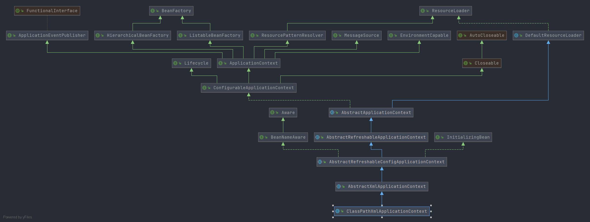
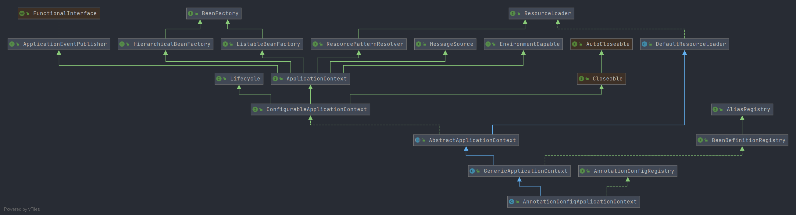

# Spring IoC 导读

- 通过本节的阅读将会了解 SpringIoC 中的各大核心类.

- 在 Spring 中有两种关于容器启动的方式. 第一种是使用 XML 方式进行, 第二种是使用 Java 注解的方式. 笔者建议可以先从环境搭建开始, 创建两个 demo 工程用来 debug . 
    笔者在这个阶段采取的是先编译 Spring 再创建, 读者可以直接创建一个 maven 或者 gradle 的工程进行 Spring 依赖导入. 
  
- 在 XML 模式下我们会使用: `ClassPathXmlApplicationContext` 作为应用上下文, 注解模式下我们会使用 `AnnotationConfigApplicationContext` 作为应用上下文.
    在没有开始阅读这两个类的具体实现之前笔者建议先将两个类的类图提取出来先做一下对比. 


- ClassPathXmlApplicationContext 类图

    


- AnnotationConfigApplicationContext 类图
  
  


- 从类图上我们可以对比出两者的相同之处和不同之处. 在这里笔者想要强调相同之处. 从类图上我们可以知道相同部分有
  1. `ClassPathXmlApplicationContex` 和 `AnnotationConfigApplicationContext` 两者都继承 **`AbstractApplicationContext`** 这是一个十分重要的类. 对于这个类的分析方式笔者建议各位先了解实现的接口, 例如: `BeanFactory` 、`ResourceLoader`

- 对于不同之处笔者建议在了解共同部分的内容后在进行开展. 


整体阅读过程如下

1. 对 `BeanFactory` 顶层接口先了解接口提供的方法作用, (tips: 对于接口不要过分分析, 具体分析应该在实现类中进行) 根据前文提到的两个类图各位读者至少需要了解下面这些和 `BeanFactory` 相关的接口
   1. **`BeanFactory`**
   2. **`HierarchicalBeanFactory`**
   3. **`ListableBeanFactory`**
   4. **`ApplicationContext`**
   5. **`ConfigurableApplicationContext`**
   
   - 这是关于 BeanFactory 系列接口中必读的子接口.
   
2. 在了解 BeanFactory 系列接口后应该关注 **Spring事件** 相关的接口.
   在 Spring 容器初始化阶段有关于事件的处理, 这部分内容应当作为前置知识进行学习, 当然在遇到了在学习问题也不大. 
   1. **`ApplicationEvent`**
   1. **`ApplicationListener`**
   1. **`ApplicationEventPublisher`**

3. 在了解 Spring-Event 之后就需要对 资源 `Resource` 系列接口进行了解. 

   对于资源有这么一些定义: 资源加载, 资源对象 在 Spring 中对于这两者的定义是两个接口 **`ResourceLoader`** 和 **`Resource`** 对于资源的分类在 Spring 中有 文件资源(**FileSystemResource**) 等. 
   
4. 我们经常听到说 Bean 的生命周期, 其实在 Spring IoC 中 容器也是有生命周期的, 接口为 : **`Lifecycle`**


在了解上面所说的各类接口作用后读者可以分块阅读实现类. 


- 对于想要深入了解每个具体细节的读者可以采用这样的方式进行阅读. 

在前文我们实先了解了关于接口的作用, 在阅读实现类的时候可以根据需要去阅读感谢兴趣的方法, 不过在阅读方法之前笔者强烈建议**对成员变量有一个认知** , 在 Spring 中成员变量有很多是接口, 直接调用的接口方法如果不了解接口的作用对整体的认知可能会产生一些偏差. (遇到接口**先了解接口继承关系, 了解实现方法.**) 在了解成员变量后再**逐个方法进行阅读**.  **这种阅读方法十分耗时. 请慎重选择. **

我们以`AbstractApplicationContext`为例， 使用这种方式阅读我们会先对各个成员变量进行理解, 标注含义. 遇到方法各个方法的阅读也是一个巨大的工程量. 逐行标注每行或多行的作用. 

- 标注前

```java
private final List<BeanFactoryPostProcessor> beanFactoryPostProcessors = new ArrayList<>();
```

- 标注后

```java
/**
* BeanFactoryPostProcessors to apply on refresh.
* bean 后置处理器列表
* */
private final List<BeanFactoryPostProcessor> beanFactoryPostProcessors = new ArrayList<>();
```


- 对于仅仅想要了解大致流程的读者可以采用下面这种方式. (**采用这种方法目的明确, 不追求过分细节**)

阅读方式:

首先必须要确定一个明确的目标方法, 这个目标方法就是读者想要了解的一个方法, 比如`ClassPathXmlApplicationContext`的构造函数

找到这个函数后进入到各个方法调用链路中. 进入方法后可以酌情是否对提供者感兴趣, 如果不感兴趣可以不去了解这个提供者.


笔者以: `AbstractApplicationContext#prepareBeanFactory` 方法举例


```java
protected void prepareBeanFactory(ConfigurableListableBeanFactory beanFactory) {
    // Tell the internal bean factory to use the context's class loader etc.
    // 设置 classLaoder
    beanFactory.setBeanClassLoader(getClassLoader());
    // 设置 el 表达式解析器
    beanFactory.setBeanExpressionResolver(new StandardBeanExpressionResolver(beanFactory.getBeanClassLoader()));
    // 添加属性编辑器注册工具
    beanFactory.addPropertyEditorRegistrar(new ResourceEditorRegistrar(this, getEnvironment()));

    // Configure the bean factory with context callbacks.
    // 添加 bean 后置处理器
    beanFactory.addBeanPostProcessor(new ApplicationContextAwareProcessor(this));
    // 添加忽略的接口
    beanFactory.ignoreDependencyInterface(EnvironmentAware.class);
    beanFactory.ignoreDependencyInterface(EmbeddedValueResolverAware.class);
    beanFactory.ignoreDependencyInterface(ResourceLoaderAware.class);
    beanFactory.ignoreDependencyInterface(ApplicationEventPublisherAware.class);
    beanFactory.ignoreDependencyInterface(MessageSourceAware.class);
    beanFactory.ignoreDependencyInterface(ApplicationContextAware.class);

// 省略其他
}
```


假设读者对`ignoreDependencyInterface`方法感兴趣就可以去找到它的实现方法，不感兴趣可以直接跳过, 对比前一个方法的阅读时间比较少. 


到这我们大致目标已经有了. 下面笔者将会列出一些藏在调用链路中的类, 接口细节太多了这里就不将各个接口都贴出来了.

- `BeanMetadataElement`: xml 模式下至关重要的一个接口, 接口承担了 xml 标签和 Java 对象的关系

- `BeanDefinition`: bean 定义接口， 提供了获取 bean 信息的能力, 常用实现类: `RootBeanDefinition`
- `BeanDefinitionHolder`： bean 定义持有对象, 属于 Bean 定义的拓展, 其可以获取 BeanDefinition 接口、beanName 、别名
- `BeanWrapper`: bean 包装接口
- `Lifecycle`: 容器的生命周期接口
- `SingletonBeanRegistry`: 单例 bean 注册接口
- `AliasRegistry` : 别名注册接口
- `Aware`
- `BeanPostProcessor`
- `Ordered`
- `BeanNameGenerator`
- bean 生命周期接口
- `PropertyEditor`
- .....


现在我们来做一个大致的设想围绕这个设想进行SpringIoC的阅读

- XML

读取 xml 文件, 将标签转换成 Java 对象, 调用实例从容器中获取 


- 注解

读取 Class 文件, 将注解转换成 Java 对象, 调用实例从容器中获取


在这两个设想上进行阅读源码可能会比较轻松. 