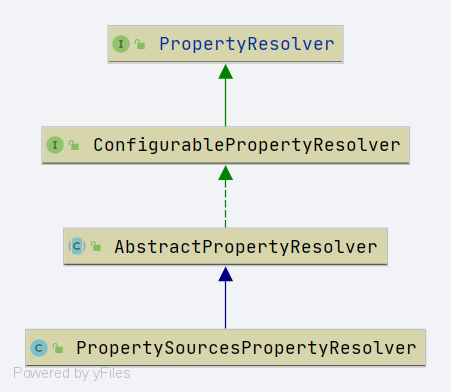

# Spring PropertySourcesPropertyResolver

- 类全路径: `org.springframework.core.env.PropertySourcesPropertyResolver`

类图



- 内部属性

```java
	@Nullable
	private final PropertySources propertySources;
```


关于 PropertySources 详见: [PropertySources-分析](Spring-PropertySources.md)


## getProperty

`PropertySourcesPropertyResolver` 内部方法围绕着 `PropertySources` 进行展开其中最重要的方法: **`getProperty`**


```java
@Nullable
protected <T> T getProperty(String key, Class<T> targetValueType, boolean resolveNestedPlaceholders) {
   if (this.propertySources != null) {
      // 循环
      for (PropertySource<?> propertySource : this.propertySources) {
         if (logger.isTraceEnabled()) {
            logger.trace("Searching for key '" + key + "' in PropertySource '" +
                  propertySource.getName() + "'");
         }
         // 获取对象结果
         Object value = propertySource.getProperty(key);
         if (value != null) {
            // 是否需要处理嵌套
            // 是否是 string 类型
            if (resolveNestedPlaceholders && value instanceof String) {
               // 嵌套获取数据
               value = resolveNestedPlaceholders((String) value);
            }
            // 日志
            logKeyFound(key, propertySource, value);
            // 类型转换
            return convertValueIfNecessary(value, targetValueType);
         }
      }
   }
   if (logger.isTraceEnabled()) {
      logger.trace("Could not find key '" + key + "' in any property source");
   }
   return null;
}
```


## resolveNestedPlaceholders

- 处理占位符,获取真实数据

- `org.springframework.core.env.AbstractPropertyResolver#resolveNestedPlaceholders`


```java
protected String resolveNestedPlaceholders(String value) {
   return (this.ignoreUnresolvableNestedPlaceholders ?
         resolvePlaceholders(value) : resolveRequiredPlaceholders(value));
}
```

- 上面的方法最后都会指向: `org.springframework.core.env.AbstractPropertyResolver#doResolvePlaceholders` 方法

  ```java
  private String doResolvePlaceholders(String text, PropertyPlaceholderHelper helper) {
     return helper.replacePlaceholders(text, this::getPropertyAsRawString);
  }
  ```


PropertyPlaceholderHelper 解析请看: [Spring-PropertyPlaceholderHelper](Spring-PropertyPlaceholderHelper.md)


## convertValueIfNecessary

- 值类型转换

- `org.springframework.core.env.AbstractPropertyResolver#convertValueIfNecessary`

```java
@SuppressWarnings("unchecked")
@Nullable
protected <T> T convertValueIfNecessary(Object value, @Nullable Class<T> targetType) {
   if (targetType == null) {
      // 类型强制转换
      return (T) value;
   }
   ConversionService conversionServiceToUse = this.conversionService;
   if (conversionServiceToUse == null) {
      // Avoid initialization of shared DefaultConversionService if
      // no standard type conversion is needed in the first place...
      if (ClassUtils.isAssignableValue(targetType, value)) {
         return (T) value;
      }
      // 默认的转换接口
      conversionServiceToUse = DefaultConversionService.getSharedInstance();
   }
   // 通过默认接口进行转换
   return conversionServiceToUse.convert(value, targetType);
}
```