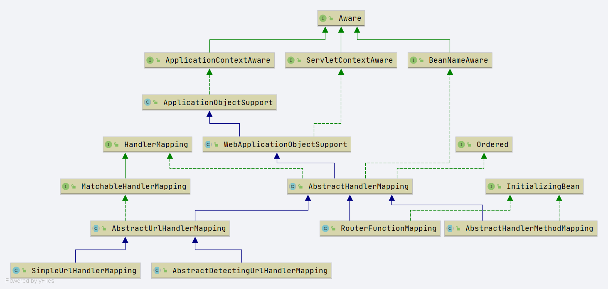
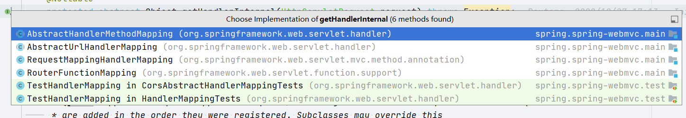

# Spring HandlerMapping
- `org.springframework.web.servlet.HandlerMapping`
- HandlerMapping 处理映射关系, 通过请求转换成对象`HandlerExecutionChain`
```java
public interface HandlerMapping {
    HandlerExecutionChain getHandler(HttpServletRequest request) throws Exception;
// 其他静态变量省略
}
```





```java
@Override
@Nullable
public final HandlerExecutionChain getHandler(HttpServletRequest request) throws Exception {
   // 转换成handler
   Object handler = getHandlerInternal(request);
   if (handler == null) {
      // 获取默认的 handler
      handler = getDefaultHandler();
   }
   if (handler == null) {
      return null;
   }
   // Bean name or resolved handler?
   if (handler instanceof String) {
      // handler 是beanName 直接从容器中获取
      String handlerName = (String) handler;
      handler = obtainApplicationContext().getBean(handlerName);
   }

   HandlerExecutionChain executionChain = getHandlerExecutionChain(handler, request);

   if (logger.isTraceEnabled()) {
      logger.trace("Mapped to " + handler);
   }
   else if (logger.isDebugEnabled() && !request.getDispatcherType().equals(DispatcherType.ASYNC)) {
      logger.debug("Mapped to " + executionChain.getHandler());
   }

   if (hasCorsConfigurationSource(handler) || CorsUtils.isPreFlightRequest(request)) {
      CorsConfiguration config = (this.corsConfigurationSource != null ? this.corsConfigurationSource.getCorsConfiguration(request) : null);
      CorsConfiguration handlerConfig = getCorsConfiguration(handler, request);
      config = (config != null ? config.combine(handlerConfig) : handlerConfig);
      executionChain = getCorsHandlerExecutionChain(request, executionChain, config);
   }

   return executionChain;
}
```


- `getHandlerInternal`方法是一个抽象方法

  ```JAVA
  @Nullable
  protected abstract Object getHandlerInternal(HttpServletRequest request) throws Exception;
  ```

  存在的实现方法

  


- 先看`org.springframework.web.servlet.handler.AbstractHandlerMethodMapping#getHandlerInternal`方法是怎么一回事.


```java
@Override
protected HandlerMethod getHandlerInternal(HttpServletRequest request) throws Exception {
   //
   String lookupPath = getUrlPathHelper().getLookupPathForRequest(request);
   // 设置属性 
   request.setAttribute(LOOKUP_PATH, lookupPath);
   // 上锁
   this.mappingRegistry.acquireReadLock();
   try {
      // 寻找 handler method
      HandlerMethod handlerMethod = lookupHandlerMethod(lookupPath, request);
      return (handlerMethod != null ? handlerMethod.createWithResolvedBean() : null);
   }
   finally {
      // 释放锁
      this.mappingRegistry.releaseReadLock();
   }
}
```


## UrlPathHelper 

- 全路径:`org.springframework.web.util.UrlPathHelper`

- 几个属性

  ```java
  /**
   * 是否全路径标记
   */
  private boolean alwaysUseFullPath = false;
  
  /**
   * 是否需要 decode
   */
  private boolean urlDecode = true;
  
  private boolean removeSemicolonContent = true;
  
  /**
   * 默认的encoding编码格式
   */
  private String defaultEncoding = WebUtils.DEFAULT_CHARACTER_ENCODING;
  ```


### getPathWithinApplication


```java
public String getPathWithinApplication(HttpServletRequest request) {
   // 获取 context path
   String contextPath = getContextPath(request);
   // 获取 uri
   String requestUri = getRequestUri(request);
   String path = getRemainingPath(requestUri, contextPath, true);
   if (path != null) {
      // Normal case: URI contains context path.
      return (StringUtils.hasText(path) ? path : "/");
   }
   else {
      return requestUri;
   }
}
```

1. 从 request 中获取 context-path
   1. 从属性中直接获取
   2. 从request中调用 getContextPath 获取
   3. 判断是否是**`/`**
   4. decode request string 
2. 从 request 中虎丘 request-uri
   1. 从属性中获取
   2. 从 request 中调用 getRequestURI 获取
   3. decode 
3. 获取剩余路径


### getContextPath

- 获取 context-path 地址

```java
public String getContextPath(HttpServletRequest request) {
   // 从 request 获取 context path
   String contextPath = (String) request.getAttribute(WebUtils.INCLUDE_CONTEXT_PATH_ATTRIBUTE);
   if (contextPath == null) {
      contextPath = request.getContextPath();
   }
   if ("/".equals(contextPath)) {
      // Invalid case, but happens for includes on Jetty: silently adapt it.
      contextPath = "";
   }
   // decode context path
   return decodeRequestString(request, contextPath);
}
```


### decodeRequestString

- 判断是否需要编码, 需要编码就做编码操作，不需要就直接返回

```java
public String decodeRequestString(HttpServletRequest request, String source) {
   // 判断是否需要编码
   if (this.urlDecode) {
      // 进行编码
      return decodeInternal(request, source);
   }
   return source;
}
```


### decodeInternal

- 编码方法

```java
@SuppressWarnings("deprecation")
private String decodeInternal(HttpServletRequest request, String source) {
   // 确定编码方式
   String enc = determineEncoding(request);
   try {
      // 将 source 编译成 enc 的编码方式
      return UriUtils.decode(source, enc);
   }
   catch (UnsupportedCharsetException ex) {
      if (logger.isWarnEnabled()) {
         logger.warn("Could not decode request string [" + source + "] with encoding '" + enc +
               "': falling back to platform default encoding; exception message: " + ex.getMessage());
      }
      // 直接编码,JDK底层编码
      return URLDecoder.decode(source);
   }
}
```


### determineEncoding

- 确认编码


```java
protected String determineEncoding(HttpServletRequest request) {
   // 从 request 中获取编码方式
   String enc = request.getCharacterEncoding();
   if (enc == null) {
      // 默认编码
      enc = getDefaultEncoding();
   }
   return enc;
}
```


### getRequestUri

- 获取 uri 地址

```java
	public String getRequestUri(HttpServletRequest request) {
		// 从属性中获取
		String uri = (String) request.getAttribute(WebUtils.INCLUDE_REQUEST_URI_ATTRIBUTE);
		if (uri == null) {
			// 调用方法获取
			uri = request.getRequestURI();
		}
		//编码和清理数据
		return decodeAndCleanUriString(request, uri);
	}

```


### decodeAndCleanUriString

- 编码和清理数据

```java
private String decodeAndCleanUriString(HttpServletRequest request, String uri) {
   // 去掉分号
   uri = removeSemicolonContent(uri);
   // decoding
   uri = decodeRequestString(request, uri);
   // 去掉 // 双斜杠
   uri = getSanitizedPath(uri);
   return uri;
}
```


### shouldRemoveTrailingServletPathSlash

- 是否删除 servlet path 后的斜杠

- 默认是 false .
- 代码流程
  1. 通过 classLoader 加载 `"com.ibm.ws.webcontainer.WebContainer"`
  2. 调用方法 `"getWebContainerProperties"`
  3. 从方法结果中取`"getWebContainerProperties"`

```java
private boolean shouldRemoveTrailingServletPathSlash(HttpServletRequest request) {
   if (request.getAttribute(WEBSPHERE_URI_ATTRIBUTE) == null) {
      // Regular servlet container: behaves as expected in any case,
      // so the trailing slash is the result of a "/" url-pattern mapping.
      // Don't remove that slash.
      return false;
   }
   Boolean flagToUse = websphereComplianceFlag;
   if (flagToUse == null) {
      ClassLoader classLoader = UrlPathHelper.class.getClassLoader();
      String className = "com.ibm.ws.webcontainer.WebContainer";
      String methodName = "getWebContainerProperties";
      String propName = "com.ibm.ws.webcontainer.removetrailingservletpathslash";
      boolean flag = false;
      try {
         Class<?> cl = classLoader.loadClass(className);
         Properties prop = (Properties) cl.getMethod(methodName).invoke(null);
         flag = Boolean.parseBoolean(prop.getProperty(propName));
      }
      catch (Throwable ex) {
         if (logger.isDebugEnabled()) {
            logger.debug("Could not introspect WebSphere web container properties: " + ex);
         }
      }
      flagToUse = flag;
      websphereComplianceFlag = flag;
   }
   // Don't bother if WebSphere is configured to be fully Servlet compliant.
   // However, if it is not compliant, do remove the improper trailing slash!
   return !flagToUse;
}
```


### decodeMatrixVariables

- 编码修改方法

```java
public MultiValueMap<String, String> decodeMatrixVariables(
      HttpServletRequest request, MultiValueMap<String, String> vars) {

   // 判断是否需要重写编码
   if (this.urlDecode) {
      return vars;
   }
   else {
      // 需要重写编码的情况
      MultiValueMap<String, String> decodedVars = new LinkedMultiValueMap<>(vars.size());
      // 循环, 将 value 调用decodeInternal写到结果map返回
      vars.forEach((key, values) -> {
         for (String value : values) {
            decodedVars.add(key, decodeInternal(request, value));
         }
      });
      return decodedVars;
   }
}
```

- 与这个方法对应的还有`decodePathVariables`


### decodePathVariables

```java
public Map<String, String> decodePathVariables(HttpServletRequest request, Map<String, String> vars) {
   // 判断是否需要重写编码
   if (this.urlDecode) {
      return vars;
   }
   else {
      Map<String, String> decodedVars = new LinkedHashMap<>(vars.size());
      // 虚幻 decoding 
      vars.forEach((key, value) -> decodedVars.put(key, decodeInternal(request, value)));
      return decodedVars;
   }
}
```


### getPathWithinServletMapping

- 获取匹配的url