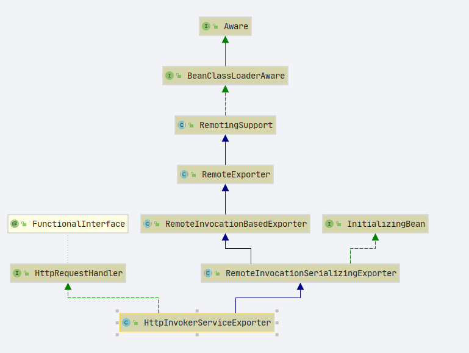
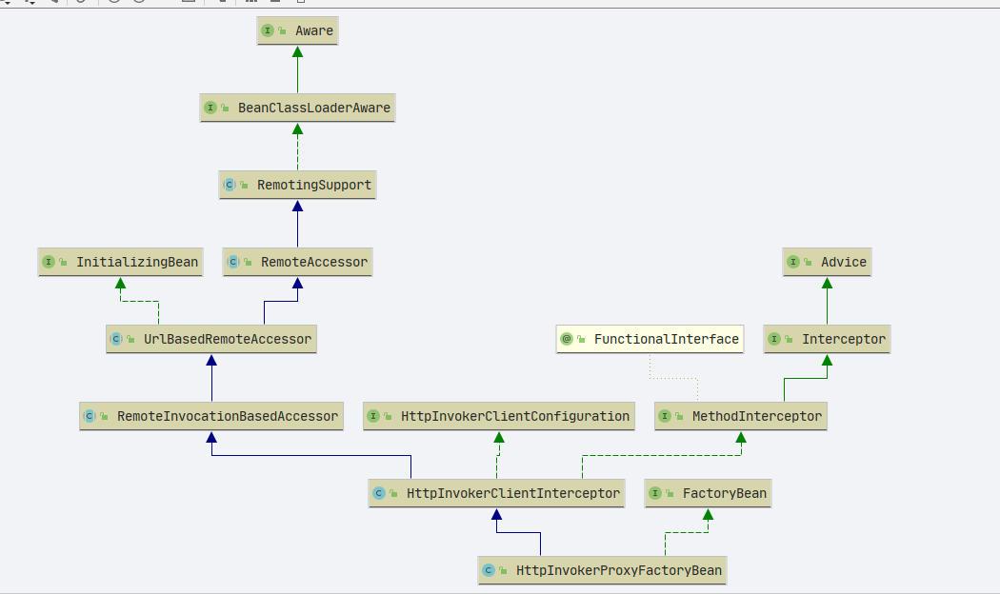

# Spring httpinvoker
- 包路径: `org.springframework.remoting `

## 配置
### 服务端
```xml
    <bean name="helloExporter"
          class="org.springframework.remoting.httpinvoker.HttpInvokerServiceExporter">
        <property name="service" ref="helloService"></property>
        <property name="serviceInterface" value="org.sourcehot.httpinvoker.IHttpInvokerService">
        </property>
    </bean>
    <bean id="helloService" class="org.sourcehot.httpinvoker.IHttpInvokerServiceImpl"/>
```
### 客户端

```xml
    <bean id="httpInvokerProxyFactoryBean" class="org.springframework.remoting.httpinvoker.HttpInvokerProxyFactoryBean">
        <property name="serviceUrl" value="http://localhost:9999//helloService/helloExporter"/>
        <property name="serviceInterface" value="org.sourcehot.httpinvoker.IHttpInvokerService"/>

    </bean>
```


## 分析

### org.springframework.remoting.httpinvoker.HttpInvokerServiceExporter

类图




- `org.springframework.remoting.rmi.RemoteInvocationSerializingExporter#afterPropertiesSet`

```java
    @Override
    public void afterPropertiesSet() {
        prepare();
    }

    /**
     * Initialize this service exporter.
     */
    public void prepare() {
        this.proxy = getProxyForService();
    }
```

- `org.springframework.remoting.support.RemoteExporter#getProxyForService`在spring-rmi的时候讲过此处不展开

- 请求处理`org.springframework.web.HttpRequestHandler`

  ```JAVA
      @Override
      public void handleRequest(HttpServletRequest request, HttpServletResponse response)
              throws ServletException, IOException {
  
          try {
              // 从request中获取序列化对象 RemoteInvocation
              RemoteInvocation invocation = readRemoteInvocation(request);
              // 执行
              RemoteInvocationResult result = invokeAndCreateResult(invocation, getProxy());
              // 写出response
              writeRemoteInvocationResult(request, response, result);
          }
          catch (ClassNotFoundException ex) {
              throw new NestedServletException("Class not found during deserialization", ex);
          }
      }
  
  ```

  

#### readRemoteInvocation

```JAVA
    protected RemoteInvocation readRemoteInvocation(HttpServletRequest request)
            throws IOException, ClassNotFoundException {

        return readRemoteInvocation(request, request.getInputStream());
    }


    protected RemoteInvocation readRemoteInvocation(HttpServletRequest request, InputStream is)
            throws IOException, ClassNotFoundException {

        // 获取输入流
        ObjectInputStream ois = createObjectInputStream(decorateInputStream(request, is));
        try {
            // 返回 RemoteInvocation 对象, 类型判断后强制转换
            return doReadRemoteInvocation(ois);
        }
        finally {
            ois.close();
        }
    }


    protected RemoteInvocation doReadRemoteInvocation(ObjectInputStream ois)
            throws IOException, ClassNotFoundException {

        Object obj = ois.readObject();
        if (!(obj instanceof RemoteInvocation)) {
            throw new RemoteException("Deserialized object needs to be assignable to type [" +
                    RemoteInvocation.class.getName() + "]: " + ClassUtils.getDescriptiveType(obj));
        }
        return (RemoteInvocation) obj;
    }
```


#### invokeAndCreateResult

- `org.springframework.remoting.support.RemoteInvocationBasedExporter#invokeAndCreateResult`

  ```java
      protected RemoteInvocationResult invokeAndCreateResult(RemoteInvocation invocation, Object targetObject) {
          try {
              Object value = invoke(invocation, targetObject);
              return new RemoteInvocationResult(value);
          }
          catch (Throwable ex) {
              return new RemoteInvocationResult(ex);
          }
      }
  ```

  - `org.springframework.remoting.support.RemoteInvocationBasedExporter#invoke`这个方法在SpringRMI 中讲过

#### writeRemoteInvocationResult

```java
    protected void writeRemoteInvocationResult(
            HttpServletRequest request, HttpServletResponse response, RemoteInvocationResult result)
            throws IOException {

        // 设置类型
        response.setContentType(getContentType());
        // 写出response
        writeRemoteInvocationResult(request, response, result, response.getOutputStream());
    }
```


```java
    protected void writeRemoteInvocationResult(
            HttpServletRequest request, HttpServletResponse response, RemoteInvocationResult result, OutputStream os)
            throws IOException {

        // 输出流
        ObjectOutputStream oos =
                createObjectOutputStream(new FlushGuardedOutputStream(decorateOutputStream(request, response, os)));
        try {
            // 写出
            doWriteRemoteInvocationResult(result, oos);
        }
        finally {
            oos.close();
        }
    }

```


## org.springframework.remoting.httpinvoker.HttpInvokerProxyFactoryBean

类图




- 初始化流程大同小异，直接看`invoke`方法

```JAVA
    @Override
    public Object invoke(MethodInvocation methodInvocation) throws Throwable {
        if (AopUtils.isToStringMethod(methodInvocation.getMethod())) {
            return "HTTP invoker proxy for service URL [" + getServiceUrl() + "]";
        }
        // 对象封装
        RemoteInvocation invocation = createRemoteInvocation(methodInvocation);
        RemoteInvocationResult result;

        try {
            // 远程调用
            result = executeRequest(invocation, methodInvocation);
        }
        catch (Throwable ex) {
            RemoteAccessException rae = convertHttpInvokerAccessException(ex);
            throw (rae != null ? rae : ex);
        }

        try {
            // 组装对象
            return recreateRemoteInvocationResult(result);
        }
        catch (Throwable ex) {
            if (result.hasInvocationTargetException()) {
                throw ex;
            }
            else {
                throw new RemoteInvocationFailureException("Invocation of method [" + methodInvocation.getMethod() +
                        "] failed in HTTP invoker remote service at [" + getServiceUrl() + "]", ex);
            }
        }
    }


```


### executeRequest

```JAVA
    protected RemoteInvocationResult executeRequest(
            RemoteInvocation invocation, MethodInvocation originalInvocation) throws Exception {

        return executeRequest(invocation);
    }


    protected RemoteInvocationResult executeRequest(RemoteInvocation invocation) throws Exception {
        return getHttpInvokerRequestExecutor().executeRequest(this, invocation);
    }


    @Override
    public final RemoteInvocationResult executeRequest(
            HttpInvokerClientConfiguration config, RemoteInvocation invocation) throws Exception {

        ByteArrayOutputStream baos = getByteArrayOutputStream(invocation);
        if (logger.isDebugEnabled()) {
            logger.debug("Sending HTTP invoker request for service at [" + config.getServiceUrl() +
                    "], with size " + baos.size());
        }
        return doExecuteRequest(config, baos);
    }


//org.springframework.remoting.httpinvoker.HttpComponentsHttpInvokerRequestExecutor#doExecuteRequest
    @Override
    protected RemoteInvocationResult doExecuteRequest(
            HttpInvokerClientConfiguration config, ByteArrayOutputStream baos)
            throws IOException, ClassNotFoundException {

        // 创建 httpPost 第三方的库
        HttpPost postMethod = createHttpPost(config);
        setRequestBody(config, postMethod, baos);
        try {
            // 执行方法
            HttpResponse response = executeHttpPost(config, getHttpClient(), postMethod);
            // 校验response
            validateResponse(config, response);
            // 获取输入流
            InputStream responseBody = getResponseBody(config, response);
            // 提取结果
            return readRemoteInvocationResult(responseBody, config.getCodebaseUrl());
        }
        finally {
            postMethod.releaseConnection();
        }
    }

```

