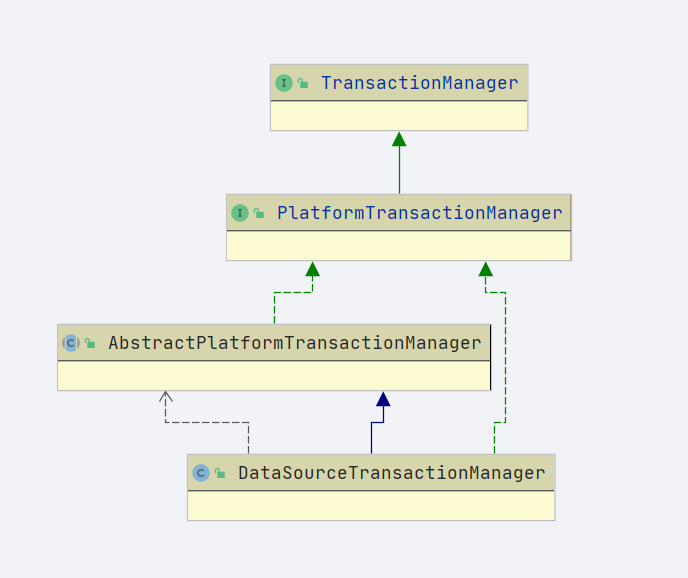
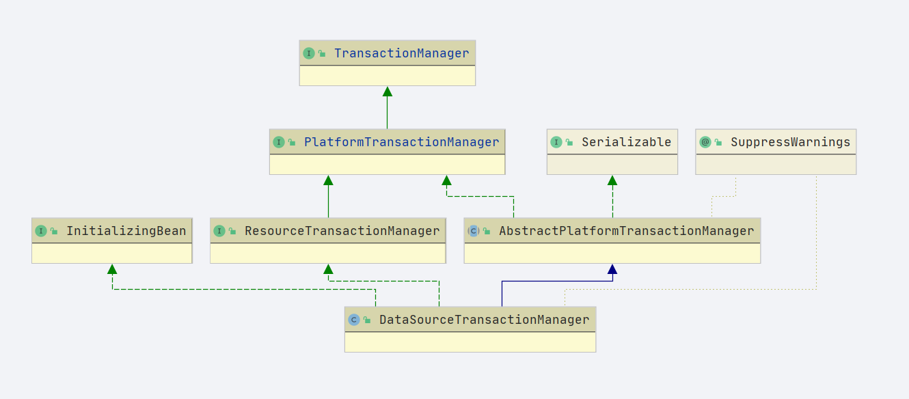
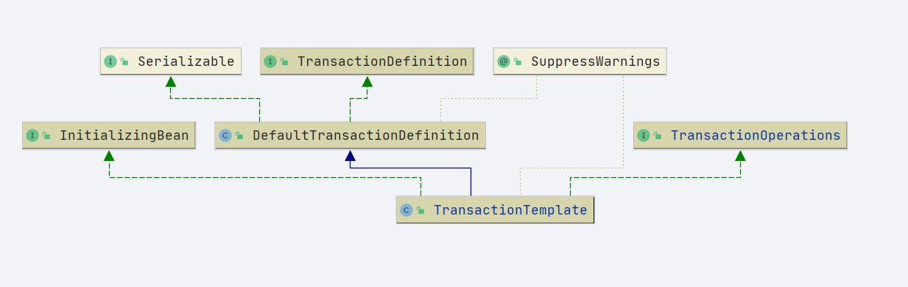

org.springframework.jdbc.datasource.DataSourceTransactionManager 数据库事务管理
org.springframework.transaction.annotation.Transactional 事务注解
org.springframework.transaction.config.TxNamespaceHandler 事务命名空间解析
org.springframework.transaction.support.TransactionTemplate 事务模板
org.springframework.transaction.support.TransactionOperations 事务操作接口
org.springframework.transaction.support.TransactionCallback 事务的回调接口
org.springframework.transaction.support.TransactionCallbackWithoutResult 带有返回结果的事务回调

org.springframework.transaction.support.DefaultTransactionDefinition 默认事务定义


## DefaultTransactionDefinition

- 默认的事务定义
  - 常见属性
    1. timeout
    2. readOnly
    3. ....


## PlatformTransactionManager


```java
// 获取事务
TransactionStatus getTransaction(@Nullable TransactionDefinition definition)throws TransactionException;
// 提交事务
void commit(TransactionStatus status) throws TransactionException;
// 回滚事务
void rollback(TransactionStatus status) throws TransactionException;
```

- 贴出一部分




- AbstractPlatformTransactionManager 定义了一些基础属性 以及一些需要子类实现的方法

```java
// 属性
defaultTimeout
nestedTransactionAllowed
validateExistingTransaction
globalRollbackOnParticipationFailure
failEarlyOnGlobalRollbackOnly
rollbackOnCommitFailure
// 方法
doGetTransaction
isExistingTransaction
useSavepointForNestedTransaction
doBegin
doSuspend
doResume
shouldCommitOnGlobalRollbackOnly
prepareForCommit
doCommit
doRollback
doSetRollbackOnly
registerAfterCompletionWithExistingTransaction
doCleanupAfterCompletion
    
```


## DataSourceTransactionManager

- xml配置如下

  

```xml
	<bean id="dataSource" class="com.alibaba.druid.pool.DruidDataSource">
		<property name="url"
				value=""/>
		<property name="username" value=""/>
		<property name="password" value=""/>
		<property name="driverClassName" value="com.mysql.jdbc.Driver"/>
	</bean>
	<bean id="jdbcTemplate" class="org.springframework.jdbc.core.JdbcTemplate">
		<property name="dataSource" ref="dataSource"/>
	</bean>
	<bean id="transactionManager"
			class="org.springframework.jdbc.datasource.DataSourceTransactionManager">
		<property name="dataSource" ref="dataSource"/>
	</bean>
```

- 两个属性，通常我们会配置datasource

  ```java
  	@Nullable
  	private DataSource dataSource;
  
  	private boolean enforceReadOnly = false;
  ```

  - bean 的属性注入就不具体描述了



- `InitializingBean`

  - ```java
    @Override
    public void afterPropertiesSet() {
       if (getDataSource() == null) {
          throw new IllegalArgumentException("Property 'dataSource' is required");
       }
    }
    ```

    - 如果`dataSource`为空会抛出异常
    - 默认单例会注册到ioc容器中.后续注册流程不具体描述


- 方法注释

```java
	/**
	 * 获取datasource
	 */
	protected DataSource obtainDataSource() {
		DataSource dataSource = getDataSource();
		Assert.state(dataSource != null, "No DataSource set");
		return dataSource;
	}

	/**
	 * 创建事务
	 *
	 * @return 事务对象
	 */
	@Override
	protected Object doGetTransaction() {
		DataSourceTransactionObject txObject = new DataSourceTransactionObject();
		txObject.setSavepointAllowed(isNestedTransactionAllowed());
		// 数据库链接对象
		// 从事务管理器中获取数据库链接对象
		ConnectionHolder conHolder =
				(ConnectionHolder) TransactionSynchronizationManager
						.getResource(obtainDataSource());
		txObject.setConnectionHolder(conHolder, false);
		return txObject;
	}

	/**
	 * 是否存在事务
	 *
	 * @param transaction transaction object returned by doGetTransaction
	 * @return
	 */
	@Override
	protected boolean isExistingTransaction(Object transaction) {
		DataSourceTransactionObject txObject = (DataSourceTransactionObject) transaction;
		return (txObject.hasConnectionHolder() && txObject.getConnectionHolder()
				.isTransactionActive());
	}


	/**
	 * This implementation sets the isolation level but ignores the timeout. 事务的开始方法
	 */
	@Override
	protected void doBegin(Object transaction, TransactionDefinition definition) {
		// 拿出事务
		DataSourceTransactionObject txObject = (DataSourceTransactionObject) transaction;
		// 链接对象
		Connection con = null;

		try {
			if (!txObject.hasConnectionHolder() ||
					txObject.getConnectionHolder().isSynchronizedWithTransaction()) {
				// 数据库链接对象
				Connection newCon = obtainDataSource().getConnection();
				if (logger.isDebugEnabled()) {
					logger.debug("Acquired Connection [" + newCon + "] for JDBC transaction");
				}
				// 设置数据库连接
				txObject.setConnectionHolder(new ConnectionHolder(newCon), true);
			}
			// 拿出链接对象并且设置同步事务
			txObject.getConnectionHolder().setSynchronizedWithTransaction(true);
			// 链接对象赋值
			con = txObject.getConnectionHolder().getConnection();

			// 获取事务级别
			Integer previousIsolationLevel = DataSourceUtils
					.prepareConnectionForTransaction(con, definition);
			// 设置事务隔离级别
			txObject.setPreviousIsolationLevel(previousIsolationLevel);
			// 设置只读
			txObject.setReadOnly(definition.isReadOnly());

			// Switch to manual commit if necessary. This is very expensive in some JDBC drivers,
			// so we don't want to do it unnecessarily (for example if we've explicitly
			// configured the connection pool to set it already).
			// 判断是否自动提交
			if (con.getAutoCommit()) {
				txObject.setMustRestoreAutoCommit(true);
				if (logger.isDebugEnabled()) {
					logger.debug("Switching JDBC Connection [" + con + "] to manual commit");
				}
				con.setAutoCommit(false);
			}

			// 事务链接准备
			prepareTransactionalConnection(con, definition);
			// 事务激活
			txObject.getConnectionHolder().setTransactionActive(true);

			// 超时时间获取
			int timeout = determineTimeout(definition);
			// 默认超时时间设置
			if (timeout != TransactionDefinition.TIMEOUT_DEFAULT) {
				txObject.getConnectionHolder().setTimeoutInSeconds(timeout);
			}

			// Bind the connection holder to the thread.
			// 将链接和当前线程绑定
			if (txObject.isNewConnectionHolder()) {
				// k: datasource v: connectionHolder
				TransactionSynchronizationManager
						.bindResource(obtainDataSource(), txObject.getConnectionHolder());
			}
		} catch (Throwable ex) {
			if (txObject.isNewConnectionHolder()) {
				// 释放链接
				DataSourceUtils.releaseConnection(con, obtainDataSource());
				txObject.setConnectionHolder(null, false);
			}
			throw new CannotCreateTransactionException(
					"Could not open JDBC Connection for transaction", ex);
		}
	}


	/**
	 * 挂起事务
	 *
	 * @param transaction transaction object returned by {@code doGetTransaction}
	 * @return 移除的链接
	 */
	@Override
	protected Object doSuspend(Object transaction) {
		// 获取事务对象
		DataSourceTransactionObject txObject = (DataSourceTransactionObject) transaction;
		// 连接置空
		txObject.setConnectionHolder(null);
		// 解除资源绑定
		return TransactionSynchronizationManager.unbindResource(obtainDataSource());
	}


	/**
	 * 恢复事务
	 *
	 * @param transaction        transaction object returned by {@code doGetTransaction}
	 * @param suspendedResources the object that holds suspended resources, as returned by
	 *                           doSuspend
	 */
	@Override
	protected void doResume(@Nullable Object transaction, Object suspendedResources) {
		// 资源绑定
		TransactionSynchronizationManager.bindResource(obtainDataSource(), suspendedResources);
	}


	/**
	 * 做提交
	 *
	 * @param status the status representation of the transaction
	 */
	@Override
	protected void doCommit(DefaultTransactionStatus status) {
		// 事务对象
		DataSourceTransactionObject txObject = (DataSourceTransactionObject) status
				.getTransaction();
		// 获取链接
		Connection con = txObject.getConnectionHolder().getConnection();
		if (status.isDebug()) {
			logger.debug("Committing JDBC transaction on Connection [" + con + "]");
		}
		try {
			// 链接提交
			con.commit();
		} catch (SQLException ex) {
			throw new TransactionSystemException("Could not commit JDBC transaction", ex);
		}
	}


	/**
	 * 事务回滚
	 *
	 * @param status the status representation of the transaction
	 */
	@Override
	protected void doRollback(DefaultTransactionStatus status) {

		// 事务对象
		DataSourceTransactionObject txObject = (DataSourceTransactionObject) status
				.getTransaction();
		// 链接对象
		Connection con = txObject.getConnectionHolder().getConnection();
		if (status.isDebug()) {
			logger.debug("Rolling back JDBC transaction on Connection [" + con + "]");
		}
		try {
			// 回滚方法
			con.rollback();
		} catch (SQLException ex) {
			throw new TransactionSystemException("Could not roll back JDBC transaction", ex);
		}
	}


	/**
	 * 设置回滚
	 *
	 * @param status the status representation of the transaction
	 */
	@Override
	protected void doSetRollbackOnly(DefaultTransactionStatus status) {
		DataSourceTransactionObject txObject = (DataSourceTransactionObject) status
				.getTransaction();
		if (status.isDebug()) {
			logger.debug(
					"Setting JDBC transaction [" + txObject.getConnectionHolder().getConnection() +
							"] rollback-only");
		}
		txObject.setRollbackOnly();
	}


	/**
	 * 清除
	 *
	 * @param transaction transaction object returned by {@code doGetTransaction}
	 */
	@Override
	protected void doCleanupAfterCompletion(Object transaction) {
		DataSourceTransactionObject txObject = (DataSourceTransactionObject) transaction;

		// Remove the connection holder from the thread, if exposed.
		if (txObject.isNewConnectionHolder()) {
			// 释放datasource绑定的资源
			TransactionSynchronizationManager.unbindResource(obtainDataSource());
		}

		// Reset connection.
		Connection con = txObject.getConnectionHolder().getConnection();
		try {
			if (txObject.isMustRestoreAutoCommit()) {
				con.setAutoCommit(true);
			}
			// 重置链接
			DataSourceUtils.resetConnectionAfterTransaction(
					con, txObject.getPreviousIsolationLevel(), txObject.isReadOnly());
		} catch (Throwable ex) {
			logger.debug("Could not reset JDBC Connection after transaction", ex);
		}

		if (txObject.isNewConnectionHolder()) {
			if (logger.isDebugEnabled()) {
				logger.debug("Releasing JDBC Connection [" + con + "] after transaction");
			}
			DataSourceUtils.releaseConnection(con, this.dataSource);
		}

		txObject.getConnectionHolder().clear();
	}


	/**
	*
	* 事务准备
	*/
	protected void prepareTransactionalConnection(Connection con, TransactionDefinition definition)
			throws SQLException {

		if (isEnforceReadOnly() && definition.isReadOnly()) {
			try (Statement stmt = con.createStatement()) {
				// 执行sql 类似事务隔离级别
				stmt.executeUpdate("SET TRANSACTION READ ONLY");
			}
		}
	}
```

### 内部类 DataSourceTransactionObject

```java
	private static class DataSourceTransactionObject extends JdbcTransactionObjectSupport {

		/**
		 * 是否有新的链接
		 */
		private boolean newConnectionHolder;

		/**
		 * 是否自动提交
		 */
		private boolean mustRestoreAutoCommit;
    }
```


## AbstractPlatformTransactionManager

- abstract 修饰具体定义的方法不具体展开。主要关注实现`org.springframework.transaction.PlatformTransactionManager`的几个方法


### commit 方法

```java
@Override
public final void commit(TransactionStatus status) throws TransactionException {
   if (status.isCompleted()) {
      throw new IllegalTransactionStateException(
            "Transaction is already completed - do not call commit or rollback more than once per transaction");
   }

   // 事务状态
   DefaultTransactionStatus defStatus = (DefaultTransactionStatus) status;

   if (defStatus.isLocalRollbackOnly()) {
      if (defStatus.isDebug()) {
         logger.debug("Transactional code has requested rollback");
      }
      // 处理回滚
      processRollback(defStatus, false);
      return;
   }

   if (!shouldCommitOnGlobalRollbackOnly() && defStatus.isGlobalRollbackOnly()) {
      if (defStatus.isDebug()) {
         logger.debug(
               "Global transaction is marked as rollback-only but transactional code requested commit");
      }
      // 处理回滚
      processRollback(defStatus, true);
      return;
   }
   // 真正的处理提交
   processCommit(defStatus);
}
```


```java
private void processCommit(DefaultTransactionStatus status) throws TransactionException {
   try {
      boolean beforeCompletionInvoked = false;

      try {
         boolean unexpectedRollback = false;
         //
         prepareForCommit(status);
         triggerBeforeCommit(status);
         triggerBeforeCompletion(status);
         // 前置任务是否已经执行
         beforeCompletionInvoked = true;

         // 嵌套事务. 是否有保存点
         if (status.hasSavepoint()) {
            if (status.isDebug()) {
               logger.debug("Releasing transaction savepoint");
            }
            unexpectedRollback = status.isGlobalRollbackOnly();
            status.releaseHeldSavepoint();
         } else if (status.isNewTransaction()) {
            if (status.isDebug()) {
               logger.debug("Initiating transaction commit");
            }
            unexpectedRollback = status.isGlobalRollbackOnly();
            doCommit(status);
         } else if (isFailEarlyOnGlobalRollbackOnly()) {
            unexpectedRollback = status.isGlobalRollbackOnly();
         }

         // Throw UnexpectedRollbackException if we have a global rollback-only
         // marker but still didn't get a corresponding exception from commit.
         if (unexpectedRollback) {
            throw new UnexpectedRollbackException(
                  "Transaction silently rolled back because it has been marked as rollback-only");
         }
      } catch (UnexpectedRollbackException ex) {
         // can only be caused by doCommit
         // 事务的同步状态: 回滚
         triggerAfterCompletion(status, TransactionSynchronization.STATUS_ROLLED_BACK);
         throw ex;
      } catch (TransactionException ex) {
         // can only be caused by doCommit
         // 提交失败 做回滚
         if (isRollbackOnCommitFailure()) {
            doRollbackOnCommitException(status, ex);
         } else {
            // 事务的同步状态: 未知
            triggerAfterCompletion(status, TransactionSynchronization.STATUS_UNKNOWN);
         }
         throw ex;
      } catch (RuntimeException | Error ex) {
         if (!beforeCompletionInvoked) {
            triggerBeforeCompletion(status);
         }
         doRollbackOnCommitException(status, ex);
         throw ex;
      }

      // Trigger afterCommit callbacks, with an exception thrown there
      // propagated to callers but the transaction still considered as committed.
      try {
         triggerAfterCommit(status);
      } finally {
         triggerAfterCompletion(status, TransactionSynchronization.STATUS_COMMITTED);
      }

   } finally {
      // 完成后清理
      cleanupAfterCompletion(status);
   }
}
```


### rollback 方法


```java
@Override
public final void rollback(TransactionStatus status) throws TransactionException {
   // 是否已完成
   if (status.isCompleted()) {
      throw new IllegalTransactionStateException(
            "Transaction is already completed - do not call commit or rollback more than once per transaction");
   }

   DefaultTransactionStatus defStatus = (DefaultTransactionStatus) status;
   // 执行回滚
   processRollback(defStatus, false);
}
```


```java
private void processRollback(DefaultTransactionStatus status, boolean unexpected) {
   try {
      boolean unexpectedRollback = unexpected;

      try {
         triggerBeforeCompletion(status);

         // 嵌套事务
         if (status.hasSavepoint()) {
            if (status.isDebug()) {
               logger.debug("Rolling back transaction to savepoint");
            }
            // 回滚保存点
            status.rollbackToHeldSavepoint();
         }
         // 独立事务
         else if (status.isNewTransaction()) {
            if (status.isDebug()) {
               logger.debug("Initiating transaction rollback");
            }
            // 执行回滚
            doRollback(status);
         } else {
            // Participating in larger transaction
            if (status.hasTransaction()) {
               if (status.isLocalRollbackOnly()
                     || isGlobalRollbackOnParticipationFailure()) {
                  if (status.isDebug()) {
                     logger.debug(
                           "Participating transaction failed - marking existing transaction as rollback-only");
                  }
                  // 设置回滚
                  doSetRollbackOnly(status);
               } else {
                  if (status.isDebug()) {
                     logger.debug(
                           "Participating transaction failed - letting transaction originator decide on rollback");
                  }
               }
            } else {
               logger.debug(
                     "Should roll back transaction but cannot - no transaction available");
            }
            // Unexpected rollback only matters here if we're asked to fail early
            if (!isFailEarlyOnGlobalRollbackOnly()) {
               unexpectedRollback = false;
            }
         }
      } catch (RuntimeException | Error ex) {
         triggerAfterCompletion(status, TransactionSynchronization.STATUS_UNKNOWN);
         throw ex;
      }

      triggerAfterCompletion(status, TransactionSynchronization.STATUS_ROLLED_BACK);

      // Raise UnexpectedRollbackException if we had a global rollback-only marker
      if (unexpectedRollback) {
         throw new UnexpectedRollbackException(
               "Transaction rolled back because it has been marked as rollback-only");
      }
   } finally {
      cleanupAfterCompletion(status);
   }
}
```


## TransactionSynchronizationManager


---
## TransactionTemplate 

- 属性

  ```java
  	@Nullable
  	private PlatformTransactionManager transactionManager;
  
  ```

  前文说到	`DataSourceTransactionManager` 实现了 `PlatformTransactionManager` 因此配置的时候我们有如下片段

  ```xml
  <bean id="transactionTemplate"
        class="org.springframework.transaction.support.TransactionTemplate">
     <property name="transactionManager" ref="transactionManager"/>
  </bean>
  ```

  

- 事务操作模板类图

  

  

- `org.springframework.beans.factory.InitializingBean`接口的实现

  ```java
  @Override
  public void afterPropertiesSet() {
  		if (this.transactionManager == null) {
  			throw new IllegalArgumentException("Property 'transactionManager' is required");
  		}
  	}
  ```


### execute

```java
   @Override
   @Nullable
   public <T> T execute(TransactionCallback<T> action) throws TransactionException {
      Assert.state(this.transactionManager != null, "No PlatformTransactionManager set");

      // 事务管理是否是 xxx接口
      if (this.transactionManager instanceof CallbackPreferringPlatformTransactionManager) {
//       强转执行
         return ((CallbackPreferringPlatformTransactionManager) this.transactionManager)
               .execute(this, action);
      } else {
         // 获取事务状态
         TransactionStatus status = this.transactionManager.getTransaction(this);
         // 返回结果
         T result;
         try {
            // 事务回调执行
            result = action.doInTransaction(status);
         } catch (RuntimeException | Error ex) {
            // Transactional code threw application exception -> rollback
            // 回滚异常
            rollbackOnException(status, ex);
            throw ex;
         } catch (Throwable ex) {
            // Transactional code threw unexpected exception -> rollback
            // 回滚异常
            rollbackOnException(status, ex);
            throw new UndeclaredThrowableException(ex,
                  "TransactionCallback threw undeclared checked exception");
         }
         // 提交
         this.transactionManager.commit(status);
         return result;
      }
   }
```

